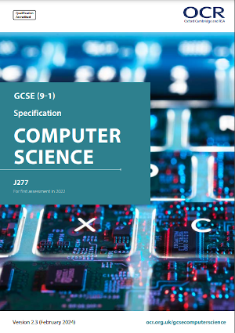
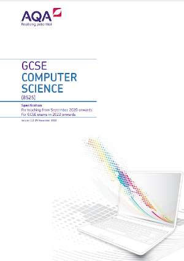
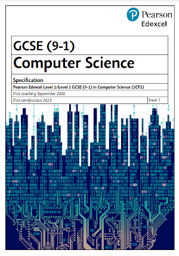

# Documents



## Specifications

| Board | Specification | Type |
|-------|---------------|------|
| AQA | [{ width="100" }](assets/images/aqa_spec.png) | PDF |

-   __OCR__
  
    ---
    <figure markdown="span">
        [{ width="100" }](files/specs/ocr_2022.pdf){:target="_blank"}
        <figcaption>OCR Specification J277</figcaption>
    </figure>
    
-   __AQA__

    ---
    <figure markdown="span">
        [{ width="100" }](files/specs/aqa_2022.pdf){:target="_blank"}
        <figcaption>AQA Specification 8525</figcaption>
    </figure>

-   __PEARSON__

    ---
    <figure markdown="span">
        [{ width="100" }](files/specs/pearson_2022.pdf){:target="_blank"}
        <figcaption>Pearson Specification 8525</figcaption>
    </figure>

-   __WJEC__
   
    ---

    <figure markdown="span">
        { width="100" }
        <figcaption>To follow ...</figcaption>
    </figure>

