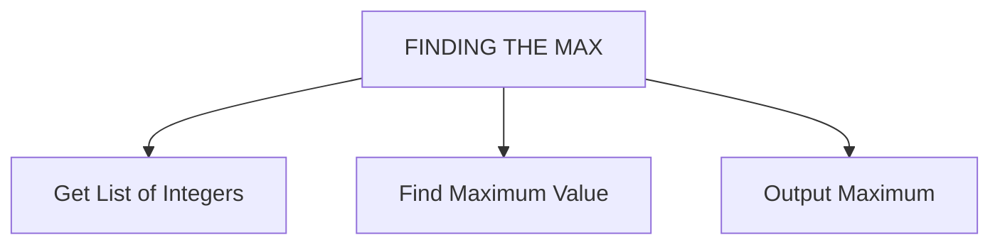
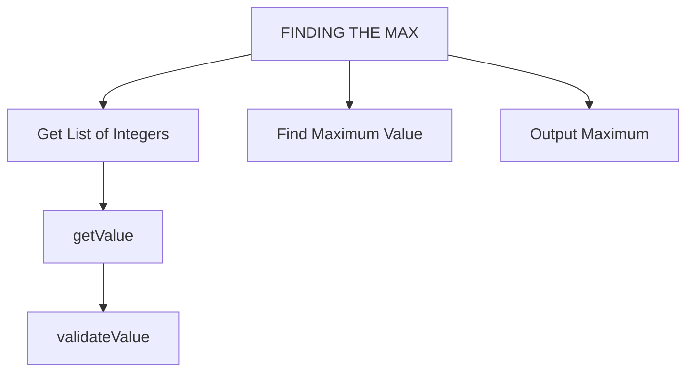

{width="100"; align=right}

# {{ title}}

!!! note "Objectives"
    - first

As we have seen the importance of algorithms in solving computational problems. One essential tool in developing algorithms is the **structure diagram**, which helps visualize and organize the steps involved in solving a problem. In this note, we'll explore the role of structure diagrams in algorithm development, using the example of finding a maximum in a list of values.

## What is a Structure Diagram?

A structure diagram is a graphical representation of an algorithm, showing the sequence of steps and the flow of control between them. It's a high-level design tool that helps programmers plan, organize, and communicate their algorithms effectively.

Unlike the flowchart, it highlights the broad steps that are needed to solve the problem without getting into the detail of loops or selection structures.  If you find yourself here, you have gone into too much detail.  Think of the structure diagram as containing those elements that will be converted into functions in your programming language.

## Finding a Maximum in a List of Values

Suppose we have a list of integers, and we want to find the maximum value in the list. For example, given the list `[3, 1, 4, 2, 5, 6]`, we want to write an algorithm that returns the maximum value, which is 6.

### The Structure Diagram

From the specification we can see there are three main steps (it's the input -> process -> output model again):

1. **Input**: read in a list of integers
2. **Find Maximum**: identify the maximum value in the list
3. **Output**: Display the maximum value

Each of these three steps get displayed in a rectangle, the process:



!!! note

    We are not interested at this stage about the detail of how we get hold of the list of integers, nor the algorithm of finding the max etc..  It's just a bird's eye view!

## "Unpack" each of the processes

The next stage is to them consider what is  involved in each of these processes.

**Get list of integers**

There may be several ways of getting hold of these:

- hard code them directly in your code
- ask the user to enter the values (and provide some validation of that input)
- read the values in from a file

To keep it simple, we'll use the first method:

```python
def read_input():
    return [3, 1, 4, 2, 5]  # Replace with actual input mechanism
```

**FindMax()**

This is the tricky piece of the algorithm.  In pseudocode we might use:

```
 Initialize max_value to the first element of the list
 For each element in the list:
   If element > max_value:
     Update max_value to element
 Return max_value
```

**Output Maximum**

Again we need to know where the output is to go, it could go to the screen or written to a file.  Here we just output it to the screen:

```python
def display_output(max_value):
    print("Maximum value:", max_value)
```

**MAIN**

Our main program now consists of the three processes we identified in our structure diagram:

```python
def main():
    numbers = read_input()
    max_value = find_max(numbers)
    display_output(max_value)

main()
```

## Expanding the structure diagram

Perhaps the specification required the user to enter the integers.  This would require another process for the user enter the value, which should then be validated to ensure it is a genuine integer, before adding that value to the list.

The structure diagram can thus be expanded:



## Benefit of Structure Diagram

The structure diagram helps us in several ways:

- **Clarifies the problem**: By breaking down the problem into smaller steps, we can better understand what we need to do to find the maximum value.
- **Organizes the algorithm**: The structure diagram shows the sequence of steps and the flow of control, making it easier to write the algorithm.
- **Identifies key processes**: The diagram highlights the comparison step, where we decide whether to update the maximum value or not.
- **Simplifies the implementation**: With a clear structure diagram, we can focus on implementing each step individually, making the coding process more manageable.


A good workflow can be developed once you have the structure diagram in place.  The `main()` function calls each of the processes from the structure diagram.  Then each of the functions can be defined with **stubs**

```python
def read_input():
    print("Read input")
    return 0

def find_max(numbers):
    print("Find Max")
    return 0

def display_output():
    print("Display output")
    return 0

def main():
    numbers = read_input()
    max_value = find_max(numbers)
    display_output(max_value)

main()
```

Structure diagrams are a powerful tool in algorithm development, helping us to plan, organize, and communicate our algorithms effectively. By using a structure diagram to find the maximum in a list of values, we can break down the problem into manageable steps, identify key decisions, and simplify the implementation. As you continue to develop your programming skills, remember to use structure diagrams to help you design and implement algorithms efficiently.


## Questions

{{ show_questions(page.title, page.meta.filename) }}