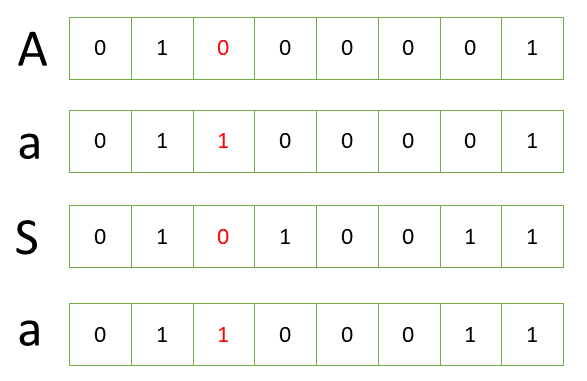
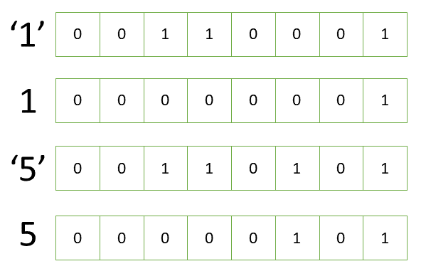
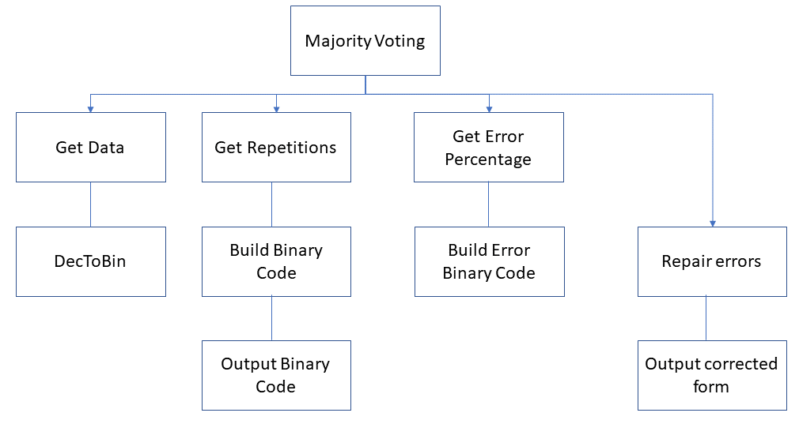
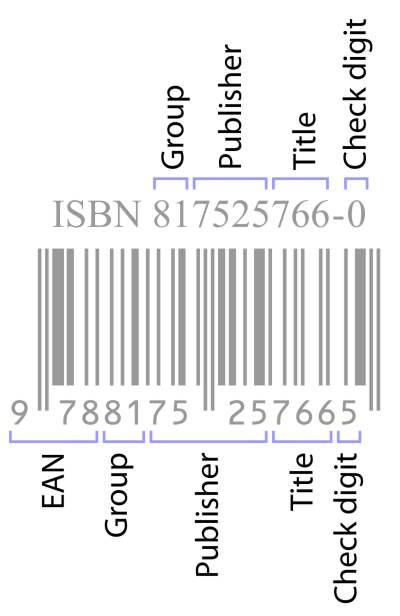

{width="100"; align=right}

# {{ title}}

---

> [!NOTE] The purpose of this section is to ...
> - To differentiate between the character code representation of a decimal digit and its pure binary representation
> - Describe both ASCII, Extended ASCII and Unicode systems for encoding character data
> - Know why Unicode was introduced
> - Describe and explain the use of:
>   - Parity bits
>   - Majority voting
>   - Check sums
>   - Check Digits
> - Consider the algorithms being implemented in these techniques

---

In this and the next two sections we consider how the computer handles other types of data.  Of course, under the hood, all data has to be represented using binary as the machine components will be in one of two states, on or off, which we can represent as either a one or zero.  We need our computer to handle lots of different types of data some of it will be numeric data, but also we need to handle text, images and sound.  These sections explore how that data is handled.

First, information coding systems of ASCII and Unicode

> - Differentiate between the character code representation of a decimal digit and its pure binary representation
> - Be able to describe the ASCII and Unicode coding systems for coding character data and explain why Unicode was introduced
> - Describe and explain the use of parity bits, majority voting, checksums and check digits

## The ASCII Character Set

When we use the term **character** we mean text, or anything we want to type on a keyboard.  This will include the letters of the alphabet (upper and lower case), punctuation characters, the numbers or digits '0' through to '9' but also other characters such as the space bar, the tab key, Enter or Return etc..  

Manufacturers will typically sell keyboards with 104 keys (gaming keyboards will come with more, laptops will have less).  The nearest power of $2$ to $104$ is $2^7$ and what we need therefore is a binary code for each of the characters we need to enter on the keyboard and each code need only occupy $7$ bits which gives us a range of codes from $0$ to $127$.  This is what **ASCII** provides.

ASCII stands for **American Standard Code for Information Interchange**.  The title describes its purpose:

- It was created in the USA so it only caters for the American form of English (we'll return to this shortcoming later)
- It is a standard code for representing characters ...
- ... for the sharing of information and data between devices

It is organised as four groups of 32 characters:

- 0 - 31: a set of non-printing characters or control codes.  They handle various printing or display controls e.g. the tab key, or the return key, or back space
- 32 - 63: includes some of the punctuation, special characters and the numeric digits
- 64 - 95: includes the upper case characters and some special characters
- 96 - 127: includes the lower case characters and further special symbols, including delete

You can see them laid out in the image of an ASCII table:

[IMAGE missing]
<!--  -->

This might, on first glance, appear a bit random but there is some clever thinking behind the allocation of these codes some of which only becomes clear when we look at the binary representation of these codes.  If we convert the codes for upper and lower case characters to binary they differ in only one bit position:



These codes only differ by the value in the fifth bit.  Upper case characters always have a zero in this position, lower case characters always have a one.  This makes it trivial to convert between the two by changing the state of that bit, either by adding $32$ to its ASCII value or by using the bitwise operator OR:

~~~~~cs
static void Main(string[] args)
{
    string example = "AbCDeF";
    for (int i = 0; i < example.Length; i++)
    {
        //char ch = (char)(example[i] + 32);
        //char ch = (char)(example[i] | 0b00100000);  // using OR (if orig is upper case)
        char ch = (char)(example[i] ^ 0b00100000);    // using XOR (works both ways)
        Console.WriteLine($"Uppercase: {example[i]}; Lowercase: {ch}");
    }
}
~~~~~

> [!NOTE] This method is not advisable, it works as long as you're using English!  Much better to use the functions ```toupper()``` or ```tolower()```.


Bits 5 and 6 of the ASCII code determine to which of the fours groups they belong:

| Bit 6 | Bit 5 | Group |
|-------|-------|-------|
|   0   |   0   |   Control characters |
|   0   |   1   | Digits and punctuation |
|   1   |   0   | Upper case and special |
|   1   |   1   | Lower case and special |

The decimal codes used for the numeric characters are not quite so revealing but the hexadecimal values for these does help out:

| Character | Decimal | Hexadecimal |
|-----------|---------|-------------|
| '0' | 48 | 30 |
| '1' | 49 | 31 |
| '2' | 50 | 32 |
| '3' | 51 | 33 |
| '4' | 52 | 34 |
| '5' | 53 | 35 |
| ... | ... | ... |
| '9' | 57 | 39 |

The right-most digit in the hexadecimal code is equivalent to the numeric value of the character:



Thus, by setting the top half of the byte (sometimes known as the high order nibble) to zero you can convert the character code for the number to its binary value; conversely setting that nibble to three converts the numeric value to its character code. Using logical operations in your code can help here:

~~~~~cs
static void Main(string[] args)
{
    string values = "0123456789";
    for (int i = 0; i < values.Length; i++)
    {
        Console.WriteLine($"'{values[i]}' : {(int)values[i]} : {values[i] & 0b00001111}");
    }
}
~~~~~

## Extended ASCII

The most significant bit in ASCII is always zero using only 128 of the possible 256 characters in the byte available.  **Extended ASCII** makes use of this bit adding a further 128 characters to the alphabet.  This included characters such as French and German letters using accented characters, characters used in maths equations and the pound symbol.  Remaining characters were used for drawing boxes and shading in a terminal environment.  Several variants on extended ASCII were introduced,code pages, adding to the confusion and moving away from the idea of a "standard code".  Also many other languages were excluded.

## Unicode

Neither ASCII nor Extended ASCII could cope with representing characters associated with all the languages in the world and it became increasingly important to develop a new system.  Extended ASCII went some of the way but if you used the wrong extended SCIi variant your screen might display nonsense!

**Unicode** was an attempt to unify the various encodings of different characters and has become the universal standard.  ASCII maps a character to a binary code (e.g. A is 0100 0001).  In Unicode the character maps to a **code point** e.g A is U+0041 (you can view the character map for Basic Latin characters [here](https://www.unicode.org/charts/PDF/U0000.pdf)).  Unicode has developed several encoding systems of which the most popular, and used for Internet communication is **UTF-8**.

With UTF-8 if a character can be represented with one byte then that's all that will be used,if it needs 4-bytes, then 4-bytes will be used.  The first 128 code points in UTF-* map directly to ASCII encoding.

It's worth mentioning that different programming languages have a different view on how to implement Unicode e.g. PHP always assumes a single character will occupy one byte, Javascript uses UTF-16 code units for handling all strings and MySQL uses its own utfmb4 to encode UTF-8 characters.

However, the bottom line is that Unicode enables us to store every character from every alphabet plus a rangle of additional symbols (including emojis).


Numeric digits differ from their value in the high order nibble

Numeric digits differ from their value in the high order nibble

# Error Checking

When transferring binary data between one device and another over network problems such as noise or interference can corrupt the state of the data at the receiving end.  There are various techniques that can be used to check is such an error has occurred during transmission:

- Parity Bit
- Majority Voting
- Checksum
- Check Digit

Each work on a similar principle, that of taking the data (or a portion of it) and applying an algorithm to that data to produce an additional value.  This value is appended to the original data.  At the receiving end the same algorithm is applied and if the result is different then an error has occurred.

For each of these techniques we'll briefly look at how they work, their advantages/disadvantages and then use C/# code to amplify.  (Some of this material is also covered in the Programming section --> Arrays --> extended theory).

### Parity Bits

With __parity checking__ an additional bit is added to a string of binary data to ensure the total number of $1$ bits in the string is either an odd or an even number.  There are two types of parity checking:

- **Even parity**: the total number of bits in the message is even (including the parity bit)
- **Odd parity**: the total number of bits in the message is odd (including the parity bit)

When building the frame of data to transmit the sender's machine will count the number of 1s.  If it is odd, and it's using even parity, the parity bit will be a $1$, otherwise it will be $0$.  Obviously the reverse would be the case if odd parity was being used.

The receiver checks the message and counts the number of 1s.  If using even parity and the number of 1s is odd then it will not accept the data.

It's a rudimentary technique as it can only detect single bit errors.  Further, it has no way of identifying which bit is at fault and so is unable to correct the data.

[IMAGE missing]
<!--  -->

#### Parity Bit in C\#

It's trivial to iterate through an array of bits, count the number of $1$s and determine if the parity bit needs to be set or not.  

In the following example, the user is asked to enter a character, which we'll assume is the data to be transmitted.  The ASCII value of the character is obtained and the number of bits set (the 1s) is counted.  The user is asked if they wish to use Odd or Even parity and the appropriate bit is set in the most significant bit position.

~~~~~cs
namespace parity
{
    class Program 
    {
        const int WIDTH = 8;

        static string DecimalToBinary(int dec)
        {
            int bit;
            string result = "";
            while (dec > 0)
            {
                bit = dec % 2;
                result = bit.ToString() + result;
                dec /= 2;
            }
            return result;
        }

        static int countBitsSet(int value)
        {
            int count = 0;
            for (int i = 0; i < 7; i++) 
            {
                // AND each bit with power of 2
                if ((value & (1 << i)) > 0) 
                {
                    count++;
                }
            }
            return count;
        }

        static string GetIntBinaryString(int value)
        {
            return Convert.ToString(value, 2); //.PadLeft(WIDTH, '0');
        }

        static void Main(string[] args) 
        {
            Console.Write("Enter a character to be encoded: ");
            char data = char.Parse(Console.ReadLine());
            
            // output the ASCII code for the character
            int asciiVal = (int)data;
            string binAsciiVal = GetIntBinaryString(asciiVal);

            // convert that value into binary, and output to screen
            Console.WriteLine($"In binary this is: {binAsciiVal.PadLeft(WIDTH,'0')} ({asciiVal})");

            // input odd or even parity to be used
            Console.Write("Would you like to use Odd or Even parity [O/E]: ");
            char parityCode = char.Parse(Console.ReadLine());
            
            // Calculate the parity bit needed, and output
            int bitsSet = countBitsSet(asciiVal);

            if ((Char.ToUpper(parityCode) == 'E') && (bitsSet % 2 == 0)) {
                binAsciiVal = '0'  + binAsciiVal;
            } else {
                binAsciiVal = '1' + binAsciiVal;
            }
                  
            // Output the complete code (parity bit in MSB)            
            Console.WriteLine($"The complete code using msb for parity bit: {binAsciiVal}");
        } 
    }
}
~~~~~

### Majority Voting

Another method for detecting errors where each bit is duplicated an odd number of times, i.e. $3$, so if the binary data was $101_2$ then $111 000 111$ will be transmitted.  The receiving device will take the most repeated bit in each position as the intended bit.  

This is not a fail-safe method for detecting transmission errors.  Consider the situation when the receiver got $111 011 111$, rather than the intended $111 000 111$, it would take the majority in the second position as a $1$ which would be incorrect.  

This can be minimised by replicating the bit more than $3$ times but this would add to the amount of data needing to be transmitted.  

The upside is the receiving computer is able to attempt to correct the input and restore it to the original without needed to retransmit the data.

#### Majority Voting using C/#

To illustrate the process, we'll get input from a user for a character to be encoded using this technique and simulate errors that will change our binary data.  Then use a majority voting technique to decode it back to the original and compare.

It's worth running the code several times changing the values for the number of repetitions for each bit and the error percentage and analyse the effects.

Two helper methods are used on the user input to convert it into a binary string and another to convert the binary string back into a decimal representation:

~~~~~cs
static string DecimalToBinary(int dec)
{
    int bit;
    string result = "";
    while (dec > 0)
    {
        bit = dec % 2;
        result = bit.ToString() + result;
        dec /= 2;
    }
    return result;
}

static int BinaryToDecimal(string bin)
{
    int power = 1;
    int dec = 0;
    for (int i = bin.Length - 1; i >= 0; i--)
    {
        dec = dec + power * Convert.ToInt32(bin[i].ToString());
        // have to convert char to string first, otherwise it converts to ASCII code value

        power = power * 2;
    }
    return dec;
}
~~~~~

The diagram below summarises the structure for our program:



In the main program we ask the user for a character to encode/transmit which is then converted to binary. The program asks the user for the number of repetitions for each bit.

> [!NOTE] The number of repetitions should be an odd number but the code does not check for this

A loop is then used to iterate through the binary string building a new string of characters, 1s or 0s, and an inner loop generates the correct number of repetitions.  

The middle section of the algorithm here mimics the role of the receiver and randomly introduces errors transforming the original data into a new array but now with errors.  The extent of the errors can be set by the user.

The last section of the algorithm, the final loop,  is perhaps the most complex algorithmically and is worth spending some time tracing through to determine how it is able to correct the input and restore it to the original.  Of course it may fail for the reasons given earlier.  

This program can be used to investigate the relationship between the number of repetitions, the error rate and the eventual success rate in correcting the errors.

~~~~~cs
static void Main(string[] args)
{
    // get the character to encode
    Console.Write("Enter a character to encode: ");
    char ch = Console.ReadLine()[0];
    string binCode = DecimalToBinary(ch);
    Console.WriteLine($"Encoding {ch} is: {binCode}");
    
    // get the number of repetitions for each bit
    Console.Write("Enter number of repeats for each bit: ");
    int repetitions = Convert.ToInt32(Console.ReadLine());
    string newBinCode = "";
    for (int i = 0; i < binCode.Length; i++)
    {
        for (int j = 0; j < repetitions; j++)
        {
            newBinCode = newBinCode + binCode[i];
        }
    }
    Console.WriteLine($"The transmitted code is: {newBinCode}");

    // introduce errors as a percentage
    Console.Write("Enter percentage of errors to introduce: ");
    int errorPercent = Convert.ToInt32(Console.ReadLine());
    string errorBinCode = "";
    Random rnd = new Random();
    for (int i = 0; i < newBinCode.Length; i++)
    {
        if (rnd.Next(100) < errorPercent)
        {
            if (newBinCode[i] == '0')
                errorBinCode = errorBinCode + '1';
            else    
                errorBinCode = errorBinCode + '0';
        }
        else
        {
            errorBinCode = errorBinCode + newBinCode[i];
        }
    }
    Console.WriteLine($"Code with errors introduced: {errorBinCode}");
    
    // check and correct the errors using majority voting
    string repairedCode = "";
    int n = 0;
    while (n < errorBinCode.Length)
    {
        int count = 0;
        for (int i = 0; i < repetitions; i++)
        {
            if (errorBinCode[n] == '1')
                count++;
            n++;
        }
        if (count > repetitions / 2)
        {
            repairedCode = repairedCode + '1';
        }
        else
        {
            repairedCode = repairedCode + '0';
        }
    }
    Console.WriteLine($"Repaired code is: {repairedCode} or {Convert.ToChar(BinaryToDecimal(repairedCode))}");
}
~~~~~

### Check Digit

A __check digit__ is a digit added to the end of the transmitted data, similar in that sense to the parity bit. It's frequently used to checking input of e.g. bank account numbers, credit cards numbers, ISBN numbers where, when input manually, mistakes can often occur.

Various algorithms are used to generate the check digit, typically using a weighted modulo algorithm.  Simplistically one could take the sum of all the digits and modulo the result by 10.  This might a single incorrect digit but would not change the result if digits had been switched.  A weighted modulo algorithm is one where different weights are given to each position.  Also used is some alternating weights e.g. 31 31 ..., or 13 13 ... etc..

The following algorithm illustrates a check digit algorithm using such an alternating weighted modulo algorithm, typically used with ISBN-13 numbers:

[^1]

- Take first 12 digits of ISBN
- Multiply each number in turn from left to right by $1$ and $3$ alternately
- Sum the products
- Do Modulo 10 on the result
- Subtract the remainder from the result
- If it's zero then the check digit is $0$, if not subtract the remainder from $10$

~~~~~cs
namespace checkdigit
{
    class Program
    {
        static void Main(string[] args)
{
            string isbn = "9788175257665";
            int sum = 0;
            for(int i = 0; i < isbn.Length-1; i++)
            {
                int n = (int)isbn[i] & 0b00001111;
                sum = (i % 2 == 0) ? sum += n * 1 : sum += n * 3;
            }
            int rem = sum % 10;
            int checkDigit = rem == 0 ? checkDigit = 0 : checkDigit = 10 - rem;
            Console.WriteLine($"Check digit = {checkDigit}");
        }
    }
}
~~~~~


## Checksum

While parity checking and check digit use a single character for rudimentary error checking the **check sum** algorithm produces a small block of text that is derived from another block of data.  The aim is to check the integrity of the data received.  Check digits and parity bits may be thought of as special cases for checksums, used for small chunks of data.

The original data is put through the check sum algorithm (or function) and outputs the check sum value.  This value is like a fingerprint of the file, it identifies the file to which it belongs in the same way a human fingerprint identifies the person it belongs to.  Before transmission the check sum is generated, and on receipt the check sum is re-calculated.  if there is a difference between these two values there was a problem in transmission.

Let's take simple example of a file `test.txt` that contains the line "This is just a test".  Using the command line tool `md5sum` (Linux) the checksum generated is:

- 987391a95c72f9376eebb414eb884e80  test.txt

We can perform the same algorithm using the Windows tool Get-FileHash, again from the command line or Powershell using the command `Get-FileHash test.txt -Algorithm MD5`:

- 987391A95C72F9376EEBB414EB884E80

Unsurprisingly, the check sums are identical (capitalisation in Windows making no difference of course)

Note, that by making a small difference to the file contents i.e. "This is just a test!", the checksum generated by the algorithm will be different:

- b13336f9c762d8ad413b76db284e65b5 (md5sum)
- B13336F9C762D8AD413B76DB284E65B5 (Get-FileHash)

The MD5 algorithm (Message-digest algorithm) is a widely used hash function[^2] that produces a 128-bit value.  It was designed as a cryptographic function but has proven itself to be vulnerable for this purpose as the same hash value can be generated from different blocks of data.  Therefore it's of little use for SSL certificates or digital signatures. It remains in use as a checksum to verify data integrity.[^3]

If you want to build this into any C\# program there is an MD5 library used in the following example ([Source](https://code-paper.com/c-sharp/examples-c-checksum)):

~~~~~cs
namespace checksum 
{
    using System;
    using System.Security.Cryptography;
    
    class Program
    {
        private static string GetMD5HashFromFile(string fileName)
        {
            using (var md5 = MD5.Create())
            {
                using (var stream = File.OpenRead(fileName))
                {
                    return BitConverter.ToString(md5.ComputeHash(stream)).Replace("-", string.Empty);
                }
            }
        }

        static void Main(string[] args) {
            string filename = "test.txt";
            Console.WriteLine(GetMD5HashFromFile(filename));
        }
    }
}
~~~~~

## Questions

1. How many characters can be represented using:
        a. 7 - bit ASCII
        b. 8-bit extended ASCII
        c. 16-bit Unicode

2. A computer uses even parity with most significant bit as the parity bit.  Complete the following bit patterns:
        a. _0100001
        b. _1010011
        c. _1000011
        d. _1001001

3. A computer system uses odd parity. Correct those bit patterns which contain an error (again the most significant  bit is the parity bit):
        a. 11010010
        b. 11100011
        c. 01101001
        d. 11100101
        e. 11101110
        f. 11100011
        g. 01100101

4. Within a single character how many bit errors can a parity check detect? Explain your answer
---

- [^1]: By Sakurambo at English Wikipedia, CC BY-SA 3.0, https://commons.wikimedia.org/w/index.php?curid=15257526
- [^2]: A hash function is a function that maps data of any size to a fixed-size value
- [^3]: it is possible for the sender to create a second file with the same checksum, so it cannot be fully relied upon.