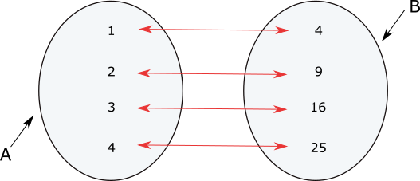
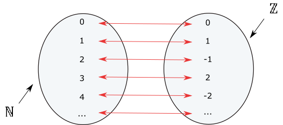
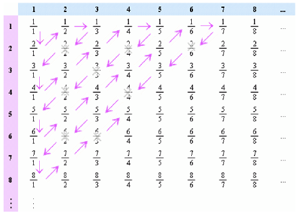

{width="100"; align=right}

# {{ title}}

> [!NOTE] The purpose of this section is to ...
> 
> Be familiar with the concept of:    
>	- finite sets    
>	- infinite sets    
>	- countably infinite sets    
>	- cardinality of a finite set    
>	- Cartesian product of sets.    

The __cardinality__ of a set is basically its size, i.e. how many elements it contains.  For example, the set $A = \{2, 5, 9\}$ contains $3$ elements, therefore $A$ has a cardinality of $3$.  Cardinality is equivalent to the sets size.

The cardinality of a set is denoted using a vertical bar either side of the set identifier: $|A|$.

Counting elements in this way should be nice and straightforward if the number of elements in the set is **finite**, but what about **infinite** sets such as $A = \{0, 1, 2, 3, ...\}$ or the set of all rational numbers $\mathbb{R}$?  For this, we need to introduce the concept of __countability__, and __uncountability__.

## Countability

There are two types of infinite set, those which are countable, and those which are uncountable. $\mathbb{N}$ and $\mathbb{Z}$ are countable, but $\mathbb{R}$ is not.  The difference here is that one could both write each element of either $\mathbb{N}$ or $\mathbb{Z}$ and count them (even if the counting goes on forever!):

$\mathbb{N} = \{1, 2, 3, ...\}$
$\mathbb{Z} = \{0, 1, -1, 2, -2, 3, -3, ...\}$

Thus, a __countable set__ is either:

- a finite set, or
- a countably infinite set

It is not possible to write down every element in the set $\mathbb{R}$, therefore it is uncountable.  There are far more real numbers than natural numbers, implying there is more than one infinity!

Lets' take a closer look at this question.  When two sets have the same cardinality it means that each element of the first set can be paired with the second:

- $|A| = |B|$

The same principle can be applied when comparing the cardinality of $\mathbb{N}$ and $\mathbb{Z}$:

{width=80%}

$|\mathbb{N}| = |\mathbb{Z}|$

The same principle can be applied to compare natural numbers to rational numbers too!

Follow the arrows in the diagram below and, if carried on forever (!), all the rational numbers can be counted:

The rational numbers can be counted against the set of natural numbers too:

$|\mathbb{N} = \mathbb{Q}|$

But this is not possible with the set of real ($\mathbb{R}$) numbers as proved by [Cantor's diagonalisation argument](https://en.wikipedia.org/wiki/Cantor%27s_diagonal_argument).  The maths involved here can get quite complex so perhaps an analogy might help ...

_Imagine you have a theoretical hotel with one room for each positive integer, numbered 1,2,3,...,etc. One night, a bus pulls up full of all the positive integers, and each integer wants a room. Easy, right? Every number just goes to the room of the same number_.

_Now imagine later that same night, a bus full of all the negative integers shows up, and they all want rooms as well. Is your hotel big enough to accommodate them? Every number is already in a room! But you know what? You can fit them all. You just get on the intercom and tell all the positive numbers to get out of their room and go to the room that is twice their number. (1 goes to 2, 2 to 4, etc.) You then tell your negative integer customers to go to the room that is one less than twice their absolute value. (-1 goes to 1, -2 goes to 3, etc.) And guess what? Everyone has a room!_

_Now here's where things become unmanageable. Assume that, on another night, your hotel is empty, and a little bus pulls in containing 0, 1, and all the numbers in between. Is your hotel big enough for that? Is there a room for every number? Let's say you put 0 in room 1. Who comes next? 0.0001? 0.0000001? I can't identify the "next" number, because between any two real numbers, there will be infinitely more numbers. (As many as there are between 0 and 1, as it happens.)_

_Our hotel is an abstraction for countability. The set of real numbers includes all rational and irrational numbers, and with our integer hotel, there's no way to arrange them in any sort of countable order, such that there's one room for each number. There's no 1:1 function/map/what-have-you of real numbers to integers or vice versa._ [^1]

# Cartesian Product

A new set can be formed by applying an operation, i.e. union, intersection etc., to a number of existing sets.  A new set can also be formed by combining sets together.  We'll use a food menu as an example:

__Starters__

- \textcolor{red}{P}ea Soup
- \textcolor{red}{G}arlic Mushrooms
- \textcolor{red}{M}ussels

__Mains__

- \textcolor{red}{V}egetable Curry
- \textcolor{red}{B}urger
- \textcolor{red}{R}oast Chicken
- \textcolor{red}{H}addock and Chips

How many different combinations of Starters and Mains?  If we represent the set of starters and teh set of mains as:

- $Starters = \{P, G, M\}$ and $Mains = \{V, B, R, H\}$.  

The cartesian product of $Starters \times Mains = \{ (P,V), (P,B), (P,R), (P,H), (G,V), (G,B), (G,R), (G,H), (M,V), (M,B), (M,R), (M,H)\}$.

Thus, we have created a new set consisting of 12 ordered pairs (or tuples) where each element of $Starters$ is combined with each element from $Mains$.

The cardinality of each set is: 

- $|Starters| = 3$
- $|Mains| = 4$. 

This combination of the two sets is called the __Cartesian product__ and is denoted by the symbol: $\times$. It is also known as the **cross product** or the **product set**.

This resembles the mathematical operator times, but the result of the operation is a number of ordered pairs $|Starters| \times |Mains|$

Let's take another example, this time using the sets:

- $A = {1, 2}$
- $B = { a, b, c}$

The Cartesian Product of $A \times B$ is:

- $A \times B = \{ (1,a),(1,b),(1,c),(2,a),(2,b), (2,c) \}$

But, notice the Cartesian Product of $A \times B \neq B \times A$!

- $B \times A = \{ (a,1), (a,2), (b,1), (b,2), (c,1),(c,2) \}$

The ordering within the tuples is important, (a,1) is not the same as (1,a).  If you think of these as coordinates then it makes sense, for example the coordinate position (2,6) is a different location from (6,2).

## What's this got to do with Computer Science?

It's a good question to ask when looking at some of the theory topics in this unit of the A Level and as the course progresses the links between the theory and the practical will/should become clearer.  The theory can appear abstract and unrelated to the practical but the two are inextricably linked.  Set theory can be regarded as the underpinning for all computer science.

Any algebra is a set of valid values combined with some operations applied to those values.  A data type is a set of valid values and some operations applied to those values.  It doesn't stop there though, programming languages are full of algebras and understanding sets provides insight into how they work.

So, where can you expect set theory to pop up and need to be applied?  The following list is a starting point:

- __Database relations__: Relational Databases which we'll look at in more detail later in Year 1 are built almost entirely on set theory.  Querying the records stored in tables using SQL will involve intersection operations.  An SQL INNER JOIN is an intersection of two sets (tables); the LEFT JOIN is set difference; the FULL OUTER JOIN is the set union.  Normalisation of data into tables as ensuring each table has no duplicates, as in set theory.
- __Turing Machines__: A Turing Machine can be viewed as a computer with a single program which is expressed as a finite set of states (state transition) with a finite set of symbols to control the program
- __Functions__: A function must relate an input to an output, its input will an element of a set (of numbers, of integers > 20, or whatever) and it will return an element of set.  The function needs to work for every element of the input set (known as its domain) and return only one output (known as its co-domain) for that input.  Take the example of a function even(), the set of inputs to this function will be the set of natural numbers and its set of outputs will be the set of booleans.
- __Regular expressions__: A regular expression is a simple way of describing a set e.g. $a(a|b)*$ describes the set of strings $\{a, aa, ab, aaa, aab, aba, ...\}$, regular expressions allow particular types of languages to be described in shorthand
- __Programming__: Java, Python, Ruby and Javascript have set data structures built-in.  (So does C\# though it's more hidden)

# Questions

<ol>
	<li>What is the cardinality of:
	<ol style="list-style-type: lower-alpha;" >
		<li>$\{1, 2, 3, 4, 5\}$</li>
		<li>$\{x| x \in \mathbb{N}, x < 5\}$</li>
		<li>the set of upper case letters of the English alphabet</li>
    	<li>$\{1, 2, 3, 4, 5\} \cup \{6, 7, 8\}$</li>
    	<li>$\{1, 2, 3, 4, 5\} \cap \{6, 7, 8\}$</li>
    	<li>$\{1, 2, 3, 4, 5\} \cup \{4, 5, 6\}$</li>
    	<li>$\{1, 2, 3, 4, 5\} \cap \{4, 5, 6\}$</li>
	</ol>
	<li>True or false?</li>
	<ol style="list-style-type: lower-alpha;" >
		<li>$|\{1, 2, 3\}| = |\{4, 5, 6\}|$</li>
		<li>$|\{1, 2, 3\}| < |\{1, 2, 3, 4\}|$</li>
		<li>$|\{negative integers\}| < |\mathbb{Z}|$</li>
		<li>$|\mathbb{N}| = |\mathbb{R}|$</li>
	</ol>
	<li>Write out the Cartesian products of the following sets:</li>
	<ol style="list-style-type: lower-alpha;">
		<li>$\{1, 2, 3\} \times \{a, b\}$</li>
		<li>$\{a, b\} \times \{1, 2, 3\}$</li>
		<li>$\{0, 1\} \times \{a, b\} x \{x, y\}$</li>
	</ol>
	<li>If $A \times B$ = $B \times A$, what can you say about $A$ and $B$? 
	<li>If $|A| = 3$, $|B| = 4$, and $|C| = 5$, what is $|A \times B \times C|$? </li>
	<li>In a certain programming language, all variable names have to be $3$ characters long.  the first character must be a letter from 'a' to 'z'; the others can be letters or digits from $0$ to $9$.  If $L = \{a, b, c, ..., z\}$, $D = \{0, 1, 2, ..., 9\}$ and $V = \{ \text{ permissible variable names }\}$, use a Cartesian product to complete: $V = \{p q r | (p, q, r) \in ?\}$</li>
	</ol>
</ol>

---

[^1]: [https://www.reddit.com/r/explainlikeimfive/comments/612wxr/eli5_why_is_the_set_of_real_numbers_uncountable/](https://www.reddit.com/r/explainlikeimfive/comments/612wxr/eli5_why_is_the_set_of_real_numbers_uncountable/)