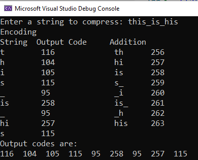

{width="100"; align=right}

# {{ title}}

> [!NOTE] The purpose of this section is to ...
> - Know why images and sound files are often compressed and that other files, such as text files, can also be compressed.
> - Understand the difference between lossless and lossy compression and explain the advantages and disadvantages of each
> - Explain the principles behind the following techniques for lossless compression:
>   - run length encoding (RLE)
>   - dictionary-based methods.
---

Both image files and sound files can get large very quickly.  To reduce the size of these files they have to be compressed i.e. made smaller to use less bits and take up less space on a storage device or reduce network transmission times.  Text files can also, and will be, compressed.  There are two main approaches:

- lossy compression
- lossless compression

Within each method there are a host of different algorithms that can be employed.  Some of these can get very complicated and are out of scope but we can look at the principles behind these approaches to explore the differences and determine their key characteristics.  Fundamentally the main question to ask is: "Does the compression technique applied **physically change the data in the image**

## Lossless compression

Lossless compression does not change the bits used but will rearrange them and try to pack them into a smaller amount of space.  As the name suggest, not data is lost in this process so the original file (the image, audio or text file) can be reproduced exactly.  That is, lossless compression is reversible.  This is clearly important when compressing database records, spreadsheets or word processing files where exact replication of the original is a must.

Two methods illustrate this process:

- Run Length encoding
- Dictionary compression

### Run Length Encoding

Run Length Encoding (RLE) takes the original file and analyses it for repeated patterns or 'runs' and encodes them into smaller bytes.  To illustrate, lets take, perhaps artificially, a sequence of characters:

- "AAAAAAAAA":  This string would require $9$ bytes, but it could be encoded as `9A` which only requires $2$ bytes
- "AAAAAbbb44444444z00000000":  This string would require $25$ bytes but the patterns could be extracted and encoded as `5A3b841z80`

Note the `z` in the string above, this has now doubled the amount of storage required.  It's not impacted on the overall saving achieved but data where there is little or no repetition will not gain using RLE.

The same approach can be taken with binary data where repetitions of `0`s and `1`s is more common, e.g. take the following string of bits:

- `0000000111111111111000011111`
- that is, $7$ 0s, $12$ 1s, $4$ 0s, $5$ 1s which can b compressed as 7 12 4 5 in the bit string
- thus: `0111 1100 0100 0101` (with spaces inserted for readability)
- this has saved $12$ bits

Before adopting this approach we'd need to consider how many bits to use for the stock numbers (here $4$ is used) and what if the run found exceeds that.

The same method can be applied to images where runs of the same colour can be encoded, for example this following simple monochrome image:

This can be represented as a series of 0s and 1s:

[IMAGE MISSING]
<!--  -->

or:

- `23W4B6W1B2W1B6W4B9W1B9W1B6W4B23W`

Here, the original $100$ bytes are reduced to $32$

Of course, this is an abstraction and the data will be stored as binary.  For this monochrome image the bit depth is 1 and thus row 3 of the image consists of 3 0s, 4 1s, 3 0s so we only need to store $343$ or in binary `0 0011 1 0100 0 0011` which is only $15$ bits (spaces inserted for readability)!  Again consideration needs to be given for the number of bits used for the colour code and the number of repetitions.

> [!NOTE] In a digital photograph it is unlikely to find such runs of repeated colour information so this approach is better suited to cartoons or icons.
>
> Typical lossless compression files for images include: .BMP and .PNG

### Lossless audio compression

Music files rarely carry a lot of repetitive information so a different approach has to be taken.  Instead of using repetition these algorithms attempt to predict the value of the succeeding sample based on what has preceded it.  Two examples are FLAC and ALAC.  The algorithms used here are complex and out of scope but FLAC claims to reduce the original audio by some 40% and is able to reproduce the original audio with no perceivable loss of quality.

### Dictionary compression

Dictionary-based compression algorithms encode patterns of characters as single values, or tokens.  These values form an index to a dictionary of these patterns.  If the values are smaller than the patterns then compression occurs.

Thinking about the principle of a dictionary, consider the text of any book (or this article) and each word could be reduced to a page number and a line number of a standard dictionary.  This will significantly reduce the original text to a series of numeric codes that act as a look-up to the dictionary file.  There is, of course, a hidden cost here.  We also need to store the dictionary!  This page of text will be much smaller using this method but the dictionary file would would dwarf it.

The trick therefore is to use the original text itself as the basis for the dictionary.  This idea was first introduced by Liv and Zempel in 1977 and has become known as the LZ77 algorithm (there have been many modifications to it subsequently e.g. LZ78, LZW).

Using a highly simplified model this is how it works:

- this string to be compressed is "this_is_his", to make it clearer spaces are being substituted by an underscore 
- we start with an initial dictionary of all ASCII characters, thus the code for 'A' is 65, for 't' it is 116
- the algorithm reads one character at a time, reading the first 't' in the string and the next character 'h'.
- 't' is already in the dictionary so this its code is added to the encoded string and a new entry for 'th' is made in the dictionary with code 256
- the  next character, 'h' is read and its next, 'i'.  'h' is in the dictionary so this is added to the encoded string and an entry for 'hi' is made in the dictionary using code 257
- this continues for the 'i', 's' and space

Our data is now:

| String | Output Code | Added to dictionary |
|--------|-------------|---------------------|
| 't'    |    116      |   'th' 256          |
| 'h'    |    104      |   'hi' 257          |
| 'i'    |    105      |   'is' 258          |
| 's'    |    115      |   's_' 259          |
| '_'    |     95      |   '_i' 260          |

- Next we get another 'i' followed by an 's'.  We already have a code for this pattern (258) so this code is added to the encoded string and the next character in the input stream is added to the 'is' giving a new pattern 'is_ which is added to the dictionary with code 261
- The underscore is read next, this is in the dictionary so added to the encoded string and the '_h' is added to the dictionary with code 262
- Next is 'h.  We already have a pattern starting with 'h' and its next letter being 'i', so this pattern can be encoded as 257 and the pattern 'his' is added to the dictionary with code 263
- The final character in the input stream, 's', is read and output.

The final trace is:

| String | Output Code | Added to dictionary |
|--------|-------------|---------------------|
| 't'    |    116      |   'th' 256          |
| 'h'    |    104      |   'hi' 257          |
| 'i'    |    105      |   'is' 258          |
| 's'    |    115      |   's_' 259          |
| '_'    |     95      |   '_i' 260          |
| 'is'   |    258      |   'is_' 261         |
| '_'    |     95      |   '_h' 262          |
| 'hi'   |    257      |   'his' 263         |
| 's'    |    115      |                     |

Thus we have taken the string 'this_is_his' and encoded it as `116 104 105 115 95 258 95 257 115`.  The code values exceed one byte so for every single character the final data size will be increased, so in this simplified example we've not gained anything.  There is, however, a significant improvement in the compression achieved with longer amounts of text.

#### LZW in C\#

The following code, adapted from [here](https://www.geeksforgeeks.org/lzw-lempel-ziv-welch-compression-technique/), demonstrates the LZW algorithm in C\#:

~~~~~cs
static Dictionary<string, int> BuildStartTable()
{
    Dictionary<string, int> table = new Dictionary<string, int>();
    for (int i = 0; i < 256; i++)
    {
        string ch = "";
        ch += (char)i;
        table[ch] = i;
    }
    return table;
}

static List<int> encoding(string s1)
{
    Console.WriteLine("Encoding");

    Dictionary<string, int> table = BuildStartTable();
    string p = "";
    string c = "";

    p += s1[0];
    int code = 256;
    List<int> output_code = new List<int>();
    Console.WriteLine("String\tOutput Code\tAddition");
    for (int i = 0; i < s1.Length; i++)
    {
        if (i != s1.Length - 1)
        {
            c += s1[i+1];
        }
        if (table.ContainsKey(p+c))
        {
            p = p + c;
        }
        else
        {
            Console.WriteLine($"{ p } \t { table[p] } \t { p + c } \t { code }");
            output_code.Add(table[p]);
            table[p + c] = code;
            code++;
            p = c;
        }
        c = "";
    }
    Console.WriteLine($"{ p } \t { table[p] }");
    output_code.Add(table[p]);

    return output_code;
}

static void Main(string[] args)
{
    Console.Write("Enter a string to compress: ");
    string s = Console.ReadLine();
    //string s = "WYS*WYGWYS*WYSWYSG";
    List<int> output_code = encoding(s);
    Console.WriteLine("Output codes are: ");
    for (int i = 0; i < output_code.Count; i++)
    {
        Console.Write($"{ output_code[i] }  ");

    }
    Console.WriteLine();
    decoding(output_code);
}
~~~~~

And an output from the program using our simple string from above:

## Lossy Compression

Unlike lossless compression, lossy compression will reduce the file size by removing data which means when reproduced it will not be (and can never be) the same as the original.

> [!NOTE] Data compressed using a lossy algorithm can never be restored back to the original

Again the algorithms used are complex and out of scope here.  We know, in theory, the size of an image file can be reduced by using less pixels or a smaller bit depth but this will impact significantly on the image.  The compression algorithms seek to use patterns in the image and reduce the space needed to represent that image, i.e. to lose detail, preferably detail our eyes are not aware of.

This approach is most effective with image and audio files where our ears and eyes can tolerate some loss of perception.  The amount of compression applied can be adjusted where there is a trade off between higher accuracy for less effective compression.

### JPEG

For images the effects of the lossy compression algorithm may not be immediately noticeable, the detail may be subtle depending on the original image and the device being used to reproduce that image.

Compare the two images below.  The first is 543Kb, the second 57.9Kb.  Both the resolution and the colours have degraded significantly

[IMAGE missing]
<!--  -->

[IMAGE missing]
<!--  -->

JPEG images are a common form of lossy compressed images.  Compare the following two images, the one on the left is the original PNG (543Kb), the second a JPEG (108Kb).  It's difficult to tell the difference between the two but the second is significantly smaller than the first.

If we zoom in to the original (a portion of the man's white top), see how the adjacent pixels are very similar.  For the highlighted pixels an average value could be taken by noting the first and the last and then getting the computer to calculate the values in between rather than storing them explicitly.   Thus, in this run only 2 values need to be stored rather than 8:

This process is known as **linear interpolation**.

### MP3

The MP3 format for audio has had a huge impact on how we collect, listen and distribute sound files.  MP3 is a lossy compression algorithm applied to audio files, it is not the same quality as the original as data has been lost but depending on our ears and the quality of the devices we're using to play the sound files it is a very good compromise.

MP3 aims to compress the original audio by a factor of between 10 and 14 without noticeably affecting the overall quality (i.e. it remains recognisable).  The MP3 algorithm relies on a number of factors:

- there are certain sounds the ear cannot pick up i.e. very high frequencies
- there are certain sounds we hear better than others and - when two sounds are played at the same time, the quieter one may be not heard, this is known as psycho-acoustics
- plus ... some complicated mathematical algorithms[^1]

This way some sounds can be removed without significantly altering the sound for the listener.  This will be subjective of course, and dependent on the equipment being used to reproduce the sound.

When converting an audio file to an MP3 the user can change the bit rate being used which is the number of bits per second encoded in the file.  The higher the bit rate, the less data will be removed and the higher the quality of the result, though the file size will also be larger.

As with other forms of loss compression, once the file has been compressed it cannot be reversed.  You can convert a .WAV file to .MP3 but you cannot go from .MP3 back to .WAV.

> [!NOTE] To get more detail (beyond what is required for A Level) about audio compression read the brilliant article [here](https://www.soundonsound.com/techniques/what-data-compression-does-your-music)

## Questions

---

[^1]: https://cs.stanford.edu/people/eroberts/courses/soco/projects/data-compression/lossy/mp3/concept.htm