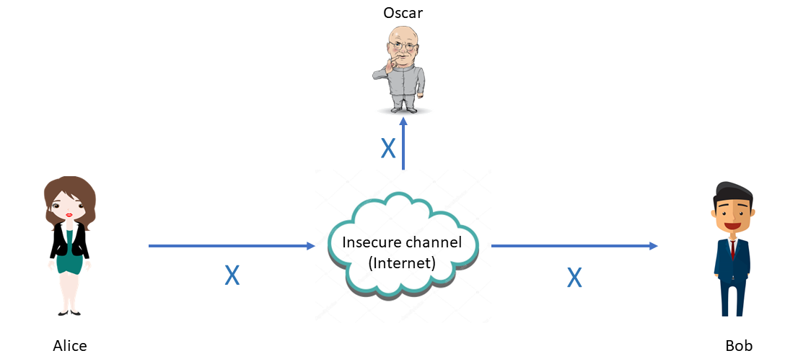
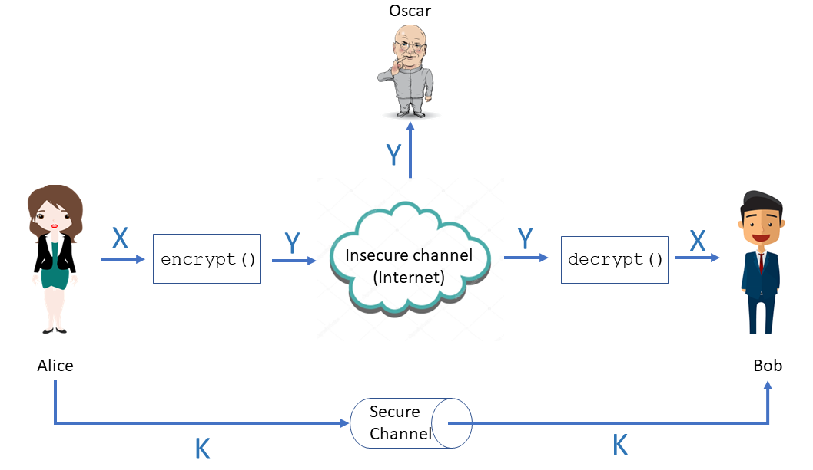
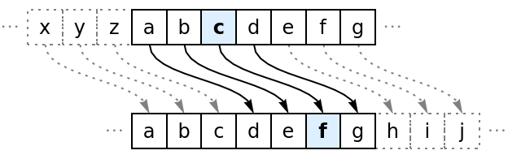
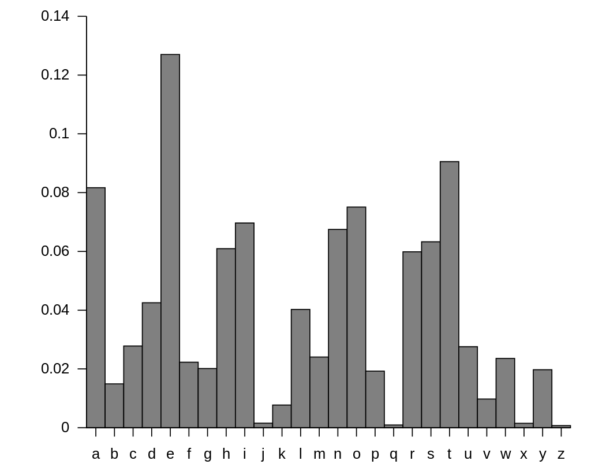

{width="100"; align=right}

# {{ title}}

> [!NOTE] The purpose of this section is to ...
> - Understand what is meant by encryption and be able to define it.
> - Investigate the principles and processes of encryption using Caesar Cipher and Vernam Cipher as exemplars
> - Know the difference between the plain text and the cipher text and methods used to both encrypt and decrypt
> - Explore the various 'costs' associated with encryption and decryption
> - Know why the Vernam cipher is considered as a cipher with perfect security

---

**Encryption** is the process of encoding information by taking the original data (the **plaintext**) and converting it into a new form which on first inspection makes no sense to the reader (the **ciphertext**).  **Decryption** is then the process of taking the ciphertext and converting it back to the original plaintext.
The goal is secrecy and the development of the algorithms used for encryption often made their start in military offences as military leaders sought to keep the messages they were sending a secret if they were intercepted by the enemy.

As information and the transmission of that information across a network becomes more and more important the role of encryption is very important.  Our data, both personal and commercial, is beamed from satellites, transported wirelessly and across cables that circle the globe and can be intercepted at any point.  It is important that data is encrypted to protect privacy.

There are two branches:

- **Cryptography** - the science of secret communication, to construct and analyse protocols used that prevent third parties, or the public, from reading private messages
- **Cryptanalysis** - the process of analysing information systems to breach cryptographic systems

[ insert example ]

## A code is not a cipher

We might use the phrase *encode* as the process of converting the plain text into the ciphertext but strictly speaking the cipher text is not a code.  The term code is best kept for encoding systems such as ASCII, or Morse Code.  A code maps something meaningful such as a word, a phrase or a character into something else - usually shorter.  It replaces a word or phrase with another word or phrase with a different meaning.  

ASCII is a mapping of a character to a numerical value.  We can look up the code being used in the ASCII table of codes, similarly Morse Code.

A cipher, on the other hand, is the application of an algorithm to individual characters and changing them into alternative characters.  We can't look up the meaning of the cipher in a code book, we need to know the algorithm used to generate the cipher.

However, we often fall into the trap of using the term "code-breaking" when we really mean "cryptanalysis".

## The principle

Two users, Alice and Bob, want to share some data (**X**) across an insecure channel (this could be the Internet, a phone line) but Oscar (a bad guy) is listening in and intercepts the data.

To stop Oscar making sense of the data he has received it needs to be encrypted.  So, Alice takes her information and applies an encryption algorithm to generate the ciphertext (**Y**) before sending it to Bob.  Bob receives the message and decrypts it.  If Oscar intercepts the ciphertext will be too scrambled for him to make any sense of it.  Alice needs a key (**K**) to encrypt, and Bob needs the key to decrypt the message.  

Alice and Bob need to find a way to share the key securely, if Oscar gets hold of the key then he can decrypt the data.  The key is critical to the process as the algorithm used will not be a secret.  It's only the key that is a secret.

## Caesar Cipher

The Caesar cipher is one of the simplest approaches where each letter is substituted for another, the letter used as the substitution is found by shifting the alphabet along by a fixed number of positions.  So, shifting by $3$ would mean 'A' is replaced by 'D', 'B' by 'E' and so on.  At the other end it wraps around, so 'X' becomes 'A' and 'Y' becomes 'B'.

The key in this instance is the amount to shift by, $3$.  The cipher algorithm can be defined as:

- `encrypt(x, k) = x + k mod 26`
- `decrypt(x, k) = x - k mod 26`

It's not a strong algorithm!  There are only 26 possible permutations so a **brute force** approach to breaking the cipher will not take very long.  Brute force means to try every possible permutation until the text reveals itself.

Other techniques such as **frequency analysis** could also be used.  This is the process of counting the occurrence of particular letters in the text and comparing them to the expected distribution.  As shown in the following chart, the letter 'E' is the most common letter in English so when using a simple substitution cipher such as the Caesar Cipher we can look for the most common letter and see if that would match to an 'E'.

One can then look for pairs of letters, or triplets e.g. in English 'Q' is usually followed by 'U'.  For this to be effective the sample text needs to be of sufficient size.

### Caesar Cipher in C\#

~~~~~cs
namespace caesar
{
    using System;
    class Program
    {
        const int SHIFT = 3;
        public static readonly char[] alphabet = new char[26] {
                'A','B','C','D','E','F','G','H','I','J','K','L','M','N','O','P','Q','R','S','T','U','V','W','X','Y','Z'
            };

        private static string InsertSpaces(string s)
        {
            char[] result = new char[s.Length + (s.Length / 4)];

            for (int i = 0, target = 0; i < s.Length; i++)
            {
                result[target++] = s[i];
                if (i % 5 == 4)
                    result[target++] = ' ';
            }
            return new string(result);
        }

        private static string Encrypt(string s) 
        {
            string ciphertext = "";
            foreach (char ch in s) {
                if (Char.IsAsciiLetterUpper(ch)) {
                    int index = Array.IndexOf(alphabet, ch);
                    ciphertext += alphabet[(index+SHIFT) % alphabet.Length];
                }
            }
            return ciphertext;
        }
        public static void Main(string[] args)
        {
            // get the message, and convert to upper case
            Console.Write("Enter your message to be encrypted: ");
            string plaintext = Console.ReadLine().ToUpper();               
                        
            // encode, ignoring non-letters
            string ciphertext = Encrypt(plaintext);            
            
            // insert spaces into final ciphertext for blocks of 5 characters
            ciphertext = InsertSpaces(ciphertext);
            Console.WriteLine("The encrypted message is " + ciphertext);
        }
    }
}
~~~~~

### Improving the Caesar Cipher

As it stands the Caesar Cipher is insecure as it is trivial to decrypt but we can make it more secure by e.g. introducing a keyword.  For example, if our keyword was 'DECRYPT', we can arrange our alphabet as follows:

| A | B | C | D | E | F | G | H | I | J | K | L | M | N | O | P | Q | R | S | T | U | V | W | X | Y | Z |
|---|---|---|---|---|---|---|---|---|---|---|---|---|---|---|---|---|---|---|---|---|---|---|---|---|---|
| D | E | C | R | Y | P | T | A | B | F | G | H | I | J | K | L | M | N | O | P | Q | S | U | W | X | Z |

Then proceed with the shift algorithm as before.  The length of the chosen keyword will have an impact on the resulting ciphertext, the longer it is the harder it becomes to decrypt but it remains susceptible to frequency analysis as the 'E' will always be encoded as 'A' (using shift of 3).

There are a multitude of alternatives.  One could apply a numeric key e.g. 3791 and use these in turn as the shift value.  Thus using the alphabet in the table above (with the keyword) encoding 'ATTACK' becomes:

- 'A' shift 3 --> 'P'
- 'T' shift 7 --> 'C'
- 'T' shift 9 --> 'Y'
- 'A' shift 1 --> 'R'
- 'C' shift 3 --> 'I'
- 'K' shift 7 --> 'M'

This has the advantage that repeated letters in the plain text will be encoded using different letters in the cipher text thus reducing the use of frequency analysis in the decryption.

Similarly, one could take the position of each keyword character in the alphabet and use this as the numeric key.  Thus for 'DECRYPT' the numeric key becomes: $4 5 3 18 25 20$.  Then use these values as the amount to shift for each successive character.

This means there are 6 different alphabets being used to generate the cipher text, known as **polyalphabetic substitution**.  The cipher text is harder to decrypt but remains insecure as patterns will be able to be found.  A classic polyalphabetic cipher is the Vigenere Cipher

One could take this further and make the key 26 characters long, i.e. generate a random shuffled alphabet.  This means there would be 400,000,000,000,000,000,000,000,000 possible keys from which to choose!  This would take too long to test all possible keys using a brute-force attack, but it's not very easy to remember the key which could lead to mistakes in encrypting as we still have to find a way to transfer the key securely. 

## Vigenere Cipher

While thinking about polyalphabetic ciphers and ways of improving on the Caesar Cipher, a brief diversion into the Vigenere Cipher which uses a series of interwoven Caesar Ciphers.

> [!NOTE] The Vigenere Cipher is not required by the AQA A Level syllabus

The algorithm requires the use of a Vigenere square, simply the 26 available caesar alphabets.  The ciphertext is built by using a different alphabet from one of the rows, the row selection dependent on a pre-determined keyword.

The keyword (DECRYPT) is repeated for every character in the plain text e.g.

- `THEPENGUINSWILLBEFLYINGSOUTHONMONDAY`
- `DECRYPTDECRYPTDECRYPTDECRYPTDECRYPTD`

To encrypt use the pair of letters at each position like a pair of coordinates in the table i.e. (D,T), (E,H), (C,E) gives "WLG" etc..

Frequency analysis is of little use for decryption but the weakness of the Vigenere lies in the repeating nature of the key.  If the code breaker can deduce the length of the key then brute force can be applied knowing it is that number of interleaved Caesar ciphers[^1].  Repetition of words or sequences of characters as the same sequence may be encrypted by the same sequence of shift values.

See [here](https://www.geeksforgeeks.org/vigenere-cipher/) for a implementation of the Vigenere algorithm in C\#.

## One-time pad

The ciphers looked at so far each revealed certain weaknesses especially with the key as it frequently leaks by providing small clues to aid the process of cryptanalysis.  Even with a long key the Vigenere method is not sufficiently secure as it is repeated along the length of the message. What is needed is a truly random key the same length is the original message.  Each bit or character of the plaintext is encrypted by combining it with the corresponding character in the key, using modulo addition. Such a cipher is known as the **One-time pad**.  The term one-time because the key will only ever be used once.

The one-time pad works as follows:

- Alice wants to send the message 'attack' to Bob
- Two pads exist with identical random sequences of letters.  Alice and Bob already have these.
- Alice and Bob agree to use an unused page from the pad - the key
- The alphabet position of each character is added to the alphabet position of the corresponding character in the key, modulo 26
- When Bob receives the ciphertext he reverses the process subtracting the key from the ciphertext

The one-time pad is absolutely secure if:

- the key is truly random (this is not straight forward)
- the key must be the same length as the plaintext
- only two copies of the key exist, and only two
- the key is used only once, and only once (every message needs its own unique one time pad)
- the key is destroyed as soon as it has been used

Such constraints make the one-time pad impractical.

## Vernam Cipher

Gilbert Vernam, a telegraph operator, developed a one-time pad system in 1918.  Part of his thinking was to mechanize the creation of the ciphertext using a teletype system that used a 5-bit code to represent characters.  In those days this was done using punched paper tape.  Both the plaintext and the key were punched onto the tape as 5 bit binary numbers (the original one-time pad method used decimal numbers for the key and the plain text). The plaintext message and the key would be combined to form the ciphertext.  The tape would be of a fixed length (1000 characters) and both sides need copies of the same tape.  

The distribution problem remains and so sometimes the tape may be used more than once, or it was reversed or different messages might start to be encoded at different points on the tape.  So too the generated key had to be truly random.

The "mixing" of the plain text with the code to produce the ciphertext was done using the XOR operation to the individual bits (using a mixing machine.  XOR is known as modulo-2 where the resulting bit will only be $1$ if the two input bits are different.  The advantage of this is that it can be reversed e.g.

    P 0 0 0 1 1  plaintext character
    K 1 1 0 0 1  key character
      ---------
    C 1 1 0 1 1  ciphertext character

then reversed:

    C 1 1 0 1 1
    K 1 1 0 0 1
      ---------
    P 0 0 0 1 1

Thus, as the plain text and key were mixed together each character from the plaintext would be XOR'd with the corresponding character in the key to generate the cipher text.  The receiver could then reverse that process but for any eavesdropper they would not be able to restore the original without the key.

The Vernam cipher is 100% safe but the conditions must be met:

- Only two copies of the key tape exist
- Both sides need the same key-tape
- The key-tape is only used once, and destroyed after use
- The key-tape is truly random

Failing to meet any of these conditions introduced a weakness in the system.  It was problematic to generate truly random key tapes at the volume and to distribute the key tapes.

## Computational security

Computers can be set to work to generate random keys and they can do this very quickly which it does using an algorithm and a starting seed value.  Herein lies the problem, there are only a finite number of seed values.  If the eaves dropped knows the seed (and algorithm used) they can recreate the key, thus it is only computationally secure, not physically secure.

Similarly, computers can be used for brute force attacks.  Given enough time the computer will be able to decrypt the code.  It will certainly be faster than a human but even so the amount of time needed may be impractical.

## Questions

---

[^1]: You can read more about the Vigenere cipher [here](https://en.wikipedia.org/wiki/Vigenère_cipher)