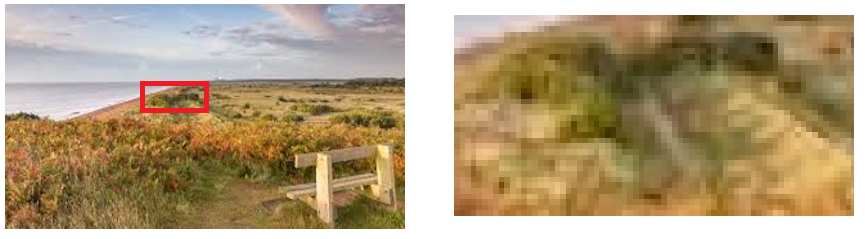
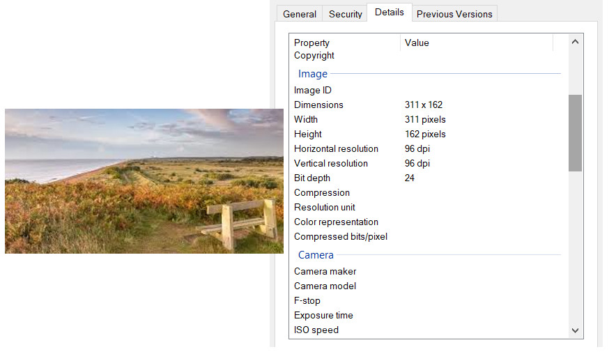

{width="100"; align=right}

# {{ title}}

> [!NOTE] The purpose of this section is to ...
> - Know how bit patterns may represent other forms of data including graphics
> - Understand the difference between analogue and digital:
>   - data
>   - signals
> - Explain how bitmaps are represented.
> - Explain the following for bitmaps:
>   - resolution
>   - colour depth
>   - size in pixels
> - Calculate storage requirements for bitmapped images and be aware that bitmap image files may also contain metadata.
> - Explain how vector graphics represents images using lists of objects. 
> - Use vector graphic primitives to create a simple vector graphic
> - Compare the vector graphics approach with the bitmapped graphics approach and understand the advantages and disadvantages of each.

---

The storing and processing of images is another important feature of computer systems.  The data for the image has to be stored as binary patterns and there are two main methods:

- bit-mapped graphics: data is stored as a grid of elements, each element representing a colour being used
- vector graphics:  individual shapes are stored as a set of instructions used to recreate the graphic

Similar concepts and terms to those considered with sound also come into play when looking at graphics and images.

## Bit-mapped graphics

The **bitmap**, as the name suggests, is a map of bits implying an underlying array structure with rows and columns.  At each intersection is a picture element, or **pixel** which is the smallest identifiable element of an image.  The pixel is the building block that builds any image, font, screen that you see.  Each pixel will have a single numeric value, this value usually represents the colour of the pixel.  If an image is opened with any image editing program on the computer and we zoom in on that image the pixels become visible as individual squares, as shown in the following image:

This occurs because the image is beng displayed with a lower dots per inch density and is known as **pixellation**.

> [!NOTE] Many of the common file formats we use for storing and representing images will use this format including .BMP, .JPG, .PNG though many will also apply sophisticated [compression](compression.md) techniques which we'll consider later.

There are two aspects of any bit-mapped image which impact the quality of that image (ignoring any compression for now):

- **Resolution**
- **Bit depth** (or **Colour Depth**)

### Image Resolution

The resolution os an image is the number of total pixels in the image, usually expressed as the number in the $x$ dimension multiplied by the number in the $y$ dimension.  For example:

- 1024 x 768
- 1200 x 1800
- 600 x 400

Multiplying these two numbers together will produce the total number of pixels in the image, or the pixel resolution. So, an image with pixel resolution of $6000 \times 4000$ means the image is $6000$ pixels wide and $4000$ pixels high.  In total, the image contains $24,000,000$ pixels or $24 \text{MP}$.  This is a fairly typical resolution used by cameras today (2022).  This is the number of pixels contained in the image and is known as the **image resolution**.

Most operating systems can display the resolution of an image as in the example above (Windows), here by right-clicking on the image and selecting the option 'Properties' from the menu.  This is a small image $311 \times 162$ pixels or $50,382$ pixels.

In the properties window above is also shown the display resolution, recorded here as $96 dpi$ where **dpi** stands for **dots per inch**.[^1]  The DPI is a print measurement indicating how many dots will fit into one inch, it's a measure of pixel density.  It's usually used for measuring the resolution of a computer screen, television or when printing the image on paper.  Simplistically one might think of the pixel resolution of the image as an input measurement, and DPI as an output measurement. So, 300 dpi means e.g. the printer will output 300 tiny dots for every inch of the print.  Any image can be displayed at any dot density.

The final *printed* size of an image depends on the DPI.  If an image has a resolution of $4500 \times 3000$ pixels the image will print at $15 \times 10$ inches at 300 DPI.  If the DPI was changed to $72$ it will use $62.5 \times 41.6$ inches.  

> [!NOTE] The print size has changed bit the image itself has not been resized, it's merely reorganised the pixels.  The same thing happens when you change the resolution of your monitor, a higher resolution is making each pixel smaller and the smaller the icons, text etc will appear.

It's important not to confuse image resolution with display resolution.

### Colour Depth

Each pixel represents a colour, each colour will be represented internally by a binary value.  The number of bits being allocated to each pixel will determine the **colour depth**, also known as the **bit depth** as it tells us how many bits have been used for that colour.

For a monochrome (2-colour) image we only need 1 bit per pixel with $0$ for black and $1$ for white (or any two colours you want to choose).  Increasing the number of bits per pixel to $2$ gives us four possible options, thus four possible colours.  Remember, $2^2 = 4$.  Thus, $8$ bits will provide $256$ possible colours.

As for all types of binary data, the general formula is that for $n$ bits you can store $2^n$ colour codes, so more bits being allocated to each pixel will yield more colours being available.

Modern displays will use a combination of red, green and blue to form the colours.  Each of these colours can be allocated 8-bits giving 24-bits in total.  This amounts to $2^{24}$ colours (16.7 million possible colours).  It is believed the human eye can only distinguish about 10 million colours so this is sufficient and is often known as **true colour**.

You will also encounter 32-bit colour depth, an extra byte being added.  This extra 8 bits is usually used as an alpha or transparency byte, frequently termed as channel, which adjusts the level of opacity for a pixel when being blended with other colours.  This makes the pixel translucent, or "see-through".

Increasing the colour depth will inevitably lead to a larger file size.

### Calculating file size for an image

There are two measurements to consider:

- resolution of the image, i.e. the number of pixels being used
- the colour depth for each pixel

It's a relatively simple calculation:

- $filesize = (\text{ number of pixels } \times \text{ bits per pixel })$

Thus, is $12$ bits are used per pixel in an image $800$ bits wide and $600$ bits tall:

- Number of pixels = $800 \times 600$ 
- Colour depth = $12$
- Total number of bits = $800 \times 600 \times 12$ = $5760000$
- Total number of bytes = $5760000 / 8$ = $720000$ bytes 

> [!NOTE] Many images will use compression to reduce the size of the file

### Image metadata

The actual size of the file saved to a disk will be higher than that calculated above. The reason being that along with the data about each individual pixel will be data about the image itself, known as the **metadata**, and usually stored in the header of a file.  The metadata includes image about the the image itself as well as information about how it was produced.  Typically this might include e.g.:

- the format of the file
- the dimensions, in pixels
- data information i.e. when created, when last modified etc
- the device used to take the image, and if camera any specific details about aperture size etc
- geographical location
- colour depth used

The properties image above showed the metadata available for that image.

## Vector graphics

Vector graphics do not store the pixel information for the image, rather they store the information about the shapes that constitute the image.  The images are then reproduced by using mathematical formulae to generate the image based on that information.

The building blocks for a vector graphic are:

- point: a single point
- line: defined by two end points
- polyline: a number of connected lines
- polygon: a shape defined by a boundary

You can also have:

- parametric curves, or arcs
- standard shapes e.g. circle, square etc

Each shape being used will have an associated collection of **properties** such as:

- colour including line colour and fill
- line weight

There are a number of advantages vector graphics have over bitmaps:

- they can be scaled without loss of quality and so no need to worry about the final resolution
- they require less space 
- they are easy to modify as each shape in the image can be edited independently of any other shape

Vector graphics store the information about where the pixels are located, when resized the picture will look the same but more pixels will be used to represent the image.  The computer's graphics card will convert the vector graphic into a bitmap for display on the screen.

The disadvantages include:

- they are not suited to real world photographic images, most cameras will use bitmaps
- there is a hit on the processing power needed to reproduce the image (depending on the image content)

Because vector graphics are so easy to work with and store they're often used for branding in advertising and marketing but are increasingly popular in web apps, animations and infographics.

### Creating SVG images

SVG (Scalable Vector Graphics) use an XML style language to describe the vector images.  It includes elements for creating shapes and more advanced features for transformation and animation.  E.g.

~~~~~svg
<svg width="400" height="200"
  version="1.1"
  baseProfile="full"
  width="300"
  height="200"
  xmlns="http://www.w3.org/2000/svg">
  <rect width="100%" height="100%" fill="#336699" />
  <circle cx="50" cy="50" r="50" fill="white" />
  <rect x="190" y="100" width="25%" height="40%" fill="#010101" />
  <polygon points="120,0 140,125 40,225" fill="red"/>
  <text x="230" y="160" font-family="Verdana" font-size="35"
          fill="white" stroke="white" stroke-width="1">
            Hello!
</svg>
~~~~~

<svg width="400" height="200"
  version="1.1"
  baseProfile="full"
  width="300"
  height="200"
  xmlns="http://www.w3.org/2000/svg">
  <rect width="100%" height="100%" fill="#336699" />
  <circle cx="50" cy="50" r="50" fill="white" />
  <rect x="190" y="100" width="25%" height="40%" fill="#010101" />
  <polygon points="120,0 140,125 40,225" fill="red"/>
  <text x="230" y="160" font-family="Verdana" font-size="35"
          fill="white" stroke="white" stroke-width="1">
            Hello!
</svg>

While this may be possible to describe the image this way, in practice, it is much easier to user a vector graphics package (e.g Inkscape) to create the image as the code can get complicated pretty quickly.

## Compression

Image files can get very large very quickly and transmitting them across the network requires a lot of bandwidth so images are usually compressed i.e. made smaller.  This [next section](compression.md) looks at two compression techniques:  lossy and lossless compression.

## Graphics Programming with C\#

There are many ways of tackling graphics with C\# and a host of third-party libraries to help, they boil down to a **Graphics Object** which handles most of the complexity of different display devices and screen resolutions leaving the developer to focus on the code to get the right image.  All we need to do is create the Graphics Object and then tell that object what to draw and where to place the drawing.

The start point, using a Windows Forms Project, is to create this object in the `Paint()` method of the form. 

> [!NOTE] The Graphics class is in the `System.Drawing` library so this needs to be added with a `using` statement in the program header if not already included. This method handles all the drawing required for a Windows form and is triggered whenever the form needs to be redrawn:

There are a collection of built-in classes in the library, one of which is the `Pen` required for any drawing on the form.  The pen must be created with either a colour and/or width specified but once this has been created we can set other properties of the pen such as the `DashStyle`.  Then we can draw a line with the pen calling the `DrawLine()` method as in the following code:

~~~~~cs
private void frmMain_Paint(object sender, PaintEventArgs e)
{
    // Create an instance of the Graphics Object
    Graphics graphicsObj;
    graphicsObj = this.CreateGraphics();

    // Create a Pen for drawing
    Pen myPen = new Pen(Color.Red, 10);
    // Draw a line
    graphicsObj.DrawLine(myPen, 10, 10, 10, 200);
}
~~~~~

To draw a shape, such as a rectangle, we can either:

- call `DrawRectangle(pen, x, y, width, height)`
- or create a rectangle object and then asked the Graphics Object to draw it i.e. 

~~~~~cs
Rectangle myRectangle = new Rectangle(100,100,200,50);
graphicsObj.DrawRectangle(myPen, myRectangle);
~~~~~

To draw a circle requires that circle to be drawn within a bounding box of a rectangle:

~~~~~cs
Rectangle myRectangle = new Rectangle(100,100,200,50);
//graphicsObj.DrawRectangle(myPen, myRectangle);
graphicsObj.DrawEllipse(myPen, myRectangle);
~~~~~

Finally, we can draw text onto the form.  For this we need:

- the string of text to display
- the font to use
- a brush object (similar to pen for drawing shapes and lines but provides a fill pattern)
- a location to start drawing

~~~~~cs
Brush myBrush = new SolidBrush(Color.Red);
Font myFont = new Font("Segoe UI", 40);
graphicsObj.DrawString("Simple Graphics", myFont, myBrush, 150, 150);
~~~~~

This has only provided a very small scratch on the very large surface of graphics programming with C\# there are a whole host of additional techniques but before leaving it is quite easy to build on the code above to get the user to interact with the drawing and get them to draw the lines for the image.  For this we need to capture mouse events, the location of the mouse and a boolean for whether drawing is to be made or not:

~~~~~cs
bool d;
int startX, startY;

private void frmMain_MouseUp(object sender, MouseEventArgs e)
{
    d = false;
}

private void frmMain_MouseDown(object sender, MouseEventArgs e)
{
    d = true;
    startX = e.X;
    startY = e.Y;
}

private void frmMain_MouseMove(object sender, MouseEventArgs e)
{
    Graphics g = this.CreateGraphics();
    Pen p = new Pen(Color.Black, 4);
    Point x = new Point(startX, startY);
    Point y = new Point(e.X, e.Y);
    if (d)
    {
        g.DrawLine(p, x, y);
        startX = e.X;
        startY = e.Y;
    }
}
~~~~~

> [!NOTE] If you minimise the form when the application is running, and then open it again the drawing made by the user has disappeared.  It is not persistent, can you find out why this is happening and how to correct this behaviour?

## Questions

1.	Explain, with reasons, which would be better- vector graphics or bitmap graphics- for the following situations:
        a)	Creating a design for a new house
        b)	Taking photographs
        c)	Creating graphics for a website
        d)	Creating CGI (Computer-generated Imagery) for a film
2.	An image of size 640 X 480 pixels is to be printed at 300 pixels per inch. What will be the size of the printed image in inches to one decimal place? 
3.	The size of a photographic print printed at 300 ppi is 4.2 x 3.2 inches. What was the size in pixels of the digital image that was printed?
4.	A bitmap image is produced by scanning a 35mm film slide (0.94 inches by 1.42 inches) with a scanner designed for this purpose. A print of size 9.4 X 14.2 inches is to be made of the bitmapped image on a printer that prints at 300 pixels per inch, i.e. photographic quality.
        a)	How many pixels are printed in a 9.4 inch wide row?
        b)	If the scanning resolution is n samples per inch, how many samples, in terms of n, would be taken in a scan of one row across the film slide (0.94 inches)?
        c)	What must the minimum value of the scanning resolution be in samples per inch to produce a print of acceptable quality?
        d)	 Using your answer to part (c), what is the size of the bitmap in pixels produced by the scanner? 
        Express your answer in the form of number of pixel columns (width) by the number of pixel rows (height). Both numbers are integers.
5.	List three items of metadata that might be stored in an image file.

---

[^1]: The density of pixels in a monitor is measured in dots per inch (DPI) but since it refers to the number of dots that are within a line of one inch of scan, they were discontinued in favor of PPI (pixels per inch). While PPI is the correct term to refer to monitors, the two are often used interchangeably.