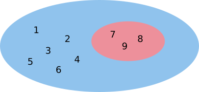
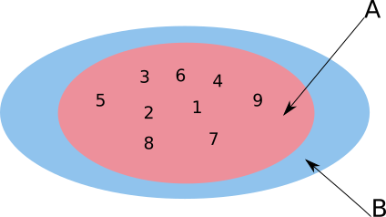
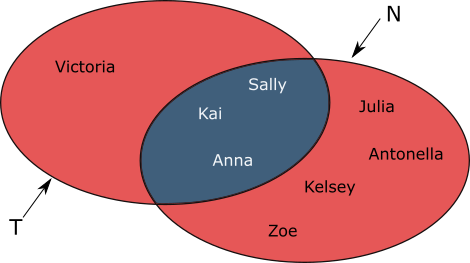
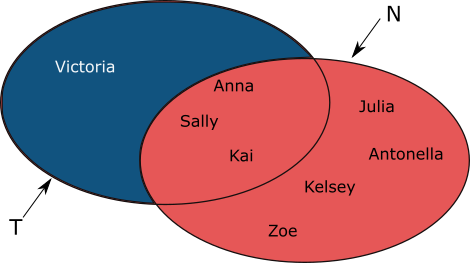

{width="100"; align=right}

# {{ title}}


> [!NOTE] The purpose of this section is to ...
> - Definition of a set
> - Set Membership
> - Important sets of numbers: Natural numbers, Integers, Rational numbers, Reals and the empty set
> - Set Comprehensions
> - Relationships between sets: Equal, Equivalence, Subsets
> - Operations on sets e.g. Union, Difference, Intersection

---

## Definition

First up, a definition:

> A set is a well defined [unordered] collection of distinct objects, considered as an object in its own right [Wikipedia][^1]

Think of a set as being a container.  Into that container we can put objects which are usually referred to as **elements**.  To denote a set we use the name of the set, followed by an equals sign and then the elements of the set are contained between a pair of curly brackets (braces). For example: 

- $Weekdays = \{Monday, Tuesday, Wednesday, Thursday, Friday\}$, 
- $PrimaryColours = \{red, green, blue\}$

In the first example, the name of the set is $Weekdays$ and the elements are:
- $Monday, Tuesday, Wednesday, Thursday, Friday$. 

$Tuesday$ is an element of the set $Weekdays$; green is an element of the set $PrimaryColours$.

The set of weekdays has five elements, the set of primary colours has three elements.  In both cases there is a _finite_ number of elements and they are small enough to be written as above. 

When defining a set it has to be clear what is _in_ the set, and, by inference, what might be outside of the set.  That is, the set must be _well-defined_.  

For example: the number $6$ is a distinct value, it is in the set of set of even numbers (defined as those numbers that can be divided by $2$ leaving a remainder of $0$), but it could also be an element of the set of the factors of $12$ : $\{1, 2, 3, 4, 6, 12\}$.

There are two ways we might choose to define the set:

1. textual description:
   - "prime numbers less than 100"
   - "all students taking Computer Science and Music A Levels"
   - "the plays of William Shakespeare"
   - etc ..

2. list the members of the set, using curly brackets:
    - $\{1, 2, 3\}$
    - $\{1, 2, 3, 4, ..., 100\}$    
    - $\{1, 2, 3, ...\}$ 

> [!NOTE]
> The dots (ellipsis) above imply a range of values, thus all the whole numbers between and including 1 and 100, or in the second case to infinity.  This works in the opposite direction: $\{...,-3, -2, -1\}$ defines a set of all the negative numbers.

## Set membership

In the previous examples: $7$ __is a member of__ the set of prime numbers less than $100$, and "Romeo and Juliet" is a member of the set of plays written by William Shakespeare.

This relationship is denoted using the symbol: $\in$.

> [!TIP]
> The symbol is not unlike an __E__, to remember think of ".. is an Element of .."

Thus:

- apple $\in \{fruits\}$  (apple is an element of the set of fruits)
- $12 \in \{2, 4, 6, ..., 100\}$ (12 is an element of the set of positive even numbers <= 100)

Similarly, an object can be defined as not being a member of a set using the symbol: $\notin$.

Thus:

- $11 \notin \{2, 4, 6, ..., 100\}$ (11 is not an element of the set of positive even numbers <= 100)

Our definition described a set as a "well defined collection of __distinct__ objects".  Therefore, elements of a set are distinct, that is, they are not repeated, so the following two sets are identical:

$S = \{1, 2, 3, 6, 8, 8, 9\}$ is equivalent to $S = \{1, 2, 3, 6, 8, 9\}$

Further, it does not matter in which order the elements of a set are written.  Therefore the following sets are equivalent:

$S = \{a, b, c\}$ and  $S = \{b, c, a\}$ and $S = \{c, b, a\}$

Finally, sets can contain other sets as elements, here the set $S$ has two elements:

$S = \{\{a b, c\}\{d, e, f\}\}$

## Some important sets

There are some important sets of numbers that hold mathematical importance and are used so often they have been given special names and notation to define them:

- Natural numbers ($\mathbb{N}$)
- Integers ($\mathbb{Z}$)
- Real numbers ($\mathbb{R}$)
- Rational numbers  ($\mathbb{Q}$)
- Empty Set ($\emptyset$ or $\{\}$)

These sets are also regarded as **Universal sets**.  So, we may have two sets, $A$ and $B$, that each contain some of the natural numbers.  The Universal set of natural numbers contains all those other natural numbers that are not elements of either $A$ or $B$.

### Natural Numbers 

The set of numbers used for __counting__ and __ordering__.  They are in the set of __positive integers__: $\{1, 2, 3, 4, ...\}$ or in the set of __non-negative integers__ which includes zero: $\{0, 1, 2, 3, 4, ...\}$ which is the form adopted by the exam board.  This latter set is also known as __whole numbers__.

The set of natural numbers is denoted by the symbol $\mathbb{N}$.

### Integers 

The set of integers is whole numbers, positive and negative.

The set of whole numbers is denoted by the symbol $\mathbb{Z}$.

Though not specifically required by the syllabus be aware that the integers are made up of a number of **subsets**:

- __positive integers__:  $\{1, 2, 3, 4, ...\}$
- __non-negative integers__: $\{0, 1, 2, 3, 4, ...\}$
- __non-positive integers__: $\{0, -1, -2, -3, -4, ...\}$
- __negative integers__: $\{-1, -2, -3, -4, ...\}$

### Real numbers 

The set of rational and irrational numbers is called __real numbers__.  Nearly any number one can think of will be a real number.  A couple of notable exceptions are $\sqrt{-1}$ and infinity ($\infty$).  It's not easy to represent the set of Real numbers.

Real numbers are denoted by the symbol $\mathbb{R}$.

### Rational numbers 

A rational number can be expressed as a fraction, $x/y$, where $x$ and $y$ are integers and $y \ne 0$.  Further, $x$ is called the __numerator__, and $y$ the __denominator__ which, of course, should be familiar from GCSE Maths.

All integers are members of the set of rational numbers, because $y$ can be $1$.

Rational numbers are denoted by the symbol $\mathbb{Q}$.

Numbers that are not rational, i.e. cannot be expressed as a fraction, are called __irrational numbers__.  When a rational number is converted into decimal it either ends after a finite number of digits or it repeats a sequence of digits over and over.  Irrational numbers will continue without repeating.  Examples of irrational numbers include: $\sqrt{2}$, $\pi$.


### The Empty Set 

This is the set that contains no elements.  It is sometimes called the **null set**.

Remember a set is a collection of items or objects which are put into the set, in the case of the empty set there are no items in the set!  For example, $\{7\}$ is the set with the number $7$ as an element, it's not the number $7$.  The $7$ and the set $\{7\}$ are different entities.  In the same way $\{\}$ is not nothing, it a set with no elements.  The empty set is a subset (see below) of any set.

The empty set is usually denoted by the symbol $\emptyset$, but also by $\{\}$.

> [!NOTE] The two sets $\{\emptyset\}$ and $\emptyset$ should not be confused.  The first is a set with one element, the empty set; the second is just the empty set.  They are different because they have different elements.


## Set comprehensions

There is a convenient notation for building sets used in many programming environments.  Sometimes called __set comprehension__ but more usefully __set-builder notation__.  For small sets, where the elements can be listed (or enumerated) it is not needed but it becomes a convenient shorthand when the sets are large e.g. the set of all natural numbers less than one billion and divisible by $2$ and $5$!

For example, the set $S = \{0, 1, 2, 3\}$ can be defined using set builder notation as:

- $S = \{ x | x >=0  \text{ and }  x < 4\}$

The vertical bar, the 'pipe' symbol should be read as "such that" so: "$S$ is the set of all elements $x$ _such that_ $x$ is greater than or equal to $0$ and is less than $4$.

The diagram illustrates the various components of the set builder notation:

[IMAGE MISSING]
<!--  -->

What are the members of the set defined by the expression: $S = \{2x | x \in \mathbb{N}\}$} ?

The advantage of this notation is that it scales very easily e.g. changing the $4$ to, say, 100 results in a different set:

- $S = \{ x | x >=0  \text{ and }  x < 100\}$

This notation also allows for filters, think of them as 'if' statements, e.g.:

- $S = \{x | x \in \mathbb{N}, x < 4\}$

Here, we've defined our set as "$S$ is the set of all elements $x$ such that $x$ is an element of natural numbers if (or where) $x$ is less than $4$"


## Relationships between sets

A number of relationships can be defined when comparing one set with another:

- Equal ($=$), and Not Equal ($\neq$)
- Equivalence ($\equiv$)
- Subset ($\subseteq$)
- Proper Subset ($\subset$)

### Equal  and Not Equal 

Two sets are equal if, and only if, they have __exactly__ the same members/elements.  This can be expressed formally for sets $A$ and $B$ as:

For all $a \in A$, then $a \in B$, and for all $b \in B$, then $b \in A$.

So, the following sets are equal:

- $\{1, 2, 3\} = \{1, 2, 3\}$
- $\{2, 3, 5\} = \{\text{ prime numbers less than 6 }\}$
- $\{1, 2, 3\} = \{3, 2, 1\}$
- $\{January, March, April\} = \{March, January, April\}$
- $\{x | x \in \mathbb{N}, x < 0\} = \emptyset$

If set $A = \{1, 3, 7\}$ and set $B = \{3, 7, 1\}$, then $A = B$.

Inequality between sets is denoted by the symbol $\neq$.

So, the following sets are not equal ($\neq$) with each other:

- $\{1, 2, 3\} \neq \{0, 1, 2\}$
- $\{0, 1, 2, 3\} \neq \{x | x \in \mathbb{N}, x < 4\}$

### Equivalence 

If one can pair each element of one set with each element of the second set they are said to be **equivalent**, that is, they have the _same number_ of elements.

For example:

$A = \{A, B, C\}$ is equivalent to $B = \{January, March, April\}$

The sets do not have to contain the same elements, just the same number of elements.

Equivalence is denoted by $\equiv$.

### Subset 

Set $A$ is a __subset__ of a set $B$ if, and only if, every element of $A$ is in $B$.  Formally this can be expressed as, for all $a \in A$, then $a \in B$.

The subset relationship is denoted using the symbol $\subseteq$.  Think of this as being similar to $<=$. 

> [!NOTE] Any set is a subset of itself (**but** see proper subsets below)

Thus:

- $\{1, 2, 3\} \subseteq$ of the natural numbers
- $\{1, 2, 3\} \subseteq \mathbb{N}$
- $\{dogs\} \subseteq \{mammals\}$

And, significantly:

- $\mathbb{N} \subseteq \mathbb{Z} \subseteq \mathbb{Q} \subseteq \mathbb{R}$

> [!NOTE] Is $\{1, 2, 3\} \subseteq \{1, 2, 3\}$?

### Proper subset 

Set $A$ is a __proper subset__ of a set $B$ if, and only if, every element of $A$ is in $B$ and there is at least one element of $B$ that is not in $A$.

The proper subset relationship is denoted by the symbol $\subset$.

For example:

- $A = \{1,2,3,4,5\}$
- $B = \{2,3,4\}$
- Thus, $B \subset A$ 

Thus:

- $\{1, 2, 3\} \subset \mathbb{N}$
- $\{1, 2, 3\} \not\subset \{1, 2, 3\}$ ($\not\subset$ = "not a proper subset of")

> [!NOTE] A set is not a proper subset of itself.

## Venn diagrams

In addition to the formal definitions and use of symbolic notation it can be helpful to express sets and their relationships visually.  This is done using __Venn diagrams__ and should be familiar from primary school (if not secondary school) Maths.  An ellipse is drawn to represent a set and the elements of the set are written inside.  Relationships between the sets are shown by the set ellipses overlapping, or not.

For example: 

- $\{7, 8, 9\} \subset \{1, 2, 3, 4, 5, 6, 7, 8, 9\}$



- $A \subseteq B$



> [!NOTE] $A$ is a subset of $B$, but __not__ a proper subset.

## Operations on sets

New sets can be built by applying operators to existing sets.  This section looks at those operations where they are described formally and through the use of Venn diagrams.  They are:

- Union ($\cup$)
- Intersection ($\cap$)
- Difference or Complement ($-$)

### Union 

Two sets can be added together using the __union__ operator.  The union of two sets $A$ and $B$ is the set of elements in $A or B$.

Union is denoted by the symbol: $\cup$.

For example: if $A = \{1, 2, 3\}$ and $B = \{4, 5, 6\}$ then:

- $A \cup B = \{1, 2, 3, 4, 5, 6\}$

Also:

- $\{1, 2\} \cup \{1, 2\} = \{1, 2\}$

Taking a specific example: set $T$ contains students who pay Tennis for the college: 

- $T = \{Anna, Sally, Kai, Victoria\}$ 

Another set, $N$, contains students who play Netball: 

- $N = \{Julia, Antonella, Kai, Sally, Kelsey, Zoe, Anna\}$.  

The __union__ of these two teams who are planning a night out together, will have 8 members: 

- $T \cup N = \{Anna, Sally, Kai, Victoria, Julia, Antonella, Kelsey, Zoe\}$.


> [!NOTE] $T \cup N$ is the entire shaded area.

### Intersection 

The __intersection__ of two or more sets is the set of all elements which are common in _all_ of the sets i.e. $A and B$.

Intersection is denoted by the symbol: $\cap$.

For example: if $A = \{1, 2, 3\}$ and $B = \{2, 3, 4, 5, 6\}$ then $A \cap B = \{2, 3\}$

Using our previous example of sports students: $T \cap N = \{Anna, Sally, Kai\}$



> [!NOTE] Union and Intersection are similar to the AND and OR used in boolean logic.  For example, the union of $A$ and $B$ can be described as the set of elements that are in $A OR B$.  Similarly, the intersection of $A$ and $B$ can be described as the set of elements that are contained in both $A AND B$.

### Difference

The **difference** denotes those elements in $A$ that are not included in $B$.  This is sometimes known as the relative complement.


We can subtract two sets, known as the **complement** or **difference**.  The difference between two sets will be the set of elements which are in the first set but not in the second i.e. $A - B$.

Difference is denoted by the symbol: $-$.

For example, if $A = \{1, 2, 3, 4, 5\}$ and $B = \{3, 4, 5, 6\}$ then $A - B = \{1, 2\}$.  These are the elements that are in set $A$ but not in set $B$.

For our sports students example: $T - N = \{Victoria\}$.  Victoria is the only student who only plays in the tennis team and not in the netball team.



> [!NOTE] $\{1, 2\} - \{1, 2\} = \emptyset$

# Sets and Types

The word _type_ is often used synonymously with that of _set_, while not required the elements of a set will often be of the same type and the elements in such a set will be drawn from the _universe_ of values.  For example, the set of _booleans_ is $\{true, false\}$, when declaring a variable to be of type _bool_ is saying the value in that type will be drawn from this universal set.

Of course, the word "type" will have been encountered in programming classes e.g. "data type".  As above we declare a variable to be a ```boolean``` meaning its value will be drawn from the set of booleans, $\{true, false\}$.  The same is true when we declare a variable as an ```int```, its value will be drawn from the set of integers.

---

# Questions

1. Write the following facts in set notation:
   
    a. A sheep is a member of the set of animals
    
    b. A carrot is not a member of the set of fruits
    
    c. 42 is a member of the set of integers
    
    d. is not a member of the set of rational numbers
    
    e. There are no pink giraffes
    
2. True or false?
    
    a. '5' $\in \{alphanumeric characters\}$
    
    b. $3 \in \{2, 4, 6\}$
    
    c. $5 \notin \{1, ..., 10\}$
    
    d. $-6 \in \mathbb{N}$
       
    e. $\emptyset \in \{\emptyset\}$
     
3. Assuming the following set:  $S = \{6, \sqrt{2}, 3/4, -1.5, -9, 11, \sqrt{16}, \pi \}$, use set notation $\{...\}$ to write out the following sets:
    
    a. natural numbers in $S$
    
    b. integers in $S$
     
    c. rational numbers in $S$
    
    d. irrational numbers in $S$
      
    e. positive integers greater than $20$ in $S$
      
4. List the members of the following sets, defined using set comprehensions:
    
    a. $\{x | x \in \mathbb{N} \land x < 5\}$
    
    b. $\{x | x \in \mathbb{Z} \land x < 2 \land x > -2\}$
    
    c. $\{x | x \in \mathbb{N} \land x > 3\}$
    
    d. $\{2x | x \in \mathbb{N} \land x < 4\}$
    
    e. $\{2x + 1 | x \in \mathbb{N} \land x < 10\}$
    
5. Use set builder notation (set comprehension) to describe the following sets:

    a. $\{2, 3, 4, 5\}$

    b. The set of odd integers

    c. The set of real numbers between $3$ and $42$ inclusive
    
    d. The set of natural numbers which are perfect squares
    
    e. The set of integers which are square roots of $49$ 

6. True or False?
    
    a. $\{1, 2, 3\} = \{2, 3, 1\}$
       
    b. $\{a, b, c\} \subseteq \{a, b, c\}$
    
    c. $\{2, 3, 1\} \subset \{1, 2, 3\}$
    
    d. $\mathbb{N} \subset \mathbb{R}$
    
    e. $\emptyset \subset \{1, 2, 3\}$

7. Given the following sets:
- $U = \{a, b, c, d, e, f, g, h\}$, 
- $P = \{c, f\}$, 
- $Q = \{a, c, d, e, f, h\}$, 
- $R = \{c, d, h\}$

    a. Draw a Venn diagram llustrating these sets, with no empty regions
    
    b. Which of the sets $P$, $Q$ and $R$ are proper subsets of the others?  Write your answer(s) using the $\subset$ symbol.
     
8.Given the following sets:
  - $U = \{1, 2, 3, 4, 5, 6, 7, 8, 9, 10\}$, 
  - $A = \{1, 3, 6, 7, 8\}$, 
  - $B = \{1, 3, 6, 7, 8\}$, 
  - $C = \{3, 7\}$
   

    a. Illustrate the sets $U$, $A$, $B$ and $C$ in a Venn diagram, with no empty regions
    
    b. Using the Venn diagram from (a), list the elements in each of the following sets:
    
    i. $A \cap B$ 
    
    ii. $A \cup C$
    
    iii. $B \cup A$ 
    
    iv. $B \cap C$ 
    
    v. $A - B$    

---

[^1]: [https://en.wikipedia.org/wiki/Set_(mathematics)](https://en.wikipedia.org/wiki/Set_(mathematics))
