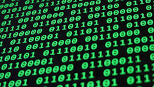
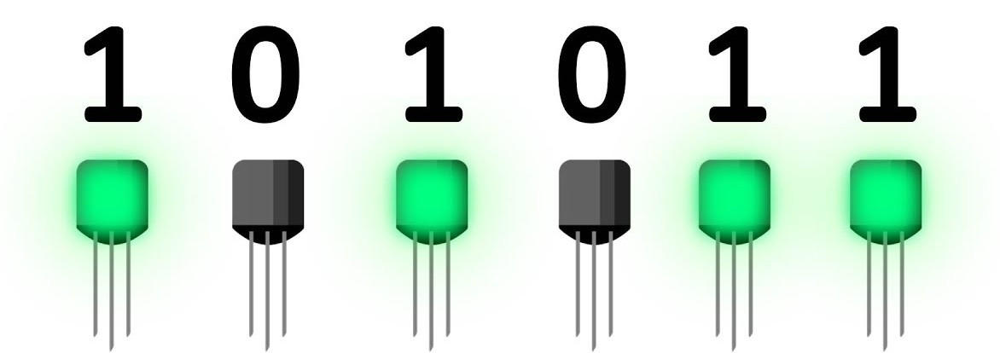
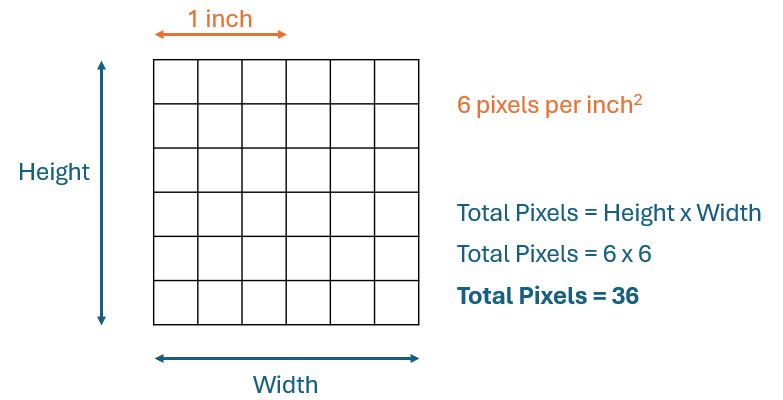
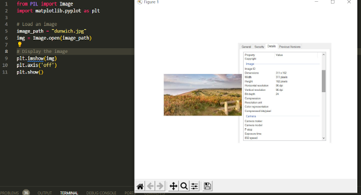
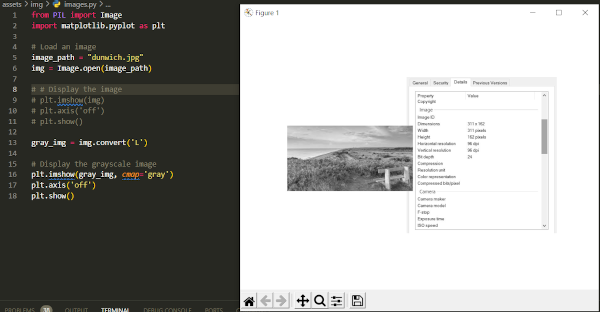
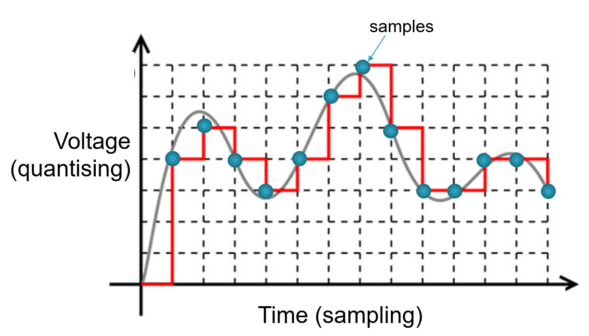
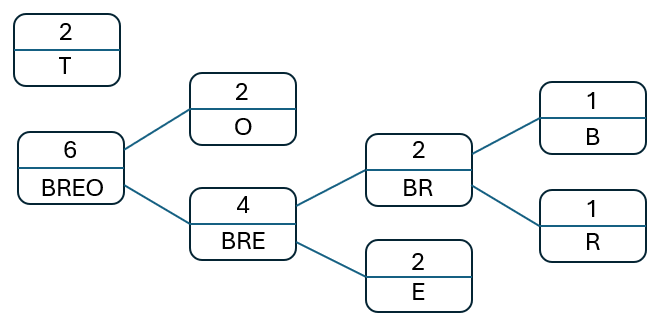
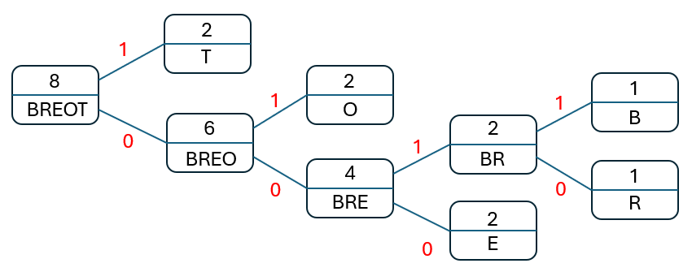

# Representation of Data



---

# Contents

- [Number Systems](#number-systems)
- [Units](#units)
- [Binary Arithmetic](#binary-arithmetic)
- [Hexadecimal](#hexadecimal)
- [Negative Numbers](#negative-numbers)
- [Character Encoding](#character-encoding)
- [Images](#images)
- [Sound](#sound)
- [Compression](#compression)

---
<!-- _class: invert -->

# Number Systems

---


# Objectives

  - Describe the binary number system (Base-2)
  - Convert between decimal (denary) and binary number bases (Base-10 and Base-2)

---

# Binary Number System



- a computer is built of lots of transistors - a type of semiconductor.  
- They act like a switch either allowing a voltage to pass through or not.  
- They can be in two **states** which can be represented by the digits $0$ and $1$ (or `True` and `False`).  
- This aligns neatly with a number system, the number base we call **binary** or base 2.

---

# Counting in Binary

<div class="columns">
<div>

| Decimal | Binary  |
|:------: |:------: |
|    0    | 0       |
|    1    | 1       |
|    2    | 10      |
|    3    | 11      |
|    4    | 100     |
|    5    | 101     |

</div>

<div>

- To count to $5$, but only have the digits $0$ and $1$
- How have those binary numbers been arrived at?

</div>

</div> 


---

# Decimal System (Base-10)

<div class="columns">
<div>

| Hundreds |   Tens   |  Units   |
| :------: | :------: | :------: |
| $10^2$ | $10^1$ | $10^0$ |
|  **2**   |  **4**   |  **5**   |

</div>

<div>

- Base 10 uses powers of 10 for each column
- So, we have:
  - $(2 \times 100) + (4 \times 10) + (5 \times 1)$
  - $= 245$


</div>
</div>

---

# Binary System (Base-2)

<div class="columns">
<div>

| 16      |    8    |    4    |    2    |    1    |
| :-----: | :-----: | :-----: | :-----: | :-----: |
| $2^4$   | $2^3$   | $2^2$   | $2^1$   | $2^0$   |
|         |         |  **1**  |  **0**  |  **1**  |

</div>

<div>

- Base 2 uses powers of 2 for each column
- So, we have:
  - $(1 \times 4) + (1 \times 1)$
  - $= 5$
 
</div>
</div>

---

# Converting Decimal to Binary (Method 1)

<div class="columns">
<div>

|   128   |   64    |   32    |   16    |    8    |    4    |    2    |    1    |
| :-----: | :-----: | :-----: | :-----: | :-----: | :-----: | :-----: | :-----: |
| $2^7$ | $2^6$ | $2^5$ | $2^4$ | $2^3$ | $2^2$ | $2^1$ | $2^0$ |
|  **1**  |  **1**  |  **1**  |  **1**  |  **0**  |  **1**  |  **0**  |  **1**  |

</div>
<div>

- Add the column headings (powers of 2)
- Sum the column headings where there is a $1$ 
- ($128 + 64 + 32 + 16 + 4 + 1$) 
- $= 245$.

</div>
</div>

---

# Converting Decimal to Binary (Method 2)

<div class="columns">
<div>

| Quotient | New Number | Remainder |
| :------: | :--------: | :-------: |
|  245/2   |    122     |   **1**   |
|  122/2   |     61     |   **0**   |
|   61/2   |     30     |   **1**   |
|   30/2   |     15     |   **0**   |
|   15/2   |     7      |   **1**   |
|   7/2    |     3      |   **1**   |
|   3/2    |     1      |   **1**   |
|   1/2    |     0      |   **1**   |

</div>

<div>

- Repeated division by 2 (the base)
- Take the decimal number and repeatedly divide by 2
- Write down the remainder
- Stop when zero is reached
- Read the result upwards to get the binary value

</div>
</div>


---

# Converting Binary to Decimal (Method 1)

<div class="columns">
<div>

$2 \times 0 + 1 = 1$  
$2 \times 1 + 1 = 3$  
$2 \times 3 + 1 = 7$  
$2 \times 7 + 1 = 15$  
$2 \times 15 + 0 = 30$  
$2 \times 30 + 1 = 61$  
$2 \times 61 + 0 = 122$  
$2 \times 122 + 1 = 245$ 

</div>
<div>

Taking the binary number $11110101$

- Multiply current total by 2
- Add the current digit 
- Continue until there are no more digits left.  

</div>
</div>


---

# Converting Binary to Decimal (Method 2)

Taking the binary number $11110101$

- Use the positional notation, multiply each digit by the corresponding power of two and sum these products:

$(1 \times 128) + (1 \times 64) + (1 \times 32) + (1 \times 16) + (1 \times 4) + (1 \times 1) = 245$  

---

# Convert Binary to Decimal (Method 2)

```python
binary_string = "11110101"
decimal = 0
power = 128  # Start with the highest power for an 8-bit number (2^7)

# Loop through the binary string from left to right
for bit in binary_string:
    decimal += int(bit) * power
    power //= 2  # Integer division to reduce the power by half

print(f"The decimal equivalent of {binary_string} is {decimal}")
```

- The power starts at 128 ($2^7$) and is halved after each iteration using `power //= 2`.
- Loop through the string from left to right, processing each bit in order
- Each bit's value is multiplied by the corresponding power of 2 and added to the decimal result.

---

# Summary & Recap

  - What is binary and why computers use it
  - Converting between decimal and binary (two methods for each)

---
<!-- _class: invert -->

# Units

---

# Objectives

  - Understand what bits and bytes are.
  - Explain MSB (Most Significant Bit) and LSB (Least Significant Bit).
  - Determine if a binary number is odd or even.
  - Calculate the range of values for a given number of bits.
  - Identify common names for multiples of bytes.

---

# Bits and Bytes

  - A **bit** is the smallest unit of data, either 0 or 1.
  - A **byte** is a group of 8 bits.
  - One byte is often enough to store a single character.
  
---

# Most Significant Bit (MSB) and Least Significant Bit (LSB)

- **Most Significant Bit (MSB)**:
  - Leftmost bit in a binary number.
  - Holds the highest value (e.g., 2^7 in an 8-bit binary number).
- **Least Significant Bit (LSB)**:
  - Rightmost bit in a binary number.
  - Holds the lowest value (e.g., 2^0 in an 8-bit binary number).

---

# Binary Example: MSB and LSB

<div class="columns">
<div>

| $2^7$ | $2^6$ | $2^5$ | $2^4$ | $2^3$ | $2^2$ | $2^1$ | $2^0$ |
|:-----:|:-----:|:-----:|:-----:|:-----:|:-----:|:-----:|:-----:|
|  1    |  0    | 1     | 1     | 0     | 0     |  1    | 0     |
| MSB   |       |       |       |       |       |       | LSB   |
  
</div>

<div>

- The leftmost bit is the MSB 
- The rightmost bit is the LSB.

</div>


---

# Identifying Odd or Even Binary Numbers

- The LSB determines whether a number is odd or even:
  - LSB = 1 → odd number.
  - LSB = 0 → even number.

- **Examples**:
  - $00000101_2$ → odd.
  - $01010100_2$ → even.

---

# Range of Values for Bits

- 1 bit → 2 distinct values (0, 1).
- 2 bits → 4 distinct values (0 to 3).
- 3 bits → 8 distinct values (0 to 7).
- 1 byte (8 bits) → 256 distinct values (0 to 255).

- **Formula**: 
  - Number of values = $2^n$, where $n$ is the number of bits.
  - Maximum value = $2^{n-1}$

---

# Byte Multiples

**Table of Common Units**:

  | Unit           | Equivalent (Bytes)         |
  |----------------|:--------------------------:|
  | 1 Kilobyte (KB)| 1,024                      |
  | 1 Megabyte (MB)| 1,048,576                  |
  | 1 Gigabyte (GB)| 1,073,741,824              |
  | 1 Terabyte (TB)| 1,099,511,627,776          |
  | 1 Petabyte (PB)| 1,125,899,906,842,624      |
  
---

# Nibble and Word

- **Nibble**: 4 bits (half a byte).
- **Word**: The amount of data a processor can handle, typically 32 or 64 bits.

- **Real-world Context**:
  - 1 TB = the amount of information in a large library.
  - 1 PB = a stack of CDs a mile high!

---
# Binary Multiples (IEC Standard)

- **IEC Standard Table**:
  | Unit        | Short form | Magnitude     |
  |-------------|:----------:|---------------|
  | Kibibyte    | KiB        | $2^{10}$  |
  | Mebibyte    | MiB        | $2^{20}$  |
  | Gibibyte    | GiB        | $2^{30}$  |
  | Tebibyte    | TiB        | $2^{40}$  |
  | Pebibyte    | PiB        | $2^{50}$  |

- **Note**: These terms have been slow to adopt but are technically more accurate.

---

# Storage Terminology: Decimal vs. Binary

How big is your 500Gb hard drive?  It depends ...

<div class="columns">
<div>

**Decimal (Gigabyte - GB)**:

- Hard drive manufacturers use **decimal** to measure storage.
- 1 GB = $10^9$ bytes = 1,000,000,000 bytes.
- So, a **500GB** hard drive is advertised as having:
 $500,000,000,000 \, \text{bytes}$

</div>

<div>

**Binary (Gibibyte - GiB)**:

- Operating systems like Windows use **binary** to calculate storage.
- 1 GiB = $2^{30}$ bytes = 1,073,741,824 bytes.
- To convert 500GB into **Gibibytes (GiB)**, we divide by $2^{30}$:
 $
 \frac{500,000,000,000}{1,073,741,824} \approx 465.66 \, \text{GiB}.
 $

</div>
</div>

---

# Challenge Question

- Can you find out the names of even bigger byte multiples?
- How big is a **Zoogolplex**?

---
<!-- _class: invert -->

# Binary Arithmetic

---

# Objectives

- Learn to add two binary numbers
- Understand how binary shift operators perform multiplication and division by powers of 2
- Use binary shift operators `>>` and `<<`

---

## Introduction to Binary Arithmetic

- All computer data is processed in binary (Base-2).
- Computers use transistors to represent two states:  
  - **0** = no charge
  - **1** = charge
- All arithmetic operations (add, subtract, multiply, divide) must be performed using binary.

---

## Binary Addition Rules

- Binary addition is similar to decimal addition.
- Only four possible outcomes for adding two binary digits:

  | Operation        | Result            |
  | ---------------- | :---------------: |
  | 0 + 0            | 0                 |
  | 0 + 1 or 1 + 0   | 1                 |
  | 1 + 1            | 0 (carry 1)       |
  
---

## Addition with Carry

- Four possible rules with carry:

  | Operation                | Result            |
  | -------------------------| :---------------: |
  | 0 + 0 + carry 1          | 1                 |
  | 0 + 1 + carry 1          | 0 (carry 1)       |
  | 1 + 1 + carry 0 or 1     | 1 (carry 1)       |
  | 1 + 1 + carry 1          | 0 (carry 1)       |

---

## Example of Binary Addition
- Example:  
  Add $01101110_2$ and $00011100_2$
  
  ```
  01101110
  00011100 +
  --------
  10001010
  --------
   1111
  ```

---

## Overflow Error

- An **Overflow Error** occurs when the result exceeds the available bits.
- Example (8-bit addition):  
  
  $254 + 2 = 256_{10}$, which exceeds 8 bits:

  ```
  11111110 +
  00000010 =
  --------
  00000000 (overflow)
  ```

---

## Binary Multiplication by Shifting

- **Multiplication by powers of 2** uses left shifts (`<<`).
  - Shift left by 1 bit = multiply by 2.
  - Shift left by 2 bits = multiply by 4.

- Example:

    - $00000101_2$ << $1$ $\rightarrow$ $00001010_2$
    - Equivalent to: $5 \times 2 = 10$
  
---

## Binary Division by Shifting

- **Division by powers of 2** uses right shifts (`>>`).
  - Shift right by 1 bit = divide by 2.
  - Shift right by 2 bits = divide by 4.

- Example:

    - $00010100_2$ >> $1$ $\rightarrow 00001010_2$
    - Equivalent to $20 \div 2 = 10$
  
---

## Errors in Binary Shifts

- **Right shift rounding down:**
  - Example: $11_{10}$ shifted right by 1 becomes $5_{10}$.
  
    
    $00001011_2$ (11) >> 1 = $00000101_2$ (5)
    

- **Left shift overflow:**
  - Example: $160_{10}$ shifted left by 1:

    
    $10100000_2$ (160) << $1 = 01000000_2$ (64) (Overflow)
    
---

## Python Shift Operators
- Use Python to experiment with shifting:
  
  ```python
  >>> a = 5
  >>> b = a << 1  # Shift left (multiply by 2)
  >>> b
  10
  ```

- Try shifting with `>>` for division.

---

## Challenge Questions

1. Add the binary numbers $1010_2$ and $1101_2$.
2. Multiply $7_2$ by shifting left.
3. Divide $40_2$ by shifting right.

---
<!-- _class: invert -->

# Hexadecimal

---

## Objectives

- Explain why hexadecimal is used in computer science.
- Represent whole numbers in hexadecimal.
- Convert between hexadecimal, binary, and decimal.

---

## Introduction to Binary & Hexadecimal

- Computers rely on two-state switches (on/off), represented as $0$ and $1$ (binary).
- **Hexadecimal (Base-16)** is used as a shorthand for binary for easier readability.

---

## Why Use Hexadecimal?
- Long binary strings are hard to read, e.g., 
   
  $01110010101000001111001011100101_2$.
  
- The same binary string is more manageable in hexadecimal:  
  $72A0F2E5_{16}$.

- NB.  Computers **ONLY** store data using binsyy, hexadecimal is a shorthand **for us**

---

## Base-16 System (Hexadecimal)
- Hexadecimal uses digits 0-9 and A-F to represent values.
- Each hex digit corresponds to **4 binary digits**:

<div class="columns">
<div>

  | Base-10 | Base-2  | Base-16 |
  | :-----: | :-----: | :-----: |
  |    0    |  0000   |    0    |
  |    1    |  0001   |    1    |
  |    2    |  0010   |    2    |
  |    3    |  0011   |    3    |
  |    4    |  0100   |    4    |
  |    5    |  0101   |    5    |
  |    6    |  0110   |    6    |
  |    7    |  0111   |    7    |

</div>

<div>

  | Base-10 | Base-2  | Base-16 |
  | :-----: | :-----: | :-----: |
  |    8    |  1000   |    8    |
  |    9    |  1001   |    9    |
  |   10    |  1010   |    A    |
  |   11    |  1011   |    B    |
  |   12    |  1100   |    C    |
  |   13    |  1101   |    D    |
  |   14    |  1110   |    E    |
  |   15    |  1111   |    F    |

</div>

---

## Hexadecimal and Binary

- Hexadecimal makes working with binary simpler.
  - E.g., $01110010101000001111001011100101_2$ can be split into groups of 4:
    ```
    0111 0010 1010 0000 1111 0010 1110 0101
    ```
- Conversion to hex:

  | $0111$ | $0010$ | $1010$ | $0000$ | $1111$ | $0010$ | $1110$ | $0101$ |
  | :----: | :----: | :----: | :----: | :----: | :----: | :----: | :----: |
  |  $7$   |  $2$   |  $A$   |  $0$   |  $F$   |  $2$   |  $E$   |  $5$   |

---

## Uses of Hexadecimal

- **Concise Representation**: Each hex digit = 4 binary bits.
- **Memory Addresses**: Easier to manage than binary.
- **Color Codes**: Used in web design (e.g., `#FF5733`).
- **Conversion**: More readable than binary.

---

## Decimal to Hexadecimal Conversion (Method 1)

<div class="columns">
<div>

**Repeated Division by 16**:

1. Divide the decimal number by 16.
2. Write down the remainder.
3. Continue dividing until the quotient is 0.
4. Concatenate the hexadecimal digits.

</div>
<div>

- **Example**: Convert $245_{10}$ to hex:
  - $245 \div 16 = 15$ remainder $5$
  - Hex result: $F5$

</div>
</div>

---

## Decimal to Hexadecimal (Method 2: Via Binary)

<div class="columns">
<div>

1. Convert the decimal to binary.
2. Group the binary into 4-bit nibbles.
3. Convert each nibble to hexadecimal.

</div>
<div>

- Example: Convert $245_{10}$:
  - $245_{10} = 11110101_2$
  - $1111 = F$,  $0101 = 5$
  - Result: $F5_{16}$
</div>
</div>

---

### Slide 9: **Binary to Hexadecimal Conversion**

<div class="columns">
<div>

1. Split the binary string into 4-bit groups.
2. Find the hex equivalent for each group.

</div>

<div>

- Example: Convert $01101100_2$:
  - Split: $0110_2$ and $1100_2$
  - $0110_2 = 6_{16}$, $1100_2 = C_{16}$
  - Result: $6C_{16}$

</div>
</div>

---

## Hexadecimal to Binary Conversion

<div class="columns">
<div>

1. Convert each hex digit to its binary nibble equivalent.
2. Concatenate the binary nibbles.

</div>

<div>

- Example: Convert $5D_{16}$:
  - $5_{16} = 0101_2$, $D_{16} = 1101_2$
  - Result: $5D_{16} = 0101 1101_2$

</div>
</div>

---

## Hexadecimal to Decimal Conversion

<div class="columns">
<div>

- Convert the hex number to binary.
- Convert the binary number to decimal.

</div>

<div>

- Example: Convert $B3_{16}$:
  - $B_{16} = 1011_2$, $3_{16} = 0011_2$
  - $10110011_2 = 179_{10}$

</div>
</div>


---

## Challenge Questions

- Convert $3A7_{16}$ to binary and decimal.
- Convert $11011010_2$ to hex and decimal.
- Convert $462_{10}$ to binary and hex.

---
<!-- _class: invert -->

# Negative Numbers

---

## Objectives

- Understand that signed binary can represent negative integers
- Learn two's complement as a common coding scheme
- Represent negative and positive integers using two's complement
- Perform subtraction with two's complement

---

## The Challenge of Negative Numbers in Binary

In binary systems, we only have two symbols, `0` and `1`. However, we need to represent both the size and the sign of numbers, including negative values. Two common methods are:

- Sign and Magnitude
- Two's Complement

---

## Sign and Magnitude Representation

- The **Most Significant Bit (MSB)** acts as the sign indicator.
- `0` in MSB means a positive number, and `1` in MSB indicates a negative number.
  
Examples in an 8-bit system:

- `00001010` represents $+10$
- `10001010` represents $-10$

Limitations:
- Two representations of zero (positive and negative)
- Complex arithmetic

---

## Two's Complement

<div class="columns">
<div>
Two's complement uses the MSB to indicate the sign and contributes to the value.

- MSB = 1 represents a negative value.

Observations:
- Only one representation of zero.
- Range is $-2^{n-1}$ to $2^{n-1}-1$ in an n-bit system.

</div>
<div>

| Binary | Decimal |
|:------:|:-------:|
| 000    |   0     |
| 001    |   1     |
| 010    |   2     |
| 011    |   3     |
| 100    |  -4     |
| 101    |  -3     |
| 110    |  -2     |
| 111    |  -1     |

</div>
</div>


---

## Converting Decimal to Two's Complement

### Method 1: Invert and Add 1

Example for $-23$:

1. Convert $23$ to binary: $00010111_2$
2. Invert digits: $11101000_2$
3. Add 1: $11101001_2$

---

## Converting Decimal to Two's Complement

### Method 2: Flip After First 1

Example for $-40$:

1. Convert $40$ to binary: $00101000_2$
2. Copy all bits after first `1`, flip remaining: $11011000_2$

---

## Converting Two's Complement to Decimal

Sum the products of the column weightings.

Example for $-40$:

| -128 | 64 | 32 | 16 | 8 | 4 | 2 | 1 |
|:----:|:--:|:--:|:--:|:-:|:-:|:-:|:-:|
| 1    |  1 |  0 |  1 | 1 | 0 | 0 | 0 |


Final result: $-128 + 64 + 16 + 8 = -40$

---

## Subtraction in Two's Complement

Use the fact that $A - B = A + (-B)$.

Example: $7 - 4$

1. Convert $4$ to negative: `0100_2 → 1100_2`
2. Add to $7$: $0111_2 + 1100_2 = (1)0011_2$

Ignore the carry, so the result is $0011_2 = 3$.

---

## Range with a Given Number of Bits

The range of two's complement integers is given by:

$-2^{n-1}$ to $2^{n-1} - 1$

For an 8-bit system: Range is $-128$ to $127$.

---
<!-- _class: invert -->

# Character Encoding

---

## Objectives

- Understand what a character set is
- Explain how characters are represented using ASCII
- Understand how character codes are grouped
- Explain the difference between ASCII and Unicode

---

## Character Sets

When a user types a key on the keyboard, the **character** is transferred as a code. Each character corresponds to a unique number known as the **character set**.

Two primary character sets:

- **ASCII** (American Standard Code for Information Interchange)
- **Unicode**

---

## ASCII Overview

ASCII is the widely used encoding standard introduced in 1963. It uses **7 bits**, allowing for $2^7 = 128$ different characters, including:

- Digits: '0' - '9'
- Lowercase letters: 'a' - 'z'
- Uppercase letters: 'A' - 'Z'
- Punctuation: ';', '*', '?', '@', etc.
- Control codes like TAB, CR, LF

Originally designed for message communication between computers, ASCII became a standardized text format. 

---

## ASCII Table


---

## ASCII Table - digits


| Character | Decimal | Hexadecimal | Binary | 
|:---------:|:-------:|:-----------:|:------:|
| '0'       |   48    |     30      | 0110000 |
| '1'       |   49    |     31      | 0110001 |
| '2'       |   50    |     32      | 0110010 |
| ...       |   ...   |     ...     |   ...   |

- By "stripping off" the leading bits, we can reveal the value of the character
- Subtract $48$ from the ASCII code


NB. Always use quotes when writing characters (e.g., '5') to distinguish them from numeric values (e.g., $5$).

---

## Case Conversion in ASCII

The difference between uppercase and lowercase characters lies in **one bit** in the $2^5$ position.

| Character | Decimal | Hexadecimal | Binary | 
|:---------:|:-------:|:-----------:|:------:|
| 'A'       |   65    |     41      | 1000001 |
| 'B'       |   66    |     42      | 1000010 |
| ...       |   ...   |     ...     |   ...   |
| 'a'       |   97    |     61      | 1100001 |
| 'b'       |   98    |     62      | 1100010 |


---

## Exploring ASCII in Python

Python has built-in functions to explore ASCII codes.

### Get ASCII code for a character
```python
ascii_code = ord('A')
print(f"ASCII Code for 'A': {ascii_code}")
```

### Get character for an ASCII code
```python
ascii_char = chr(97)
print(f"Character for ASCII 97: {ascii_char}")
```

---

## Exploring ASCII in Python

### Convert character digit to value:

```python
digit_char = '5'
numeric_value = ord(digit_char) - ord('0')
print(f"Numeric value of '{digit_char}': {numeric_value}")
```

---

## Extended ASCII

Standard ASCII uses **7 bits**. To support more symbols and languages, **Extended ASCII** uses **8 bits** (1 byte), allowing for 256 characters.

Extended ASCII includes symbols like:

- Special characters: '£', '€'
- Accented characters: 'é', 'ü'


Extended ASCII varies across different systems, leading to compatibility issues.

---

## Unicode

Unicode is a universal encoding system that overcomes ASCII's limitations. It uses **8, 16, or 32 bits** to represent characters and supports over **a million code points** for global languages.

Unicode preserves ASCII for its first 127 characters, ensuring compatibility between ASCII and Unicode.

---

## UTF-8

**UTF-8** is the encoding used to represent Unicode in binary. It translates Unicode code points to a unique binary string for storage or transmission.

When you work with web or Python programming, you’ll often encounter UTF-8 as the standard encoding.

---
<!-- _class: invert -->

# Images

---

## Objectives

- Understand what a pixel is and how it relates to an image.
- Describe how a bitmap represents an image using pixels and color depth.
- Understand:
    - Image resolution
    - Color depth
- Calculate storage requirements for bitmap images.
- Convert binary data to a bitmap image.

---

## Bit-mapped Graphics

- **Bitmap**: A grid of elements called **pixels**.
- **Pixel**: Smallest identifiable element of an image.
- Each pixel has a numerical value representing a color.
  
  

- Common file formats: **.BMP, .JPG, .PNG**.

---

## Image Resolution

1. **Pixels per inch (PPI)** or **Dots per inch (DPI)**: Higher PPI/DPI = Sharper image.
2. **Total pixel count**: Width x Height (e.g., $6000 \times 4000 = 24 MP$).



---

## Image Size and DPI

- **DPI impacts print size**:
  - $4500 \times 3000$ pixels @ 300 DPI = 15 × 10 inches.
  - @ 72 DPI = 62.5 × 41.6 inches.


---

## Color Depth (Bit Depth)

- **1-bit per pixel**: Monochrome image (2 colors).
- **2 bits**: 4 possible colors.
  
  

- Formula: $2^n$ = Total number of colors.
  - **8 bits** = 256 colors
  - **24 bits (True Color)** = 16.7 million colors.
  - **32 bits**: 24 bits for color + 8 bits for transparency (alpha channel).

---

## Color Depth Examples

- **True Color (24-bit)** provides more realistic images.
- Human eye can distinguish about 10 million colors.


---

## Calculating File Size for Bitmap Images

- Formula: 
  $$
  \text{File size} = (\text{Number of pixels} \times \text{Bits per pixel}) 
  $$

- Example:
  - $800 \times 600$ pixels, 12-bit depth:
  - $800 \times 600 \times 12 = 5760000$ bits = 720000 bytes (720 KB).

---

## Image Metadata

- Additional information stored in image files:
  - File format.
  - Dimensions.
  - Color depth.
  - Device used, location, and more.

---

## Practical Examples with Python

<div class="columns">
<div>

- **Exercise 1: Load and Display an Image**
```python
from PIL import Image
import matplotlib.pyplot as plt

img = Image.open("dunwich.jpg")
plt.imshow(img)
plt.axis('off')
plt.show()
```

</div>

<div>



</div>
</div>

---

## Python Example: Grayscale Conversion

<div class="columns">
<div>

```python
img = Image.open("dunwich.jpg")
gray_img = img.convert('L')
plt.imshow(gray_img, cmap='gray')
plt.axis('off')
plt.show()
```
</div>
<div>



</div>
</div>

---

## Python Example: Image Resizing

```python
new_size = (300, 200)
resized_img = img.resize(new_size)
plt.imshow(resized_img)
plt.axis('off')
plt.show()
```

---

## Python Example: Image Flipping

```python
flipped_horizontal_img = img.transpose(Image.FLIP_LEFT_RIGHT)
flipped_vertical_img = img.transpose(Image.FLIP_TOP_BOTTOM)

plt.subplot(1, 2, 1)
plt.imshow(flipped_horizontal_img)
plt.subplot(1, 2, 2)
plt.imshow(flipped_vertical_img)
plt.show()
```

---

## Python Example: RGB Channel Extraction

<div class="columns">
<div>

```python
r, g, b = img.split()

plt.subplot(1, 3, 1)
plt.imshow(r, cmap='Reds')
plt.subplot(1, 3, 2)
plt.imshow(g, cmap='Greens')
plt.subplot(1, 3, 3)
plt.imshow(b, cmap='Blues')
plt.show()
```
</div>
<div>


</div>
</div>

---

## Challenge Questions

- How do resolution and color depth affect image quality and file size?
- How does DPI impact print quality vs web display?
- What is the importance of metadata in image files?

---
<!-- _class: invert -->

# Sound

---

## Objectives

- Understand that sound is analogue and must be converted into digital form for storage and processing.
- Learn how analogue signals are sampled to create a digital sound representation.
- Describe digital sound representation in terms of sampling rate and sample resolution.
- Calculate sound file sizes based on sampling rate and sample resolution.

---

### What is Sound?

Sound is a **vibration of air particles** that travels as a wave from the source to our ears, which act as pressure sensors. The frequency of the wave is measured in **Hertz (Hz)**, determining the pitch. Lower frequency equals lower pitch. 

- Sound is **analogue**, meaning it is continuously changing.
  
The human ear typically detects sounds from **~20Hz to ~20kHz**. Frequencies above 20kHz are called **ultrasound**, while frequencies below 10Hz are called **infrasound**.

---

## Sound Conversion and Processing

<div class="columns">
<div>

- **Microphone**: Converts sound waves into electrical signals.
- **Speaker**: Converts electrical signals back into sound waves.
- **ADC (Analogue-to-Digital Converter)**: Converts the electrical signal into digital form.
- **DAC (Digital-to-Analogue Converter)**: Converts digital data back to analogue signals.

</div>
<div>


</div>
</div>

---

## Sampling

Sampling measures an analogue signal at regular time intervals. The **sampling rate** (measured in Hz) determines how frequently samples are taken, affecting the accuracy of the digital representation. Higher sampling rates result in better quality audio.



For example, CDs use a **44.1kHz** sampling rate, while phone systems use around **8kHz**.

- The **Nyquist Theorem** ensures that a signal can be reconstructed if the sampling rate is **at least twice the signal’s highest frequency**. 
---

## Quantisation

Quantisation refers to assigning numerical values to each sample, with the **bit depth** (or **sampling resolution**) defining how many bits are used per sample. The higher the bit depth, the more accurate the representation of the sound wave.


---

## Quantisation Example

For example:

- **16-bit audio** provides **65,536** levels of precision, used in CDs.
- **24-bit audio** offers **16.7 million** levels, used in DVDs.

The bit depth also affects the **dynamic range**—the difference between the loudest and softest sounds, measured in **decibels (dB)**. More bits lead to a greater dynamic range.

Human ears may not perceive the difference between 16-bit and 24-bit recordings, but higher bit depth aids sound engineers. It's better to record at the highest bit depth possible and reduce if necessary for final output.

---

## Calculating File Sizes

The formula for calculating the size of a sound file:

$$
\text{File size} = \text{length} \times \text{sample rate} \times \text{bit depth}
$$

For example, a 30-second audio file with a sampling rate of **8kHz** and a bit depth of **16** bits would require:

$$
30 \times 8000 \times 16 = 3,840,000 \text{ bits} = 480,000 \text{ bytes} (480 Kb)
$$


---

## Audio Formats

Some common audio file formats include:

- **WAV**: Uncompressed, commonly used in Windows.
- **AIFF**: Similar to WAV, used in macOS.
- **MP3**: Compressed using lossy compression.
- **WMA**: Another lossy compression format from Microsoft.
- **OGG**: Open-source format with lossless compression.
- **MID**: Not an audio file, but used for **MIDI** data.

---

## MIDI

**MIDI** (Musical Instrument Digital Interface) does not record sound but records **data about sound**, such as note length, pitch, and velocity. MIDI files can be edited easily and are far smaller than equivalent audio files.

MIDI cannot record vocal sounds but is widely used with digital instruments.

---

## Python and Audio Processing

Using Python, you can manipulate audio with libraries like `pydub`, `pyaudio`, and `ffmpeg`. Install them with the following commands:

```bash
pip install pydub ffmpeg-python pyaudio
```

---

## Use Python to get audio data

Here’s a brief example of how you can use these libraries to retrieve audio details:

```python
from pydub import AudioSegment
audio = AudioSegment.from_file("piano.mp3", format="mp3")

print({
    'duration': audio.duration_seconds,
    'sample_rate': audio.frame_rate,
    'channels': audio.channels,
    'sample_width': audio.sample_width,
    'frame_count': audio.frame_count(),
})
```

---
## Use Python to play audio


```python
from pydub.playback import play
play(audio)
```

Experiment by changing the **sample rate** or **bit depth**:

```python
audio = audio.set_frame_rate(6000)  # Change the sample rate
audio = audio.set_sample_width(1)   # Change the bit depth to 8 bits
play(audio)
```

---
<!-- _class: invert -->

# Compression

---

## Objectives

- Explain what data compression is.
- Understand the reasons for compressing data.
- Differentiate between lossy and lossless compression.
- Explain how Huffman coding compresses data.
- Interpret Huffman trees.
- Calculate storage for compressed and uncompressed data using Huffman coding and ASCII.
- Describe how Run Length Encoding (RLE) works.

---

## Compression

- **Compression:** Reducing file size to save space or speed up transfer.
- **Two Methods:**
  - **Lossy Compression** – Data is permanently lost.
  - **Lossless Compression** – Data can be perfectly restored.

---

## Why Compress?

- Large image, sound, and text files take up storage and slow transfers.
- Compression reduces file sizes, impacting both storage and performance.

---

## Lossy Compression

<div class="columns">
<div>

- Data is **permanently lost** and cannot be restored.
- Common in **images** (e.g., JPEG) and **audio** (e.g., MP3).
- Effective for media where exact reproduction is not necessary.

</div>
<div>

**Example:** JPEG images remove subtle details that the human eye might not notice.


</div>
</div>

---

## Lossy Compression (Cont.)

**MP3 Audio Compression:**

- Reduces file size by eliminating inaudible sounds.
- Relies on psycho-acoustics (our perception of sound).
- The higher the bit rate, the better the quality but the larger the file.

---

## Lossless Compression

- **Preserves all original data.**
- Used when **exact reproduction** is required (e.g., text, databases).
- Two common methods:
  - **Run Length Encoding (RLE)**
  - **Huffman Encoding**

---

## Run Length Encoding (RLE)

- Identifies and compresses **repeating patterns**.
  
**Example:**
- "AAAAA" becomes `5A`.
- Reduces file size when patterns are frequent.

---

## Run Length Encoding (Images)

<div class="columns">
<div>

- Compresses sequences of repeated colors.
  
- Monochrome image stored as runs of black and white (e.g., `23W4B...`).
- Best for simple images like cartoons, not detailed photographs.
- `23W4B6W1B2W1B6W4B9W1B9W1B6W4B23W`

</div>
<div>


This can be represented as a series of 0s and 1s:


</div>
</div>

---

## Huffman Encoding

- **Lossless compression technique** based on symbol frequency.
- Uses **variable-length codes** for characters (shorter codes for frequent symbols).
  
**Example:**
- Word "BEETROOT" encoded into shorter binary sequences.

---

## Huffman Encoding Example

### Create the frequency table

<div class="columns">
<div>

| Character | Frequency |
| :-------: | :-------: |
|     B     |     1     |
|     E     |     2     |
|     T     |     2     |
|     R     |     1     |
|     O     |     2     |

</div>

<div>

Assign a binary code to each letter.  

| Character | Code  |
| :-------: | :---: |
|     B     |   1   |
|     E     |  01   |
|     T     |  11   |
|     R     |  100  |
|     O     |  101  |

- What's the problem here?
</div>
</div>

---

## Huffman Coding Binary Tree


---

## Huffman Coding Binary Tree

<div class="columns">
<div>

- Take the two nodes with the lowest frequencies out of the tree, join them together to make a new node. The label for this new node is the combined frequency of these.
- Place this new node back, ensuring the list of nodes is still in ascending order of frequency (lowest to highest).
- Repeat until there is only one node left.

</div>

<div>


</div>
</div>

---

## Huffman Coding Binary Tree

<div class="columns">
<div>

Take the next two nodes in the new list, 'BR' and 'E. Create a new parent node with the sum of their frequencies and add this new node to the original list, preserving the order:

</div>

<div>


</div>

---

## Huffman Coding Binary Tree

<div class="columns">
<div>

Repeat this process until there are no more nodes to process:

</div>

<div>



</div>
</div>

---

## Huffman Coding Binary Tree

Once the final tree has been created we assign either a '0' or a '1' to each of the edges, the upper edges are labelled with a '1', the lower edges withe '0':



---

## Huffman Coding Binary Tree

To read the encoding for each of the characters start with the root node and follow the path to the target picking up either a '0' or a '1' as indicated by the label on those paths.  Thus:

- 'B' -> 0011
- 'R' -> 0010
- 'E' -> 000
- 'T' -> 1
- 'O' -> 01

Thus: 0011 000 000 1 0010 01 01 1 (spaces inserted to aid readability).  

---

## Summary of Compression

- **Lossy:** Irreversible, smaller files (e.g., JPEG, MP3).
- **Lossless:** Reversible, preserves original (e.g., RLE, Huffman).
- Choose based on whether exact data preservation is needed.
