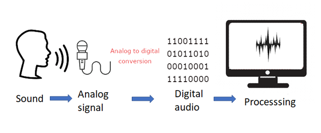
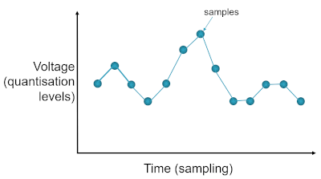

{width="100"; align=right}

# {{ title}}

> [!NOTE] The purpose of this section is to ...
> - Know how bit patterns may represent other forms of data including graphics
> - Describe the principles of operation of:
>   - an analogue to digital converter (ADC)
>   - a digital to analogue converter (DAC)
> - Know that ADCs are used with analogue sensors and that the most common use for a DAC is to convert a digital audio signal to an analogue signal.
> - Describe the digital representation of sound in terms of:
>   - sample resolution
>   - sampling rate and the Nyquist theorem.
> - Calculate sound sample sizes in bytes.
> - Describe the purpose of MIDI and the use of event messages in MIDI.
> - Describe the advantages of using MIDI files for
representing music.

---

Computers need to be able to handle other forms of data in addition to numeric or text including sound and images.  This next section examines how sound data is handled with the next looking at images and graphics.

There are some similar principles to those we saw when dealing with numeric and character data e.g. there will only a fixed number of bits available to store the colour information for a picture element (**pixel**) or the pitch (**frequency**) of a musical sound.  The data stored will, of course, need to be converted into a binary representation as under the hood the components used are either holding a charge or not.

## What is sound?

We should know from our early science lessons that sound is a change in air pressure and moves as a wave from the object generating the sound to our ears, it's a vibration of the air particles.  Our ears act as a pressure sensor, able to detect these subtle changes of air pressure.  The waves vibrate at a particular frequency which is measured in Hertz (Hz).  The lower the pitch, the lower the frequency.  The human ear can pick up sounds between ~20Hz to ~20kHz.  Sound waves above 20kHz are known as ultrasound; those below 10Hz are infrasound.  

Sound is **analogue* i.e. it is constantly changing

Sound has a number of qualities:

- **Pitch**: perceived as "high" or low"
- **Duration**: perceived as "long" or "short"
- **Volume**: perceived as "loud" or "soft"
- **Timbre**: helps us distinguish between the sound of a pneumatic drill and a violin
- **Texture**: the number of sound sources and how they are combined

For the computer to process the sound waves we need some additional equipment:

- **microphone**: to record the sound, the microphone is a pressure sensor converting that pressure into an electrical signal corresponding to the sound wave
- **speaker**: to emit the sound, the cones in the speaker generating the sound wave for the stored sound
- **analogue to digital converter** (ADC): to convert the audio voltage received by the microphone to a digital representation
- **digital to analogue converter** (DAC): to convert the digital representation of the sound to an audio voltage to be passed to the speaker cones

<!--  -->

The sound waves are captured by a microphone, which creates the voltage signal, from where is can be converted into a digital representation of the sound wave, using a technique known as **pulse code modulation**.  There are two processes involved:

- **sampling**
- **quantisation**

### Sampling

Sampling is the process of periodically measuring the analogue signal such as those coming from a microphone and converting them into discrete values.  The number of samples taken per second is known as the **sampling rate** which determines the range of frequencies that can be represented. A higher sampling rate provides a better quality reproduction of the sound wave than a lower sampling rate.  It is analogous to the frame rate in video.  Once these values have been captured these digital audio files can be processed in many different ways (digital signal processing).

To listen back to the sound is a reverse of this process, digital to analogue conversion, to reconstruct the original signal as best it can using the captured digital data.

There are a couple of other functions taking place to assist with this process e.g. the microphone will have a preamplifier as the signals in the microphone are usually too weak to be used.  Depending on the ADC being used there will also be some aliasing filters to remove any frequencies above 20kHz.  These functions are not required to be known for the A Level AQA syllabus.

> [!NOTE] The phrase "sample rate" is also used when gathering views from a survey.  The more responses you get the more reliable the conclusions being drawn from that data.

The graph maps a very simple sound wave and the measurements, samples, being taken.  Converting those samples into a digital representation (the red line) shows the results are not very close to the original sound wave.  Converting that digital representation back to a sound wave would produce a wave as in the following diagram:

[IMAGE HERE]
<!--  -->

Compare the second sound wave to the first.  It is some way off from being an accurate reproduction, and very noticeable to our ears.

Increasing the number of samples recorded, known as a higher sampling rate, will increase the quality of the digital representation meaning we are better able to map the original sound wave to the final digital representation.  For a typical audio CD the sampling rate is 44.1kHz, sample rates for phone are nearer to 8kHz.  The more higher the sample rate the more bits that will be needed and so the size of the audio file will increase.

The reason for this value (44.1kHz) is thanks to the **Nyquist Theorem** which states:

> If a system uniformly samples an analog signal at a rate that exceeds the signal’s highest frequency by at least a factor of two, the original analog signal can be perfectly recovered from the discrete values produced by sampling.

The highest frequency the human ear can perceive is approx. 20kHz, with a theoretical maximum of 22kHz, and it declines with age so the sample rate of 44.1kHz provides enough headroom to capture frequencies within the threshold of hearing.  (If anything exceeds this frequency it will not be sampled properly and will produce unwelcome audio content and distortion known as **aliasing**).

In practical terms, the theorem means that at least two samples must be taken per period of the original waveform, fewer than two will mean the frequency of the original signal will be lost.

### Quantisation

What we're increasing here takes place on the 'x' axis, the time axis.  We can also carry out improvements to our sound capture by adjusting the 'y' axis, the value at any given point in time.  You can think of this as the **bit depth** i.e. the number of bits available to store the value being sampled.  It is sometimes called the **sampling resolution**.

[IMAGE HERE]
<!--  -->

In the diagram above the second sample has increased the range of values available, with an increased number of bits, and thus able to more closely reproduce the sound wave.  For almost every sample the actual value will lie between two possible values depending on the bit depth being used.

Consider an overly simplified system that is using a bit depth of 3 bits, we know that $2^3$ is $8$, so our values available range between $0$ and $7$.  If the value sampled falls on any of these then we'll be fine but that's unlikely so the value recorded will have to be rounded or truncated to the nearest value available and thus introducing an error into the reproduction of that sound wave, as can be seen in the first of the patterns above.  Increasing the bit depth by $1$ to $4$ bits gives us $16$ different levels and the simple wave form above can be more accurately reproduced.

The bit depth used for CD recordings is $16$ bits giving $65,5536$ different levels; DVD uses $24$ bits giving $16,777,216$ different levels.  Recording sound with a higher bit depth also increases the dynamic range of sound that can be captured, this is the difference between the loudest and softest sound and measured in decibels (dB).  For example, recording at 8 bits per sample gives 49dB range (not very good); 16 bits per sample gives 96dB dynamic range.

> [!NOTE] It's doubtful the human ear can distinguish between 16-bit and 24-bit recordings but having the extra bits makes life much easier for the sound engineers.  It's often better to record at the highest bit depth possible and if necessary reduce for the final mix.

Don't forget the number of channels (stereo or mono) needs to be factored in.  One minute of CD audio data requires in excess of 5 million 16-bit numbers, of these will be for the left channel and the other half for the right channel.  That's approximately 10 Mb for a minute of sound.

Similar to the sampling rate, an increase in the bit depth will increase the size of the audio file.

Whatever bit rate or sample rate is used, the final realised version will be saved to an audio file and there are various formats used, many involving [compression](compression.md):

- .WAV: the uncompressed audio file, with a header and the individual samples, used by Windows operating systems
- .AIFF: the MAC os equivalent of .WAV files 
- .MP3: compressed using a lossy compression format
- .WMA: similar to MP3 developed by Microsoft
- .OGG: open source format, loss less compression, better than MP3 but not as widely available
- .MID: not an audio file, reserved for MIDI files (see below)

If you want to explore some sound programming with C\#, take a look at the Code project article [Fundamentals of Sound: How to Make Music out of Nothing at All](https://www.codeproject.com/articles/15786/fundamentals-of-sound-how-to-make-music-out-of-not).

### Calculating the file size

The size of sound files can be calculated using the following formula:

- $fileSize = length \times sampleRate \times bitDepth$

Thus a 30 second sound file, sampled at 8kHz, with a bit depth of 16 would be:

- $30 \times 8000 \times 16 = 3840000 \text{ bits}$ (or $480,000 \text{ bytes}$, $480 Kb$)

## MIDI

An alternative to recording the audio (the actual sound coming from an instrument) is to record the data about that sound using **MIDI** (Musical Instrument Digital Interface).  As the name suggests it is designed to be used by digital musical instruments (keyboards, drum machines etc).

Remember, in digital sound recording *audio* is sound whereas _MIDI_ contains no sound at all.  Once the audio has been captured it's not possible to remove individual notes, or change the duration of particular sounds (the can be put through various filters which can change the sound quite dramatically but all the recorded elements will be there to some degree).  With MIDI we capture information about the notes themselves e.g. the note number, its length, its velocity and it can be sent to another MIDI equipped instrument (or Digital Audio Workstation) via a specific channel.

The sound is then produced using a sound generator (or virtual instrument), perhaps a software source in the computer or passed to another instrument with in-built speakers. The sound you get back will only be as good as the sound generator being used!

> [!NOTE] Vocal sounds cannot be recorded via MIDI

MIDI files act as a set of instructions that explain how the sound should be produced once attached to a playback device.  Thus, with the right software you can edit any of the information about any of the notes (the pitch, duration, velocity etc..)

The size of MIDI files is significantly less than an equivalent audio file.

## Questions

[^1]

1.  In the diagram above, what would the binary codes be for the first five samples?
2.  What would the quantisation levels be for a 3 bit ADC with an input range of 0.0 to 8V?  Give your answer in terms of both voltage and corresponding binary value?
3.  In this ADC what binary output would the following inputs produce:  a) 2.9V b) 7.2V c) 0.6V?
4.  What is the resolution of a 12bit converter with an input range of -1.5V to +2.5V?
5.  What is the maximum quantisation error of this converter (actual – quantised voltage)?
6.  Calculate the data transmission rate needed for a low quality audio signal sampled at 10kHz and 8 bit depth.
7.  How much memory (in bytes) would be needed to store an hour of this audio?  
8.  Name three features of a musical note that can be programmed using the MIDI protocol

---

[^1]: Bond, 2016