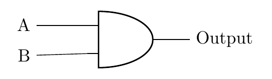
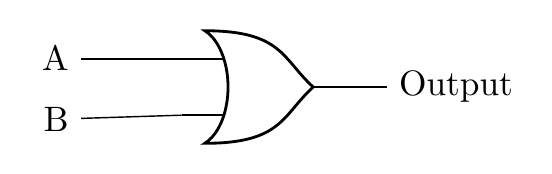
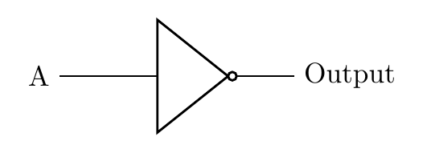
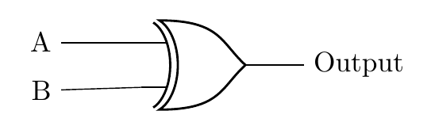

{width="100"; align=right}

# {{ title}}

In computer science and mathematics, **logic** is a way of making decisions based on certain conditions being either **true** or **false**. In digital circuits, logic helps us control how electronic devices work by making decisions based on whether inputs (conditions) are on or off, which can also be thought of as **true** or **false**.

In simple terms:

- **True** is represented as **1**
- **False** is represented as **0**

You will already use logic in everyday life, without even realizing it. 

For example:

> "If it's sunny AND I have time, I'll go for a walk."

In this case, going for a walk depends on two things being **true**: the weather is sunny, *and* you have time.

Similarly, computers and digital circuits make decisions based on inputs that are either true (1) or false (0). These decisions are controlled by **logic gates**, which perform logical operations.

## Inputs and Outputs: True or False

A logic gate takes **inputs** (true or false values, 0 or 1) and produces an **output** that depends on the type of gate. Each gate follows a set of rules about how to combine its inputs to determine the output.

For example, let’s consider two conditions:

- **A**: "It is raining."
- **B**: "I have an umbrella."

We can use logic gates to make decisions based on these inputs.

## Key Logic Gates: AND, OR, NOT and XOR

We have three ways of representing these logic gates and the circuits that can be designed using these gates:

- Truth table
- Boolean expression
- Logic Diagram

Each depicts the same process and well consider each n the following sections.

### AND Gate

The **AND gate** checks if **all** the inputs are **true**. It outputs **true (1)** if, and only if, **both inputs are true**. Otherwise, it outputs **false (0)**.

Imagine the following scenario:

You will go to the cinema if:

- **A**: You have enough money for a ticket
- **B**: There's something you want to see at the cinema

You need both the money for the ticket, and something that interests you at the cinema.  If either is missing then you will not go.

We have already encountered something similar when programming:

```python
if (A == 1 and B == 1) then
	print("You can go the cinema")
else
	print("You can  not go to the cinema")
```

We can represent all of the possible conditions for this statement by using  **truth table**:

**Truth Table for AND**:

| A (Money) | B (Interesting Movie) | A AND B (Go to the cinema) |
|----------|---------------|---------------|
|    0     |      0        |       0       |
|    0     |      1        |       0       |
|    1     |      0        |       0       |
|    1     |      1        |       1       |


The AND gate only outputs 1 (True) when **both** inputs A and B are 1 (True). When either of these conditions is `False` you will not be going to the cinema.

**Boolean expression for AND**

This scenario can also be represented using a **boolean expression**: $A \bullet B$

!!! note
    A boolean expression is an expression using special algebraic notation.  Inputs are denoted by capital letters e.g. A, B etc.  The operators used are:
    
    - **AND**: $A \bullet B$
    - **OR**: $A + B$ 
    - **NOT**: $\overline A$

**Logic diagram**

The symbol for an AND gate:



### OR Gate

The **OR gate** outputs **true (1)** if **at least one** of its inputs is true. The only time it outputs false is if **both inputs are false**.

You may not have the money for a ticket, but perhaps a friend is willing to pay for you?  (We'll ignore what might be on at the cinema!)

Now we have the following inputs:

- **A**: You have money for a ticket
- **B**: Your friend is will to pay for your ticket

```python
if (A == 1 or B == 1) then
	print("You can go to the cinema")
else
	print("You can not go to the cinema")
```

Again, we can describe these conditions using a truth table:

**Truth Table for OR**:

  | A (Money) | B (Friend pays) | A OR B (Go to the cinema) |
  |----------|---------------|--------------|
  |    0     |      0        |      0       |
  |    0     |      1        |      1       |
  |    1     |      0        |      1       |
  |    1     |      1        |      1       |

**Logic Diagram**



**Explanation**:  

The OR gate outputs 1 (True) if **either** input A or input B (or both) is 1 (True). This means you’ll go to the cinema if you have the money (A = 1), if your friend will pay for your ticket (B = 1), or both.

In these **OR** gate scenarios, the outcome is true (you go to the cinema) if either one of the conditions is met. This contrasts with the **AND** gate logic, where *both* conditions must be true. With OR, just having one true 
input is enough for the output to be true.

This scenario can also be represented using a **boolean expression**: $A + B$

### NOT Gate

The **NOT gate** does something simple: it **inverts** the input. If the input is true (1), the output will be false (0), and if the input is false (0), the output will be true (1).

The NOT gate takes only one input, either `True` (1) or `False` (0).

Our cinema analogy might might break down a little, but we can consider the scenario that says we will go to the cinema when the sun is not out!

We have the following conditions:

- **A**: It is sunny (the input)
- **NOT A**: It is not sunny (the output, and we go to the cinema)

In this case, you are more likely to go to the cinema if it's not sunny (i.e., a rainy or cloudy day). So the condition A checks whether it’s sunny, and the NOT gate inverts that. If it’s sunny (A = 1), you won’t go to the cinema (output = 0). If it’s not sunny (A = 0), the NOT gate outputs true, meaning you’ll go to the cinema.

```python
if not(A) then
	print("You can go to the cinema")
else
	print("You can not go to the cinema")
```

**Truth Table for NOT**:

| A (Sunny) | NOT A (Not sunny, go to the cinema) |
|----------|---------------------|
|    0     |          1          |
|    1     |          0          |

**Logic Diagram**



**Explanation of the NOT Logic:**

- If A (it’s sunny) is false (0), then the NOT gate outputs true (1), meaning you’ll go to the cinema.
- If A (it’s sunny) is true (1), the NOT gate outputs false (0), meaning you won’t go to the cinema because it's sunny and you're more likely to do something outdoors.

This scenario can also be represented using a **boolean expression**: $\overline A$

### XOR Gate

The **XOR gate** (exclusive OR) behaves differently from the OR gate because it only outputs **true** (1) when **exactly one** of the inputs is true—not both. In a real-life scenario, this would mean you make a decision when **one** condition is met, but not if **both** conditions are true or both are false.

**Scenario: Cinema or Streaming at Home**

You will either:

- **Go to the cinema** or
- **Stream a movie at home**, but **not both** at the same time.

**Conditions**

- **A**: You have enough money to go to the cinema.
- **B**: A good movie is available to stream at home.

Thus:

- You’ll **go to the cinema** if you have the money but **not** a good movie to stream.
- You’ll **stream at home** if a good movie is available but you **don’t have the money** to go out.
- If **both** conditions are true (you have money and a good movie to stream), you can’t do both at the same time, so you’ll choose **neither**.
- If **neither** is true, you can’t go to the cinema or stream, so you’ll do something else.


**Boolean expression**

$A \text{ XOR } B$

or

$A \oplus B$

---

**Truth Table for Cinema vs. Streaming XOR Decision**:

| A (Have Money for Cinema) | B (Good Movie to Stream) | Output (Cinema or Stream) |
|---------------------------|--------------------------|---------------------------|
|             0             |            0             |             0             |
|             0             |            1             |             1             |
|             1             |            0             |             1             |
|             1             |            1             |             0             |


**Logic Diagram**

The symbol used for the XOR gate:



**Explanation of the XOR Logic**:

- **When both A and B are false (0, 0)**: You don’t have money for the cinema, and there’s no good movie to stream, so you won’t do either (output = 0).
- **When A is false and B is true (0, 1)**: You don’t have money to go to the cinema, but there’s a good movie to stream at home, so you stream (output = 1).
- **When A is true and B is false (1, 0)**: You have money to go to the cinema, but there’s nothing good to stream, so you go to the cinema (output = 1).
- **When both A and B are true (1, 1)**: You have money to go to the cinema, and there’s a good movie to stream, but you can’t do both, so you do neither (output = 0).

The XOR gate works well here because it captures the decision-making process where you **only do one** of the two activities, not both. If **one condition is true**, you take action (go to the cinema or stream). If **both conditions are true**, you can’t choose both, so you end up doing neither.

