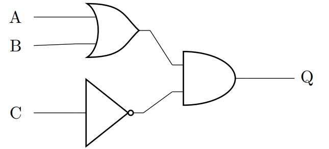

{width="100"; align=right}

# {{ title}}

Having looked at the basic gates (AND, OR, NOT and XOR) we now move to looking how these can be combined to make more complex decisions.

**Scenario: Going to the Cinema**

{width="300"; align=left}

You will go to the cinema if:

- **A**: You have money for a ticket.
- **B**: A friend is available who can pay for your ticket.
- **C**: It is not sunny.

We have three inputs for our decision.

You will go to the cinema if:

1. You have money **(A)** OR your friend is willing to pay **(B)**.
2. It is not sunny **(NOT C)** (because you prefer to go indoors when it's not sunny).

So, the logic combines:

- **A OR B**: You need either money or a friend who will pay for the ticket.
- **NOT C**: You will only go if it's **not sunny**.

The full boolean expression becomes:

$(A \text{ OR } B) \text{ AND } \text{NOT } C$

Or in formal notation:

$( A + B) \bullet \overline C$

**Logic Diagram**

**Explanation of the Logic**

- **A OR B**: You either have money (A) or a friend to pay (B) for your ticket.
- **NOT C**: It needs to be **not sunny** (C) to prefer going to the cinema.
- The combination: You’ll go to the cinema if **either** you or your friend has money **and** it’s not sunny.

**Truth Table for the Full Scenario**:

| A (Money) | B (Friend) | C (Sunny) | NOT C (Not Sunny) | Output (Go to Cinema) |
|-----------|------------|-----------|-------------------|-----------------------|
|     0     |      0     |     0     |         1         |           0           |
|     0     |      0     |     1     |         0         |           0           |
|     0     |      1     |     0     |         1         |           1           |
|     0     |      1     |     1     |         0         |           0           |
|     1     |      0     |     0     |         1         |           1           |
|     1     |      0     |     1     |         0         |           0           |
|     1     |      1     |     0     |         1         |           1           |
|     1     |      1     |     1     |         0         |           0           |

**Explanation**:

You will go to the cinema if:

- You have money (A = 1) **or** your friend can pay (B = 1).
- It is **not sunny** (NOT C = 1).
  
The only time you **won’t** go is if you:

- Have no money (A = 0) **and** no friend to pay (B = 0).
- It is sunny (C = 1).
