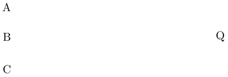
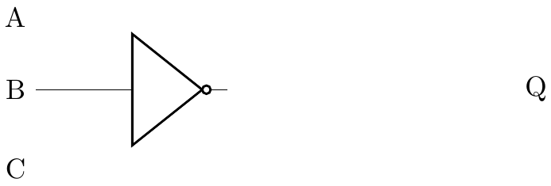
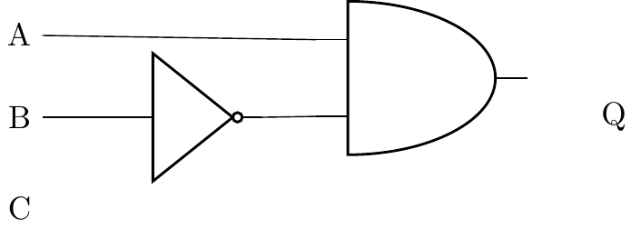
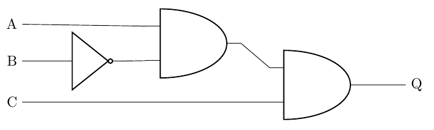

{width="100"; align=right}

# {{ title}}

This worked example has been taken from a past paper (OCR 2023, question 4).

{width="300"; align=left}

The question provides the following scenario:

> A garden floodlight system uses inputs from sensors and switches to decide whether it should be
turned on.

The floodlight is fitted with:

- a motion sensor
- a light sensor
- an on/off switch

For obvious reasons, the floodlight should only be turned on when it is dark!

The table shows the inputs into the system and the meaning of each input value:

| Letter  | Input device | Input of 1 | Input of 0 |
|---------|--------------|------------|------------|
| A | Motion sensor | Motion is detected | Motion is not detected |
| B | Light sensor  | Light levels indicate it is daytime | Light levels indicate it is nighttime |
| C | Light switch  | The switch is turned on | The switch is turned off |

The floodlight (Q) is designed to be on (Q = 1) when the switch is turned on and the motion
sensor detects motion at nighttime.

The question asks for a logic diagram but similar questions might also ask for a boolean expression and/or a truth table for a given scenario so we'll work on each of these in turn.

### Truth Table

To create a truth table, we need to list all possible combinations of input values for A, B, and C. Since each input can have two values (0 or 1), we have a total of $2^3 = 8$ possible combinations.

Here is the truth table:

|  A  |   B |  C  |  Q  |
|:---:|:---:|:---:|:---:|
|  0  |  0	|  0  |  **?**  |
|  0  |  0	|  1  |  **?**  |
|  0  |  1	|  0  |  **?**  |
|  0  |  1	|  1  |  **?**  |
|  1  |  0	|  0  |  **?**  |
|  1  |  0	|  1  |  **?**  |
|  1  |  1	|  0  |  **?**  |
|  1  |  1	|  1  |  **?**  |

Analyse the scenario carefully:

- **Light Switch (C)**: the motion sensor will only be operational if it is turned on (C=1).  Therefore, wherever C=0 then Q=0
- **Motion Sensor (A)**: for the light to come on it must detect a movement (A=1)
- **Light sensor (B)**: it has to be night time, (B=0)

Thus: The output Q is 1 only when the switch is turned on (C = 1) **AND** the motion sensor detects motion (A = 1), **AND** it is nighttime (B = 0).

We can go ahead and complete the column Q:

|  A  |   B |  C  |  Q  |
|:---:|:---:|:---:|:---:|
|  0  |  0	|  0  |  0  |
|  0  |  0	|  1  |  0  |
|  0  |  1	|  0  |  0  |
|  0  |  1	|  1  |  0  |
|  1  |  0	|  0  |  0  |
|  **1**  |  **0**	|  **1**  |  **1**  |
|  1  |  1	|  0  |  0  |
|  1  |  1	|  1  |  0  |

(b) Boolean Expression:

From the truth table, we can derive the boolean expression for Q.  From that row in the truth table we see that Q is true when A is true, B is not true and C is true.

- Q = A AND NOT(B) AND C

or using algebraic notation:

- $Q = A \bullet \overline B \bullet C$

This expression reads: "Q is true if A is true, B is false, and C is true".

(c) Logic Diagram:

- Start by drawing the inputs on the left hand side of the diagram (A, B, C), and the output (Q) on the right hand side.  
  
!!! note
    You could use descriptive labels such as "Motion Sensor", "Light Sensor" and "Switch" if you prefer.

    

- We know that input **B** has to pass through a not gate, we'll add that first:

    

- **A** AND NOT(**B**) can be added next, an **AND** gate is needed, the first input is **A**, the second input is the output from the **NOT(B)**

    

- The output from this **AND** gate needs to be connected to the input of a second **AND** gate, the other input for this new gate is taken from **C**
- The output from the second **AND** gate is then connected to output **Q**

    