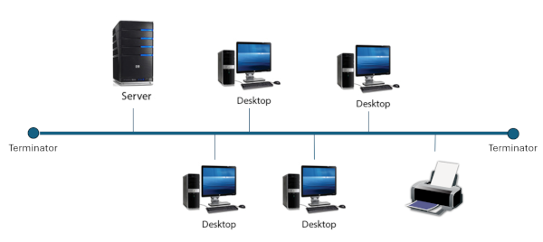
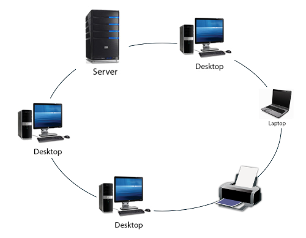

{width="100"; align=right}

# {{ title}}

!!! note "Objectives"

    - Be able to define the term "network topology" and understand its significance in computer networks.
    - Be able to describe the following common LAN topologies:
         - bus
         - star
         - ring
         - mesh
    - Compare and contrast the characteristics, advantages, and disadvantages of different network topologies.
    - Be able to identify and apply network topology concepts to real-world scenarios and understand the practical implications of choosing specific topologies based on requirements and constraints.

Network topology refers to the arrangement or layout of different elements (nodes, links, etc.) in a computer network. 

The topology defines how these components are connected and how data is transmitted between them and can play a crucial role in determining the overall performance, efficiency, and reliability of a network. There are several common types of network topologies, including:

- Bus
- Star
- Ring
- Mesh

!!! note

     Different GCSE exam boards require knowledge of different topologies but will be drawn from the list above

## Bus Topology

In a bus topology, all devices share a common communication medium, typically a single communication channel or cable. Data is transmitted along the bus, and each device receives the data, but only the intended recipient processes it.

The bus serves as a single communication path for all devices on the network. Data transmitted by one device is accessible to **all** other devices connected to the bus. It as one of the implementations of an Ethernet network.  To prevent signal reflections and ensure proper functioning of the network, the bus topology requires terminators at both ends of the central bus. Terminators absorb the signal and prevent it from bouncing back and causing interference.

Since all devices share the same communication medium, they contend for access to the bus when transmitting data.  This can lead to potential collisions if two or more devices attempt to send data simultaneously.  When a collision occurs the devices wait a random amount of time before retransmitting.  The more devices connected to the network will inevitably mean higher demand beings placed on the cable and this will impact the performance of the network.

Each message (frame) will include the destination address for the intended recipient which picks up its message while being ignored by the other devices on the network.

If the central bus fails or encounters a break in the cable, the entire network may be affected. Troubleshooting and locating faults in the bus can be challenging.

The Bus topology is relatively simple to set up and is cost-effective for small to medium-sized networks. It requires less cabling compared to some other topologies, making it economical though, it is rarely used today.

## Star Topology

In a star topology, all devices are connected to a central hub or switch. The central hub manages the communication between devices, and if one device wants to communicate with another, the data passes through the hub or switch.

- In this arrangement, each device on the network has its own dedicated connection to the central point. The central hub or switch manages the communication between devices by acting as a repeater, regenerating and forwarding data to the appropriate destination.

- In a traditional star topology with a hub, the hub is a basic networking device that receives data from one device and broadcasts it to all other connected devices. The layout of devices may resemble a star shape but the operation of the network is more akin to a bus network, and so sometimes called a **logical bus network**.

- In modern star topologies, switches are often used instead of hubs. Switches provide more efficient and intelligent communication. Unlike hubs, switches forward data only to the specific device for which it is intended, reducing network congestion.

- Devices in a star topology are isolated from each other in terms of communication which enhances network security. If one device wants to communicate with another, the data travels through the central hub or switch, and there is no direct communication between devices without involving the central point.

- Star topologies are easily scalable. Adding or removing devices does not affect the overall network structure, as each device connects directly to the central hub or switch.

- The failure of one device or cable in a star topology does not necessarily affect the rest of the network. Other devices can continue to communicate without interruption thus making the star topology more reliable than a bus topology. However, if the central hub or switch fails, the entire network may be affected.

Star topologies are commonly used in local area networks (LANs) and are favored for their simplicity, ease of installation, and scalability. The shift from hubs to switches has improved the performance and efficiency of star topologies in modern networking environments.

## Hubs vs Switches

Hubs and switches can resemble each other but internally their operation is quite different.  You can think of a switch as being an "intelligent hub".

A **hub** relays messages received to all devices on the network; a **switch** will send a message to its intended recipient.

The switch works by maintaining a table of known devices on its network i.e. those that are connected to its ports.  The table contains the MAC address of these devices so when an incoming message is received the MAC address in the message is used to identify the correct destination and it can then be transmitted through the correct port to be sent to the device with that MAC address.

## Ring Topology

In a ring topology, each device is connected to exactly two other devices, forming a circular or ring-like structure. Data travels in one direction along the ring, passing through each device until it reaches its destination.

- Ring topologies are less common in modern networking due to the prevalence of other topologies, such as star and bus, but they still have some specific use cases.

- Ring topologies can be either unidirectional (clockwise or counterclockwise) or bidirectional, depending on the network design and the capabilities of the networking equipment.  Data travels along the ring from one device to the next until it reaches the intended destination. Each device in the ring regenerates and passes along the signal to the next device.

- Collisions are not an issue in ring topologies since data travels in a unidirectional or bidirectional manner. Unlike bus topologies, where collisions can occur when devices share a common communication medium, devices in a ring operate independently.

- Ring topologies can be more fault-tolerant than some other topologies. If a device or a section of the ring fails, the data can still travel in the opposite direction to reach its destination.

- The performance of a ring topology depends on factors such as the number of devices and the length of the ring. As the number of devices increases, the overall performance may degrade due to the increased propagation delay.

While ring topologies have advantages in terms of fault tolerance, they also have some drawbacks. For example, the failure of a single device or connection can disrupt the entire network, and the overall performance can be impacted as the network scales. Modern networking technologies often prefer other topologies like star or hybrid configurations due to their flexibility and scalability.

In a **token ring** network, a special signal called the token, circulates the network. Devices can only communicate when they have the token.  Ring networks are used when guaranteed communication speeds are important. The time taken for a message to pass through the ring is consistent and reliable.

## Mesh Topology

In a mesh topology, every device is connected, with no hierarchy, to every other device in the network via a dedicated link. This provides multiple paths for data to travel, enhancing reliability and fault tolerance. Mesh topologies can be either **full mesh** (every device connected to every other) or **partial mesh** (only some devices are interconnected).

- In a full mesh topology, every device is directly connected to every other device in the network. This results in a high level of redundancy and multiple communication paths between any two devices.
   
- In a partial mesh topology, only some devices are directly connected to every other device. This topology provides a balance between connectivity and cost, allowing for redundancy and alternate paths without the full connectivity of a mesh.

- Mesh topologies offer a high degree of redundancy, meaning that if one link or device fails, alternative paths can be used for communication. This redundancy enhances network reliability and fault tolerance.

- Mesh topologies can be scalable, but the number of connections grows rapidly with the addition of each device. Managing a full mesh network with a large number of devices can become complex.

- Mesh topologies generally provide high performance due to the multiple communication paths available. However, the overhead associated with managing numerous connections may impact overall network performance.

- The cost of implementing a mesh topology can be significant, especially in a full mesh configuration. The number of required connections and cabling can make it more expensive compared to other topologies.

Mesh networks can be wired or wireless but the latter is becoming more common and devices are available for installation in domestic environments.

## Selecting the "right" topology

The choice of network topology will depend on multiple factors such as the size of the network, the communication requirements, cost considerations, fault tolerance, and scalability needs. Different network topologies offer different advantages and disadvantages, and understanding their practical implications is crucial for making informed decisions. When selecting a network topology for a real-world scenario, factors to consider include the number of devices, the distance between devices, the amount of data traffic, reliability requirements, ease of installation and maintenance, and scalability for future growth.

### Examples:

**Small Office Network:**

A small office with a few computers, printers, and a central server would be advised to use a star topology due to its simplicity, ease of installation, and centralized management. A central switch can connect all devices, providing a dedicated connection for each and allowing for easy expansion.

**University Campus Network:**

A university campus with multiple buildings, departments, and thousands of users might use a combination of a backbone bus topology and a star topology. A backbone bus connects different buildings, while each building can have a star topology to connect individual departments. This setup provides scalability and fault tolerance.

**Residential Wi-Fi Network:**

A residential home with multiple floors and several family members would be best suited for a Wi-Fi mesh topology.  Mesh networks provide seamless coverage throughout the home, even in areas with weak signals. Nodes can communicate wirelessly, and self-healing capabilities ensure reliable connectivity.

## Questions

{{ show_questions(page.title, page.meta.filename) }}

