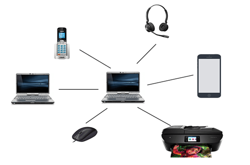
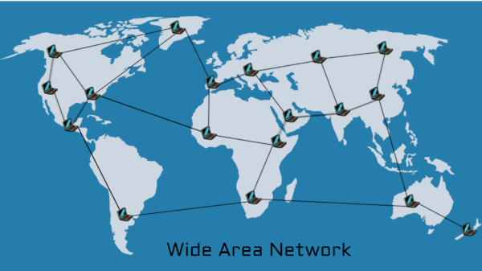
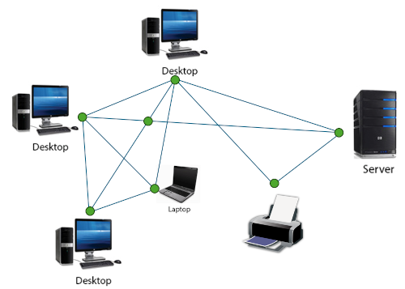
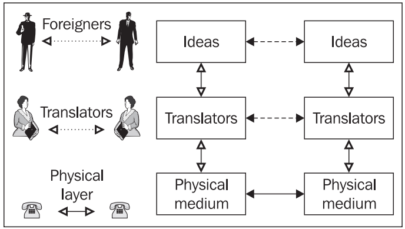
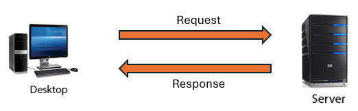

# Computer Networks


---

# Contents

- [Introduction to Networking](#introduction-to-networking)
- [Wired vs Wireless](#wired-and-wireless-networks)
- [Topologies](#topologies)
- [The Internet](#the-internet)
- [Protocols](#protocols)

---

<!-- _class: invert -->

# Introduction to Networking

---

## Objectives

- Define a computer network.
- Discuss the pros and cons of computer networks.
- Identify network types: PAN, LAN, WAN.
- Define the Internet and its distinction from the WWW.

---

# What is a Computer Network?

- A **computer network** is a system where devices are connected to share resources like:
  - Applications
  - Files
  - Hardware (e.g. printers)
- Devices connect via cables or wireless technology, allowing data transfer.

---

## Server and Client

- **Server**: A powerful central computer providing services (e.g., email, file storage).
- **Client**: A computer connected to the server.
- **Standalone**: A computer not connected to any network.

---

## Advantages of Networks

### 1. **Resource Sharing**
- Files, printers, databases, and tools can be shared.
- Examples:
  - **Files**: Shared folders for collaboration.
  - **Printers**: Shared high-quality office printers.
  - **Shared Databases**: Centralized customer information.

---

### 2. **Communication**
- Facilitates **email**, **instant messaging**, **video conferencing**.
- Example: Internal networks (LAN) for efficient department communication.

---

### 3. **Centralized Data Management**
- Data is managed centrally, reducing duplication.
- Includes file servers, NAS, and controlled access permissions.

---

## Disadvantages of Networks

### 1. **Security Concerns**
- Unauthorized access, malware, man-in-the-middle attacks.
- **Example**: Password sniffing compromises user accounts.

### 2. **Dependency**
- System failure affects multiple users.
- **Example**: A single server failure impacts the whole network.

### 3. **Cost**
- High setup and maintenance costs.
- Security, scalability, and emergency costs add financial burden.

---

## Types of Networks


<div class="columns">
<div>

### Personal Area Network (PAN)
- **Size**: Small, personal space (e.g., phone, laptop, earbuds).
- **Range**: Limited (e.g., Bluetooth).

</div>

<div>



</div>
</div>

---

<div class="columns">
<div>

### Local Area Network (LAN)
- **Size**: Covers a small area (e.g., home, office, school).
- **Control**: Managed by one organization.

</div>

<div>


</div>
</div>

---

<div class="columns">
<div>

### Wide Area Network (WAN)
- **Size**: Covers large geographical areas.
- **Example**: The Internet.
- Connects multiple LANs (e.g., company branches globally).

</div>

<div>



</div>
</div>

---

## The Internet is ...

- A **global network** of interconnected computers.
- Decentralized, meaning no single point of control.
- Communication occurs through standard protocols like **TCP/IP**.

---

## Internet Control and Regulation

- Some governments control internet access for political, security, or cultural reasons.
- Methods include **censorship**, **ISP regulation**, **data localization**.

---

## The World Wide Web (WWW)

- **Internet**: The infrastructure, the physical network of computers.
- **WWW**: A service running on the Internet, accessed via web browsers using **HTTP**.

---

<!-- _class: invert -->

# Wired and Wireless Networks

---

## Objectives
- Compare technology for implementing wired and wireless networks.
- Discuss advantages and disadvantages of both.
- Explore cables used in wired networking, including copper and fibre.
- Understand Bluetooth technology.

---

## Wired LAN

- Uses physical Ethernet cables.
- Ethernet cables consist of 4 pairs of twisted copper wires with RJ45 connectors.
- **Categories**: Cat5, Cat6, Cat7, and Cat8 – each offering different data transfer speeds and interference resistance.
- Wired connections provide high reliability and faster data speeds but require extensive cabling.

---

## Ethernet Cables

<div class="columns">
<div>

- Ethernet cables use **twisted-pair** wires to reduce interference.
- **RJ45 connectors**: 8 pins that correspond to the 8 wires in the cable.
- **Shielded vs Unshielded**: Shielded cables protect from interference.
- Categories:
    - Cat5: Up to 100 Mbps.
    - Cat6: Up to 1 Gbps.
    - Cat6a: Up to 10 Gbps.

</div>
<div>


</div>
</div>

---

## Ethernet Protocol

- **Carrier Sense Multiple Access with Collision Detection (CSMA/CD)** governs Ethernet communication.
- Devices listen for a clear network before transmitting data.
- Data is sent in **frames**, containing MAC addresses and error-checking information.


---

## Wireless LAN (Wi-Fi)

- Uses radio waves to transmit data.
- **Wi-Fi** operates on 2.4 GHz and 5 GHz frequency bands.
- Components:
    - **Wireless Access Points (WAPs)**: Transmit data wirelessly.
    - **Wireless Network Interface Cards (NICs)**: Enable devices to connect to the network.
- Governed by IEEE 802.11 standards (latest: 802.11be).

---

## Wireless Protocols & Security

- **Wi-Fi**: Wireless Fidelity, allows wireless internet connection.
- **Bluetooth**: Short-range wireless technology for connecting devices.
- **Encryption**: WPA2 and WPA3 protocols secure wireless data to prevent unauthorized access.

---

## Comparing Wired and Wireless Networks

|                  | Wired                                  | Wireless                               |
| ---------------- | -------------------------------------- | -------------------------------------- |
| Speed            | Faster, more reliable                  | Slower, prone to interference          |
| Cost             | Expensive, requires extensive cabling  | Cheaper, but may need multiple WAPs    |
| Security         | More secure                            | Less secure, susceptible to attacks    |
| Mobility         | Limited                                | High mobility, no cables needed        |
| Reliability      | High                                   | Lower reliability                      |

---

## Hybrid Networks

- **Most networks today** combine both wired and wireless components.
- Desktops are usually wired for stability, while portable devices like laptops use wireless connections for mobility.
  
---

Here’s a set of condensed slides structured for a MARP presentation format based on the notes:

---

<!-- _class: invert -->
# Topologies

---

- **Objectives**:
  - Define network topologies and their importance.
  - Describe and compare:
    - Bus
    - Star
    - Ring
    - Mesh
  - Apply topology concepts to real-world cases.

---

# **Bus Topology**

<div class="columns">
<div>

- **Single communication path** shared by all devices.
- Data collisions common; devices wait after a collision.
- **Terminators** absorb signals at the bus ends.
- **Cost-effective** for small networks but limited scalability.
- **Failing bus** disrupts the whole network.

</div>
<div>


</div>
</div>


---

# **Star Topology**

<div class="columns">
<div>

- **Central hub** connects all devices.
- Devices communicate through hub/switch.
- **Hub:** broadcasts data to all devices.
- **Switch:** sends data directly to the intended recipient.
- **Failure** of hub/switch disrupts the entire network.
- **Common** in modern LANs due to ease of expansion and reliability.

</div>
<div>


</div>
</div>

---

# **Hubs vs Switches**

- **Hub:**
  - Relays messages to all devices (like a logical bus).
- **Switch:**
  - Sends data only to the intended device.
  - Maintains a **MAC address table** for efficient communication.
  - **Switches** improve performance and reduce network congestion.

---

# **Ring Topology**

<div class="columns">
<div>

- Devices form a **circular connection**.
- **Unidirectional or bidirectional** data flow.
- **No collisions** due to controlled communication paths.
- **Token ring**: communication occurs when a device holds the token.
- **Fault tolerance**: data can travel in the opposite direction if a device fails.

</div>
<div>


</div>
</div>

---

## **Mesh Topology**

<div class="columns">
<div>

- **Full mesh**: All devices connected to every other device.
- **Partial mesh**: Only some devices interconnect.
- **Highly redundant**: Multiple communication paths improve fault tolerance.
- **Expensive** and complex for large networks.

</div>
<div>



</div>
</div>

---

## **Selecting the Right Topology**

- **Small Office**: Star topology for simplicity.
- **University Campus**: Backbone bus + star for scalability.
- **Home Wi-Fi**: Wi-Fi mesh for seamless, reliable coverage.

---

<!-- _class: invert -->
# The Internet

---

## Objectives

- Understand the structure of the Internet
- Understand packet switching and routers
- Identify the main components of a packet
- Define router, gateway, and their uses
- How is routing achieved?
- Define URL, FQDN, domain name, IP address
- Explain the services of an Internet service registry

---

## Brief History

In 1961, Leonard Kleinrock conceptualized ARPANET, the predecessor to the Internet. He introduced the **packet-switching network**, a key component of today’s **Internet**, the largest **Wide Area Network (WAN)** globally.

---

## Internet Service Providers (ISPs)

Access to the Internet is provided by ISPs, classified into three tiers:

- **Tier 1**: Backbone, handles intercontinental traffic
- **Tier 2**: Regional, connects Tier 1 to Tier 3
- **Tier 3**: Local providers, "last mile" to homes/businesses

---

## Packet Switching


<div class="columns">
<div>

### Circuit Switching


Fixed, physical path, like a phone line.

</div>

<div>

### Packet Switching


Connectionless, data is split into packets sent independently.

</div>
</div>

---

## How Packets Travel

Packets are routed individually across networks via routers, which determine the next path based on the destination address.

- Different packets from the same message may take different routes.
- The **tracert** command shows the path a packet takes.

```plain
$ tracert www.google.com
```

---

## Traceroute example

```plain
$ tracert www.google.com
Tracing route to www.google.com [216.58.204.228]
over a maximum of 30 hops:

  1     2 ms     1 ms     1 ms  ZyXEL.Home [192.168.1.1]
  2     7 ms     7 ms     6 ms  172.16.15.61
  3    12 ms    13 ms    12 ms  133.hiper04.sheff.dial.plus.net.uk [195.166.143.133]
  4    11 ms    11 ms    12 ms  132.hiper04.sheff.dial.plus.net.uk [195.166.143.132]
  5    14 ms    11 ms    10 ms  195.99.125.140
  6    12 ms    14 ms    11 ms  194.72.16.72
  7    13 ms    11 ms    11 ms  109.159.253.3
  8    15 ms    14 ms    14 ms  216.239.40.87
  9    14 ms    14 ms    12 ms  172.253.71.201
 10    14 ms    14 ms    14 ms  par21s06-in-f228.1e100.net [216.58.204.228]
```

---

## What's Inside a Packet?

Packets contain:

1. **Source/Destination Address**: IP address and port.
2. **Sequencing**: Ensures proper order of reassembly.
3. **Acknowledgment**: Confirms receipt.
4. **Error Detection**: Checks data integrity.
5. **Hop Limit**: Prevents endless looping.
6. **Payload**: Actual data.

---

## IP Addresses

- **IPv4**: 32-bit (e.g., 192.168.1.1)
- **IPv6**: 128-bit (future standard)
  
```plain
$ ipconfig
```

---

## ipconfig example

```plain
$ ipconfig
enp3s0: flags=4163<UP,BROADCAST,RUNNING,MULTICAST>  mtu 1500
        inet 192.168.1.11  netmask 255.255.255.0  broadcast 192.168.1.255
        inet6 fe80::b738:3e6d:499b:7355  prefixlen 64  scopeid 0x20<link>
        ether 10:78:d2:a0:d4:5a  txqueuelen 1000  (Ethernet)
        RX packets 41413  bytes 44775166 (44.7 MB)
        RX errors 0  dropped 0  overruns 0  frame 0
        TX packets 24078  bytes 3004699 (3.0 MB)
        TX errors 0  dropped 0 overruns 0  carrier 0  collisions 0

lo: flags=73<UP,LOOPBACK,RUNNING>  mtu 65536
        inet 127.0.0.1  netmask 255.0.0.0
        inet6 ::1  prefixlen 128  scopeid 0x10<host>
        loop  txqueuelen 1000  (Local Loopback)
        RX packets 8552  bytes 581418 (581.4 KB)
        RX errors 0  dropped 0  overruns 0  frame 0
        TX packets 8552  bytes 581418 (581.4 KB)
        TX errors 0  dropped 0 overruns 0  carrier 0  collisions 0
```

---

## Public vs Private IP Addresses

- **Public IP**: Globally routable on the Internet.
- **Private IP**: Reserved for internal networks; non-routable online.
  
    | Range | Address Space | Total Addresses |
    |-------|---------------|-----------------|
    | 10.0.0.0/8 | 10.0.0.1 - 10.255.255.255 | 16.7 million |
    | 172.16.0.0/12 | 172.16.0.1 - 172.31.255.254 | 1 million |
    | 192.168.0.0/16 | 192.168.0.1 - 192.168.255.254 | 65,536 |

---

## Domain Name System (DNS)

- DNS translates domain names (e.g., `bbc.co.uk`) into IP addresses.
- Organised hierarchically with top-level domains like **.com**, **.gov**, **.uk**.

    | Top Level Domain | Description |
    |------------------|-------------|
    | .com | Commercial |
    | .gov | Government |
    | .org | Organization |
    | .uk | United Kingdom |

---

## Fully Qualified Domain Names (FQDN)

A domain name with a specific host:

- **bbc.co.uk** → **www.bbc.co.uk** (web server)
- **mail.bbc.co.uk** (mail server)

---

## Using Python to Find IP address

```python
import socket
host = 'bbc.co.uk'
ip = socket.gethostbyname(host)
print(f"{host} IP Address: {ip}")
```

---

## Internet Registries

- **ICANN** and **IANA** manage the global assignment of domain names and IPs.
- **Regional Internet Registries (RIR)** allocate resources by region (e.g., Nominet for the UK).
- Use services like [www.nominet.uk/lookup](https://www.nominet.uk/lookup/) to check domain availability.

```python
import socket
hostname = 'bbc.co.uk'
ip_address = socket.gethostbyname(hostname)
print(f"The IP address of {hostname} is: {ip_address}")
```

---

## Summary

- The Internet relies on packet switching for efficient data transfer.
- IP addresses and DNS ensure unique identification and name-to-address translation.
- ISPs provide access in a tiered structure, while registries manage IP/domain assignments.

---
<!-- _class: invert -->

# Protocols

---

## Objectives

- Define the term network protocol
- Explain the purpose and use of common network protocols:
  - Ethernet, Wi-Fi, TCP, UDP, IP, HTTP, HTTPS, FTP, SMTP, IMAP
- Describe the 4-layer TCP/IP model
- Understand which protocols operate at which layers:
  - Application, Transport, Internet

---

## What is a Protocol?

- **Protocol**: Set of rules governing how data is transmitted and received between devices.
  - **Purpose**: Ensure standardized communication
  - Examples:
    - **TCP** (reliable, ordered delivery)
    - **UDP** (fast, but no guarantee of delivery)
    - **IP** (addressing and routing)
    - **HTTP** (web data transfer)
    - **FTP** (file transfer)

---

## TCP/IP Overview

- Developed in the 1970s by Vint Cerf and Bob Kahn
- Goals:
  - Network connectivity
  - Decentralization
  - Error recovery
- Divided into layers:
  - Application, Transport, Network, Link
- Conceptual model hides underlying network complexities

---

## Communication



---

## TCP/IP Layers

- **Application Layer**: Protocols (HTTP, FTP, SMTP) interact with software
- **Transport Layer**: TCP/UDP ensure data is delivered correctly
- **Network Layer**: IP handles routing and addressing
- **Link Layer**: MAC addressing, physical transmission

---

## TCP/IP layers


---

## Application Layer Protocols

- **HTTP**: Web communication (port 80)
- **SMTP**: Email sending (port 25)
- **FTP**: File transfer (port 21)
- Logical layer where applications exchange messages
  - Types: Requests, responses, etc.
  - Syntax: Defines message structure

---


## Transport Layer

- Ensures data delivery between application processes
- **TCP**: Reliable, ordered, error-checked
- **UDP**: Fast, no guarantees, used for streaming
- Adds port numbers to ensure correct delivery
  - Ports identify protocols (e.g., HTTP uses port 80)

---

## Internet Layer

- Routes data to its destination
- Adds IP addresses (source, destination)
- **Protocols**:
  - **IP**: Handles packet transmission
  - **ICMP**: Error reporting and diagnostics
  - **ARP**: Resolves IP to MAC addresses

---

## Link Layer

- Handles physical data transmission and MAC addressing
  - MAC addresses uniquely identify devices
  - Protocols vary depending on media:
    - Ethernet, Wi-Fi, etc.
- Converts data into electrical signals for transfer

---

## Client-Server Model

<div class="columns">
<div>

- **Client**: Requests data
- **Server**: Provides requested resources
- Example: Web browser (client) requesting a webpage from a web server
- Independent development of client and server applications

</div>
<div>



</div>
</div>

---

## Further Study

- Explore protocols in action using network tools like Wireshark.
- Experiment with TCP and UDP performance in real-time applications.

---

