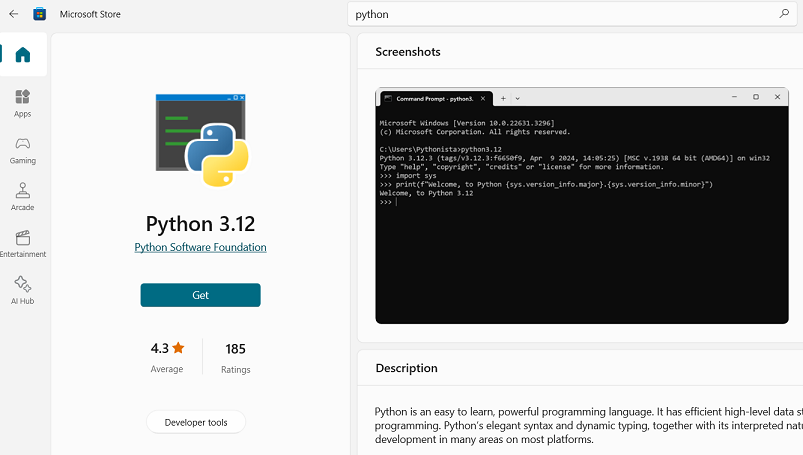
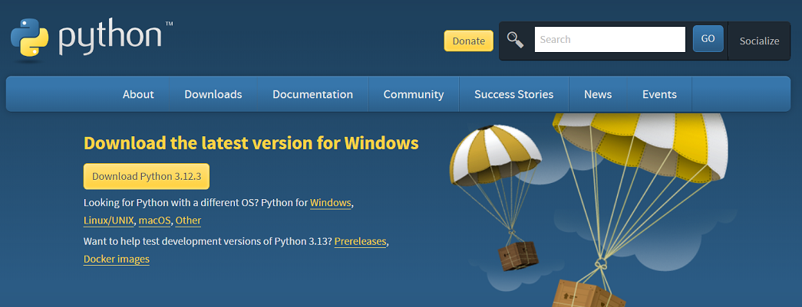

{width="100"; align=right}

# {{ title }}


!!! note  "Objectives"

    - Have a working Python environment on the computers.
    - Understand the importance of choosing and using an IDE.
    - Introduction to basic Python concepts.
    - Grasp the concept of a program and how Python fits into it.
    - Get hands-on experience by writing and running a first Python program.

The first steps to get started with programming using the Python language are:

- download and install Python to your computer
- download, install and if needed configure an IDE (Integrated Development Environment) to write your Python programs.

```python exec="on" source="tabbed-left"
print("Hello Markdown!")
for i in range(5):
    print(i)
```

## Installing a Python environment

Follow these steps to install Python to your computer.  The exact steps may vary depending on your operating system (Windows, macOS, or Linux).

### Download Python

There are a couple of options here:

**Microsoft Store Package**

  - This is the most straightforward method, especially for when just starting out.  It is designed for students and others using Python for the first time.
  - On their home page, search for "Python" or use this link: [https://www.microsoft.com/en-gb/search/shop?q=python](https://www.microsoft.com/en-gb/search/shop?q=python)
  - Select the app with the highest version number (at time of writing this was 3.11)
  - Click `Get`
  - Wait for the application to download and the click `Install`



**The full package**: 

  - Visit the official Python website at [https://www.python.org/downloads/](https://www.python.org/downloads/)
  - You'll see the latest versions of Python available for download. Choose the version that is appropriate for your operating system. For most users, it's Python 3.x (e.g., Python 3.8, Python 3.9, etc.), as Python 2 is no longer supported.  At time of writing the latest version was Python 3.12.




**2. Download the Installer:**

- Click on the download link for the Python version you've chosen.
- If you're using Windows, you'll likely download an executable installer (.exe) file. For macOS, it will be a disk image (.dmg) file. For Linux, it might be a tarball (.tar.gz) or another format, depending on your distribution.

**3. Run the Installer:**

- For Windows: Double-click the downloaded .exe file and follow the installation wizard's instructions. Make sure to check the box that says "Add Python x.x to PATH" during installation to make Python accessible from the command line.
- For macOS: Double-click the .dmg file and follow the instructions to install Python.
- For Linux: Open a terminal and navigate to the directory where you downloaded the tarball. Extract it and follow the README or installation instructions provided with your distribution.

```py
> python --version
Python 3.10.5
```

!!! note

    If you encounter any issues or would like further help go to `https://realpython.com/installing-python/` and follow the instructions there


## The Python interactive environment

- Enter `python` in your terminal (command) window, this will load the **Python interactive environment** and means you can run Python commands here.
- Sometimes known as the REPL, which stands for "Read-Evaluate-Print-Loop".  
- Try the following examples which introduce some of the fundamental concepts of Python:  

**Basic Arithmetic Operations:**

  - In Python, you can perform basic arithmetic operations directly in the interactive environment.
  - At the prompt, try the following and record your answers:

```py
>>> 2 + 3
>>> 5 - 1
>>> 4 * 6
>>> 10 / 3
>>> 10 // 3
```

**Working with Variables:**

- A **variable** is a name that we give to some data which is stored in the computer's memory.  We can create variables to store and manipulate data in the interactive environment.
- At the prompt, try the following and observe the results:

~~~~~py
>>> x = 5
>>> y = 3
>>> sum_result = x + y
>>> product_result = x * y
>>> sum_result
>>> product_result
~~~~~

**Strings and String Operations:**

- Strings are collections of characters, usually assigned to a variable.
- Strings will always be surrounded by quote characters (either single quote or double quote)
- At the prompt, try the following and observe the results:

~~~~~py
>>> greeting = "Hello"
>>> greeting
>>> name = "Alice"
>>> name
~~~~~

- String can be joined together, known as **concatenation**:

~~~~~py
>>> full_greeting = greeting + " " + name
>>> full_greeting
~~~~~

- Strings can be processed using some useful built-in functions:

~~~~~py
>>> greeting_length = len(greeting)
>>> greeting_length
>>> uppercase_name = name.upper()
>>> uppercase_name
~~~~~

**Lists and List Operations:**

- Lists are a fundamental data structure in Python, they are collections of data items with a common name.
- At the prompt, try the following and observe the results:

 ~~~~~py
 >>> fruits = ["apple", "banana", "cherry"]
 ~~~~~

- To access the elements, or items, in the list we use an index for its position (starting at $0$) 

 ~~~~~py
 >>> first_fruit = fruits[0]
 >>> second_fruit = fruits[1]
 ~~~~~

- Items can be added or removed from the list:

 ~~~~~py
 >>> fruits.append("orange")
 >>> fruits.remove("banana")
 ~~~~~

- Review the results:

 ~~~~~py
 >>> fruits
 >>> first_fruit
 >>> second_fruit
 ~~~~~

!!! info
    To exit from the interactive environment, enter the command ```exit()``` or ```quit()``` or use the shortcut keys ++ctrl+d++  (Windows)


## Install a Code Editor or IDE

- While you can write Python code using the interactive environment it soon becomes too difficult and we need to write our code in a file which can then be run by the Python interpreter.  For this we use an __IDE__, or __Interactive Development Environment__.
- The IDE will come with an editor (for writing our code and options to save our file etc), syntax highlighting, line numbers, a debugging environment and a host of other features.
- Working with an IDE that you like and can get familiar with is a really important aspect of a programmer's workflow.
- There are several IDEs available for Python and we'll not cover the specific instructions for each.
- Your Python installation will come with a [default IDE called *IDLE*](https://marketsplash.com/tutorials/python/idle-python/)
- You might like to try alternatives (as IDLE can be tricky and its debugging environment is not ideal), e.g.
  - Thonny
  - Visual Studio Code
  - PyCharm
- Alternatively you can use an online environment such as that provided by [repl.it](https://replit.com)
- With your chosen editor make sure you know how to create a new file and save.

That's it! Python should now be installed on your home computer. You can start writing and running Python scripts in your chosen development environment.

Remember to keep your Python installation updated as new versions are released with bug fixes and improvements. You can check for updates and install them using the `pip` package manager, which usually comes bundled with Python. Use the following command to upgrade `pip` and check for Python package updates:

```py
> pip install --upgrade pip
> pip list --outdated
```

## Your first program

The convention when learning any new programming language is to write a program that displays the string "Hello, World!" on the screen.  You can read about why this is the case [here](https://dev.to/just5moreminutes/why-hello-world-5c0g).

With Python this is very easy:

```python exec="on", source="tabbed-left"
print("Hello, World!")
```

That's it!  We use the built-in Python function, `print()`, and provide this function with the text we want to display inside quotation marks.  You can use single or double quote, just be consistent.

- In your IDE create a new file, save it with a suitable name e.g. 'hello.py'.
- Enter the statement to print as in the code snippet above, and re-save the file
- Run the file using e.g. 'Run Module' in IDLE, 'Run Current Module' in Python or click the play button in VSCode
- Most IDEs will run the current file using the F5 key.
- Alternatively at a terminal window, in the directory where the file has been saved you can type the following to run your program: `C:\PythonFiles\Hello\python hello.py`

!!! note
    All Python code files, sometimes called scripts, should be saved with the file extension '.py'

## Questions

{{ show_questions(page.title, page.meta.filename) }}


