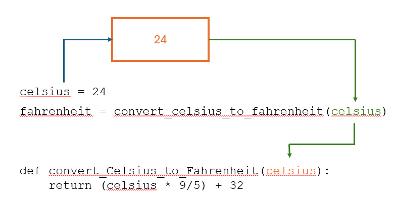

{width="100"; align=right}

# {{ title }}

!!! note "Objectives"

    - Understand the concept of functions and procedures in Python.
    - Learn why functions are useful in programming.
    - Discover when and how to use functions.
    - Understand the roles of arguments and parameters in functions.
    - Practice writing and using functions with simple examples.

Most problems we encounter can be broken down in to a series of steps.  Earlier we saw the following series of steps to make a sandwich:

- Go to the kitchen.
- Open the refrigerator.
- Take out the bread, cheese, and lettuce.
- Put two slices of bread on a plate.
- Put some cheese and lettuce on one slice of bread.
- Put the other slice of bread on top.
- Close the sandwich.
- Bring it to me.

Here's we've **decomposed** the larger problem into a series of smaller problems each can be tackled on their own but when put together will result in a sandwich being made (hopefully).

## Example 4

Read the following code and predict what the output will be using the questions below as a prompt.

```python
def convert_celsius_to_fahrenheit(celsius):
    return (celsius * 9/5) + 32

def calculate_average(temperatures):
    return sum(temperatures) / len(temperatures)

def greet(name):
    return f"Hello, {name}! Welcome to Climate Quest."

weekly_celsius_temps = [22, 24, 20, 26, 23, 25, 21]
average_temp = calculate_average(weekly_celsius_temps)
print("Average Weekly Temperature (Celsius):", average_temp)

name = "Student"
greeting = greet(name)
print(greeting)

temp_in_fahrenheit = convert_celsius_to_fahrenheit(average_temp)
print("Average Weekly Temperature (Fahrenheit):", temp_in_fahrenheit)
```

- "What will `convert_celsius_to_fahrenheit(25)` return?"
- "What does the `calculate_average` function do with the list of temperatures?"
- "What will be stored in `greeting`?"
- "What will be printed for the average temperature in Fahrenheit?"


??? note "Answers"

      1. **What will `convert_celsius_to_fahrenheit(25)` return?** 77
      2. **What does the `calculate_average` function do with the list of temperatures?** Calculates the average, which is 23.0 for the provided list.
      3. **What will be stored in `greeting`?** `"Hello, Student! Welcome to Climate Quest."`
      4. **What will be printed for the average temperature in Fahrenheit?** `Average Weekly Temperature (Fahrenheit): 73.4`

Copy and paste the example code into your code editor.  Run the code to check your predictions.

## Syntax of a functions

To create a function in Python, we use the `def` keyword, followed by the function name, pair of parentheses, `()`, followed by a colon, `:`. 

For example:

```python
def my_function():
    # Function body
    pass
```

!!! note

    The keyword `pass` is a statement that does not do anything.  It is useful when scaffolding code as in the previous example.  We know we want a function that calculates the area of a rectangle but are either unsure of how to complete this function or want to return to it later so we enter `pass`.  Our main program will still call that function but nothing will happen.

## Naming the function

Similar to the naming of variables and constants, the name we give to our function should be self-documenting.  In our example program one of the functions is named `convert_celcius_to_fahrenheit()`.  This name describes exactly what this function will do!  It might be more to type than say `conv_cel to fahr()` of `c_to_f()` but being more precise will result in your code being easier to read and maintain.

The syntax required can be summarised as:

- **Function Name**: Descriptive and meaningful (follow naming conventions), the identifier for the function
- **Parentheses**: Used to pass arguments (inputs) to the function.
- **Colon**: Indicates the beginning of the function body.
- **Indentation**: All code inside the function must be indented.
- **Statement(s)**: The body of the function, statements that get executed every time the function is called.

Using functions are **highly recommended**.  They provide: 

- **Modularity:** Divide your code into smaller, self-contained modules (functions) for easier development and debugging.
- **Reusability:** Write code once and use it multiple times, reducing duplication.
- **Readability:** Functions make code more understandable and concise.
- **Maintenance:** Changes are easier to implement and test within a function.

## Indenting the function body

When defining a function the body of the code in that function must be indented to show the code belongs to that function.

```python
def convert_celsius_to_fahrenheit(celsius):
    return (celsius * 9/5) + 32

celsius = 24
print(convert_celsius_to_fahrenheit(celsius)
```

The function body here only has one line (line 2), but it has been indented (by four spaces).  Your code editor will probably indent this line automatically.

Lines 4 and 5 are not part of the function, they are lined up with the left-hand margin.

## Functions return a value

```python hl_lines="2 5"
def convert_celsius_to_fahrenheit(celsius):
    return (celsius * 9/5) + 32

celsius = 24
fahrenheit = convert_celsius_to_fahrenheit(celsius)
```

!!! note

    All functions, by definition, will return a value.  Here the fahrenheit equivalent of the given celsius value is returned from our function (line 2) and assigned to the variable 'fahrenheit' (line 5)

## Procedures vs Functions

Look at the following code, it assumes the functions `get_value()`, `calculate_area()` but these are not shown, also `print_result()`:

```py
def main():
    length = get_value()
    height = get_value()
    area = calculate_area(length, height)
    print_result(area)
```

The statements in the first three lines are assignment statements.  An item of data is being returned from that block of code and immediately assigned to a variable.

Line 5 is different, `print_result(area)`.  Any value being returned here is not assigned to a variable.  This is known as a **procedure**.  

We might expect `print_result()` to be:

```python
def print_result(area):
    print(area)
```

Notice there is no return statement here.  This is what makes it a **procedure** and not a function.

!!! warning

    This is not strictly true _in Python_, as a procedure will always return `None` when it is called, but we generally ignore this and it is not used.

To return a value from a function we have to use the `return` statement.  Here's how it might be used for the `get_value()` function:

~~~~~py
def get_value():
    print("Enter a value: ")    # prompt for a value
    value = int(input())        # cast the input to an integer
    return value                # return the input back to the main program
~~~~~

Similarly to calculate the area the result is being returned:

~~~~~py
def calculate_area(length, height):
    return length * height
~~~~~

That return value needs to be stored somewhere, yes, in a variable: `area = calculate_area(length, height)`.

## Parameters and Arguments

```python hl_lines="1 5"
def convert_celsius_to_fahrenheit(celsius):
    return (celsius * 9/5) + 32

celsius = 24
fahrenheit = convert_celsius_to_fahrenheit(celsius)
```

Line 1 declares the function using the `def` keyword, followed by the name of the function and then a pair of brackets.  To calculate the fahrenheit value we need to know the celsius value.  This is **passed in** as a **parameter** to the function.

Think of this **parameter** as a placeholder.  We do no know the value yet, it could be any value as defined by the user or our program.

Line 5 **calls** our function, using the function name followed by the **argument** to pass to the function.  In this instance it is the value $24$.

When the function is executed Python will create a new **local variable** and copy the value of the argument to that new variable.  When the function finishes that local variable will no longer be available.

In this instance we happen to use the same name for our argument and our parameter - this can aid readability but they could have been different e.g.

```python hl_lines="4 5"
def convert_celsius_to_fahrenheit(celsius):
    return (celsius * 9/5) + 32

celsius_input = 24
fahrenheit = convert_celsius_to_fahrenheit(celsius_input)
```




Remember:

- **Parameters:** Variables declared in the function header.
- **Arguments:** Values passed to the function when it's called.

## Calling a function

To **call** a function we enter the name for the function and any arguments that need to be passed to the function from another part of our program.  The function call **must** come after the function definition in Python.

~~~~~python
def calculate_area(rec_length, rec_height):     # function definition
    return rec_length * rec_height)

length = 10
height = 5
area = calculate_area(length, height)           # function call
print(area)
~~~~~

## Default parameters

Consider the following example:

~~~~~python
def greet(name, message="Hello"):
    print(f"{message} {name})
~~~~~

Python allows for functions (and procedures) to have default arguments.  The procedure `greet()` can now be called with only one argument:

~~~~~python
greet("Sally")          # "Hello Sally"
~~~~~

Or we can override the default parameter replacing the default message with one of our own:

~~~~~python
greet("Sally", "Hi")    # "Hi Sally"
~~~~~

## Why bother with functions?

It can be a lot of trouble to organise your code into these blocks, functions, so why bother?  There are a number of good reasons:

- Providing a name for a group of statements that are responsible for a task will make the program easier to read and debug
- Using functions can eliminate the need to duplicate code.  One of the guiding rules of good programming style is the acronym **DRY**.  This stands for **Don't Repeat Yourself**
- With a long program decomposed into smaller chunks it becomes easier to locate where there might be a bug.  It can also be easier to start with a high level description (even as code) and then progressively break each of these down into as many functions as might be required.
- Well designed functions can be used in other programs.  Once its written and tested you can use it elsewhere.

## Keyword parameters

When you call a function, you usually pass values as arguments in the same order as the function's parameters are defined. However, sometimes it's more convenient to specify which argument corresponds to which parameter by using their names. These are called **keyword parameters**.

Let's say we have our simple function that calculates the area of a rectangle, we can call this function using keyword parameters:

~~~~~python
area = calculate_area(length=5, width=10)
~~~~~

The names of the parameters are explicitly mentioned with their values.  It makes the code more readable, especially when you have a function that takes in several arguments.  If the keyword parameter is used the order of the variables do not matter.

## Summary

Functions are fundamental to programming in Python. They promote code organization, reusability, and readability. As you continue your programming journey, you'll find that functions become an essential tool for solving complex problems efficiently.

[Cheat Sheet for functions](../../files/beginners_python_cheat_sheet_pcc_functions.pdf){:class=md-button}[^source]

[^source]: [https://ehmatthes.github.io/pcc_3e/cheat_sheets/(https://ehmatthes.github.io/pcc_3e/cheat_sheets/)]

## Activity

Using the following code:

```python
def add(a, b):
    return a + b

def multiply(a, b):
    return a * b

num1 = 10
num2 = 5

sum_result = add(num1, num2)
print("Sum:", sum_result)

product_result = multiply(num1, num2)
print("Product:", product_result)
```

Modify this code:

- Change the variable values and observe the output.
- Add more functions that perform different basic tasks.
- Experiment with returning different types of values (e.g., strings, booleans).

## Climate Quest Project

{align=left width="200"}

Throughout this topic we'll be working on a large scale project: **Climate Quest**.  In this project a player embarks on a journey to combat the effects of climate change by making decisions that impact the environment. Each choice affects the outcome of the game, emphasizing the importance of individual actions in addressing climate change.

[Go to task 4 - Functions](./climate_quest/task_4.md){:class=md-button}

## Questions

{{ show_questions(page.title, page.meta.filename) }}

## Programming Tasks

{{ get_programming_tasks(page.title)}}