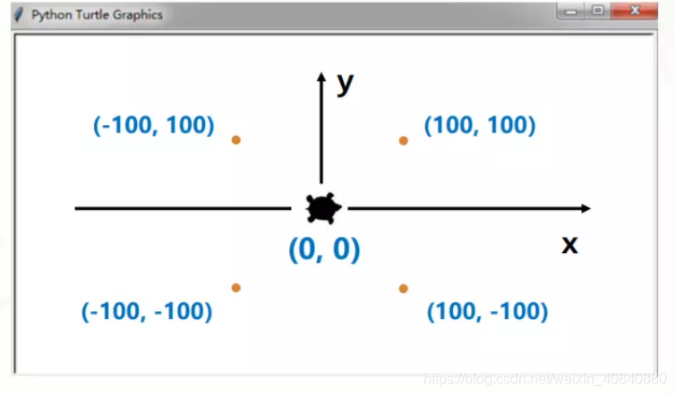
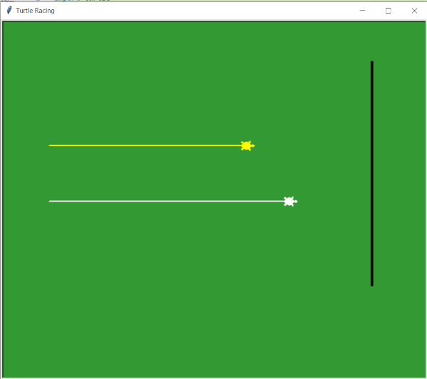
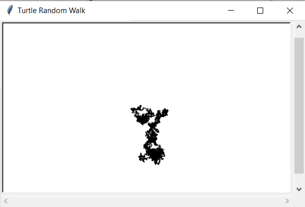

{width="100"; align=right}

# {{ title}}

!!! note "Objectives"

      - Define Turtle graphics and its role in introducing programming concepts.
      - Understand the canvas, screen, and the turtle itself in the context of Turtle graphics.
      - Explain the basic movements of the turtle using functions like `forward()`, `backward()`, `right()`, `left()`, `goto()`, and `home()`.
      - Use loops and functions to draw basic shapes such as squares, triangles, and circles with the Turtle library.
      - Demonstrate the use of functions to modularize code and avoid code duplication, especially when drawing repetitive shapes like rectangles.


The turtle library in Python is a great way to introduce beginners to programming concepts like sequence, selection, iteration, and functions while also creating visual outputs. 

The turtle library is a pre-installed Python library (also in replit) that is used to create pictures and shapes by providing a virtual canvas. The onscreen pen that you use for drawing is called the turtle and this is what gives the library its name. 

To get started we need the canvas, the screen, and we need the turtle:

~~~~~py
import turtle
s = turtle.getscreen()
t = turtle.Turtle()    # note case, and don't forget the brackets
s.exitonclick()           # stop the screen from closing
~~~~~

## Moving the turtle

The turtle can move in four directions:

~~~~~py
t.right(90)         # or t.rt(90)
t.forward(100)      # or t.fd(100)
t.left(90)          # or t.lt(90)
t.backward(100)     # or t.bk(100)
~~~~~

Or provide coordinates, (0,0) is in the centre of the screen:

~~~~~py
t.goto(50,200)
t.home()            # return it to the centre
~~~~~



### Exercise 1:

Create a program that uses the turtle library to draw basic shapes such as squares, triangles, and circles. Use loops for repetitive actions and functions to modularize code.

!!! note 

      The Turtle library has a `circle()` function; `t.dot(20)` will draw a filled in circle of given diameter

### Exercise 2:

Combine those shapes to draw a picture of say a house with a door, windows, roof, walls etc.

!!! tip

      Can a function, or several functions be used to avoid duplication of code when e.g. drawing a rectangle?

## Changing the screen colour

The default background is white, this can be changed:

~~~~~py
t.bgcolor("blue")
~~~~~

Lots of other colours are available, or can be defined using hex codes e.g. 

~~~~~py
turtle.bgcolor("#336699")
~~~~~

## Changing the turtle

The size of the turtle can be changed:

~~~~~py
t.shapesize(10,1,5)
~~~~~

The parameters are length, width and outline width.

The pen size and colour can also be changed:

~~~~~py
t.pensize(5)
t.forward(100)
~~~~~

The colour of both the turtle and the pen can be changed:

~~~~~py
t.fillcolor("red")
t.pencolor("green")
~~~~~

Many of these properties can be given a one-liner, with the pen attributes being specified in the parameters:

~~~~~py
t.pen(pencolor="purple", fillcolor="orange", pensize=10, speed=9)
~~~~~

## Picking the pen up and down

To move the turtle without drawing on the canvas, the pen must be picked up, and then put down to continue drawing:

~~~~~py
t.fd(100)
t.rt(90)
t.penup()
t.fd(100)
t.rt(90)
t.pendown()
t.fd(100)
t.rt(90)
t.penup()
t.fd(100)
t.pendown()
~~~~~

## Python commands are still available!

Using standard Python statements for `if` and `for` and `while` are still available and can be used with the turtle and the drawing commands.

~~~~~py
 n=10
while n <= 40:
    t.circle(n)
    n = n+10
~~~~~

### Exercise 3:

Create a colorful spiral pattern using the turtle library. Experiment with changing colors, angles, and distances to create an interesting visual effect. 

!!! tip

      To select a random colour use a list e.g. colours = ["red", "blue", "green"]

### Exercise 4:

Create a race program.  Two turtles move across the screen to an end point.  Each moves a random distance each time so either one could be the winner of the race.



## A final example

A random walk is a random process that describes a path that consists of a succession of random steps on some mathematical space (see [Wikipedia](https://en.wikipedia.org/wiki/Random_walk)).  An interesting theory with applications in various domains including stock market analysis.  We can illustrate this process using our humble turtle:

!!! tip 
      Leave it running for a while (perhaps a long while) and see the effect.


```py
import turtle
import random

# Initialize Turtle
wn = turtle.Screen()
wn.title("Turtle Random Walk")
wn.setup(width=200, height=100)
wn.bgcolor("white")

# Create a turtle for drawing
t = turtle.Turtle()
t.speed(0)  # Fastest drawing speed

# Start in the middle of the screen
x, y = 0, 0
t.goto(x, y)

# Function to handle screen boundaries
def check_boundaries():
    global x, y
    if x < -wn.window_width() / 2:
        x = wn.window_width() / 2
    elif x > wn.window_width() / 2:
        x = -wn.window_width() / 2
    if y < -wn.window_height() / 2:
        y = wn.window_height() / 2
    elif y > wn.window_height() / 2:
        y = -wn.window_height() / 2

# Draw loop
while True:
    t.color("black")

    # Randomly move
    x += random.uniform(-1, 1)
    y += random.uniform(-1, 1)

    # Check boundaries
    check_boundaries()

    # Update the turtle's position
    t.goto(x, y)

    # Draw the point
    t.dot(1)

    # Refresh the screen
    wn.update()

# Close the window on click
wn.exitonclick()
```



## Summary of commands

1. **Basic Movement:**
      - `import turtle`: Import the turtle module.
      - `turtle.forward(distance)`: Move the turtle forward by the specified distance.
      - `turtle.backward(distance)`: Move the turtle backward by the specified distance.
      - `turtle.right(angle)`: Turn the turtle to the right by the specified angle (in degrees).
      - `turtle.left(angle)`: Turn the turtle to the left by the specified angle.

2. **Pen Control:**

      - `turtle.penup()`: Lift the pen off the paper (turtle doesn't draw).
      - `turtle.pendown()`: Place the pen on the paper (turtle draws).
      - `turtle.pensize(width)`: Set the width of the turtle's pen.
      - `turtle.pencolor(color)`: Set the color of the turtle's pen.

3. **Color Control:**
      - `turtle.bgcolor(color)`: Set the background color of the drawing window.
      - `turtle.fillcolor(color)`: Set the fill color for shapes.
      - `turtle.begin_fill()`: Begin filling a shape.
      - `turtle.end_fill()`: End filling a shape.

4. **Turtle Positioning:**
      - `turtle.goto(x, y)`: Move the turtle to the specified coordinates.
      - `turtle.setx(x)`: Set the turtle's x-coordinate.
      - `turtle.sety(y)`: Set the turtle's y-coordinate.

5. **Loops:**
      - `for` loop: Create a loop that iterates a specific number of times.
      - `while` loop: Create a loop that continues as long as a condition is true.

6. **Functions:**
      - `def function_name(arguments)`: Define a new function.
      - `turtle.reset()`: Reset the turtle's position, heading, and pen settings.

7. **Other:**
      - `turtle.speed(speed)`: Set the turtle's drawing speed.
      - `turtle.clear()`: Clear the drawing window.
      - `turtle.done()`: Finish the drawing and display it.


## Programming Tasks

{{ get_programming_tasks(page.title)}}