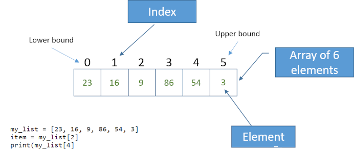

{width="100"; align=right}

# {{ title}}

!!! note "Objectives"
    - Define what a list is in Python and explain its usefulness in storing and managing collections of data.
    - Demonstrate how to create lists in Python, including examples of empty lists and lists containing various data types.
    - Explain the concept of indexing in Python lists and understand 0-based indexing.
    - Retrieve elements from a list using positive and negative indices.
    - Understand the use of a for loop to iterate over the elements of a list.
    - Introduce list operations like `append()`, `insert()`, `remove()`, and `clear()`.
    - Use the `in` keyword to check if an item is present in a list.
    - Employ the `index()` method to get the position of an item in a list.

Consider we need a program that processes capital cities of the world, we could store the names of these cities:

```py
capital1 = "London"
capital2 = "New York"
capital3 = "Paris"
capital4 = "Canberra"
# etc ...
```

Of course, the problem here is the `# etc...`.  For each new city we need a new variable.

Lists provide the solution, we can gather together the collection of cities under the one name:

```py
capital_cities = ["London", "New York", "Paris", "Canberra"]
```

The list is a fundamental data structure in Python that allows us to store and manage such collections of data. The `capital_cities` list contains a list of strings, but the list can contain any type of data.  Their contents can be changed during the run of the program, items can be added, changed or removed i.e. they are **mutable**.

## Example 8

```python hl_lines="5 9 12 15"
# Example program with basic list operations
fruits = ["apple", "banana", "cherry"]
print("Original list:", fruits)

fruits.append("orange")
print("List after appending 'date':", fruits)

mixed_list = ["text", 42, 3.14, True]
print("Mixed type list:", mixed_list)

for item in mixed_list:
    print(item)

nested_list = [[1, 2, 3], ["a", "b", "c"]]
print("Nested list:", nested_list)
```

Predict what the output of the program will be:

- What will the list look like after appending 'orange', line 5?
- Can you identify the data types of the items in `mixed_list`, line 9?
- What will be printed on line 12
- What will be printed for `nested_list`, line 15?

Run the program in a Python environment and check your predictions, were they the same?
   
## Creating Lists

To create a list we give it a name followed by the assignment operator and then a comma-separated sequence of items within square brackets `[]`.

```python
empty_list =[]                              # an empty list
fruits = ["apple", "banana", "cherry"]
numbers = [1, 2, 3, 4, 5]
mixed_list = [1, "hello", 3.14]
nested_list = [1,2,3, ['a','b'], 90]             # a nested list
```

!!! note 

    `mixed_list` has items of mixed data types, this is allowed, it can also contains lists as in `nested_list`.  The nested list here, `['a','b']` still counts as one item in this list, the number of elements in `nested` is 5.

## Accessing Items in a list

Individual elements of the list can be accessed by using **indexing.** Python uses 0-based indexing, so the first element is at index 0.

```python
first_element = my_list[0]  # Access the first element
```

To retrieve "Cherry" from the list of fruits we would use:

```py
favourite_fruit = fruits[2]
```

!!! warning

    Make sure you understand why the index used here is 2 and not 3



Thinks of this processing as mapping where each index "maps" to an item in the list.  Any integer expression can be used as the index e.g.

```py
count = 3
print(fruits[count])
print(fruits[count+1])
```
The index can also be negative, in which case it starts to count from the end of the list.

## Iterating over a list

The easiest way to iterate over the list (visit every item) is to use a `for` loop:

```py
for fruit in fruits:
    print(fruit)        # => "apple", "banana", "cherry"
```

This is fine when we need to do something with *every* item in the list.  If we want to modify particular items then we have to use the index for that item, usually combined with a function such as `range()` or `len()`:

```py
for i in range(len(fruits)):
    fruits[i] = fruits[i].upper()
```

Remember, `len()` returns the number of items in the list, and `range()` handles the indices from $0$ to $n-1$ (where $n$ is the number of items in the list).

## Modifying Lists

* Lists are 'mutable', so you can change their content by assigning new values to elements.
* This can be done by using the index:

```python
# Modifying list elements using the index
fruits[0] = "orange"
```
* Or by using a list operation:

```py
numbers.append(6)     # Adds 6 to the end of the list
numbers.insert(2, 99)  # Inserts 99 at index 2
numbers.remove(4)     # Removes the element with value 4
```

## List Slicing

* You can extract a portion of a list using slicing, which involves specifying a start and end index, separated by the slice operator, a colon `:`:

```python
# Slicing a list
sublist = numbers[1:4]  # Extracts elements at indices 1, 2, and 3
partial = fruits[:2]    # Extracts elements at indices 0 and 1
```

!!! hint

    The same slicing approach can be used when extracting sections of a string as a sub-string

* If the first index in the slice is omitted, the slice starts at the beginning of the list; if the second is omitted it will go through to the end of the list. (Omitting both returns the whole list.)

## List Operations

There are a number of useful operations, we can perform on the list, including appending, extending, and removing elements.

```python
my_list.append(4)        # Add an element to the end
my_list.extend([5, 6])   # Extend the list with another list
my_list.remove("apple")  # Remove a specific element
my_list.clear()          # remove all elements from the list
my_list.sort()           # sort the list
my_list.pop()            # removes the element at the back of the list
```

Most of these list operations act on the list but return `None`, e.g. it looks like `b` will be assigned the sorted list `a` but it does not:

```py
a = [9,3, 0, 2]
a.sort()            # OK, a is now [0,2,3,9]
a = [9,3, 0, 2]
b = a.sort()        # b is None
```

Lists can be joined together, concatenated, using the `+` operator:

```py
listA = [1,2,3]
listB = [4,5,6]
listC = listA + listB           # => [1,2,3,4,5,6]
```

!!! note 

    Similarly the multiplication operator, `*`, can be used to repeat the list a number of times in a new list

### List Functions

Also, Python provides built-in functions for working with lists, such as `len()`, `max()`, and `min()`.

```python
length = len(my_list)    # Get the length of the list
max_value = max(my_list)  # Find the maximum value in the list
min_value = min(my_list)  # Find the minimum value in the list
sum_of_list = sum(my_list)  # sums the values in the list (only works with numbers)
```

## Checking for List Membership

- You can check if an item is present in a list using the `in` keyword.

```python
# Checking for list membership
if "apple" in fruits:
    print("Found apple in the list")
```

- To get the position of an item in a list we use the `index()` method:

```py
fruits = ["apple", "banana", "cherry"]
print(fruits.index("cherry"))                   # prints 2
```

## Lists and strings

A string is a sequence of characters and often behaves like a list but note the following code:

```py
str = "hello"
str_list = list(str)
print(str_list)         # ['h','e','l','l','o']
```

The `list()` function breaks the string into its individual characters.


## Example

```python
# Creating a list of numbers
my_numbers = [10, 20, 30, 40, 50]

# Accessing and modifying list elements
my_numbers[2] = 35
my_numbers.append(60)

# Slicing the list
subset = my_numbers[1:4]  # [20, 35, 40]

# Using list comprehension to create a new list
squared_numbers = [x**2 for x in my_numbers]

# Checking for list membership
if 25 in my_numbers:
    print("25 is in the list")

# Displaying the modified list and squared numbers
print(my_numbers)
print(squared_numbers)
```

## Activity

Modify the example code to:

- Insert a new fruit into the second position of the `fruits` list.
- Remove an element from the `mixed_list`.
- Add a new element to one of the sublists in the `nested_list`.

## Climate Quest Project

{align=left width="200"}

Throughout this topic we'll be working on a large scale project: **Climate Quest**.  In this project a player embarks on a journey to combat the effects of climate change by making decisions that impact the environment. Each choice affects the outcome of the game, emphasizing the importance of individual actions in addressing climate change.

[Go to task 8 - Lists](./climate_quest/task_8.md){:class=md-button}

## Summary

* Lists are ordered, meaning they maintain the order in which items were added.
* Lists can contain elements of different types.
* Lists are versatile and can be used to implement various data structures like stacks and queues.
* Lists can be nested, meaning you can have lists within lists.

[Cheat sheet for lists)](../../files/beginners_python_cheat_sheet_pcc_lists.pdf){:class=md-button}[^source]

[^source]: [https://ehmatthes.github.io/pcc_3e/cheat_sheets/(https://ehmatthes.github.io/pcc_3e/cheat_sheets/)]

## Questions

{{ show_questions(page.title, page.meta.filename) }}

## Programming Tasks

{{ get_programming_tasks(page.title)}}