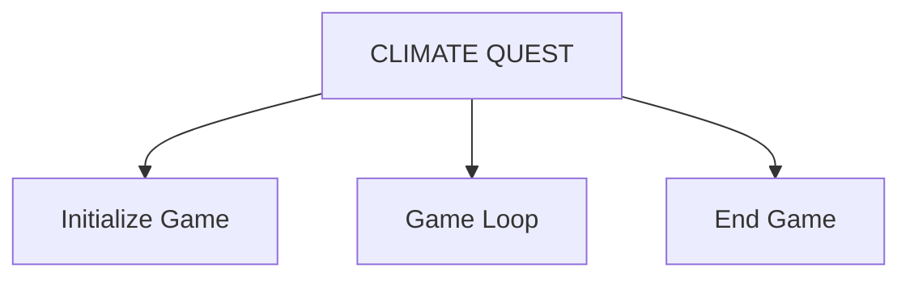
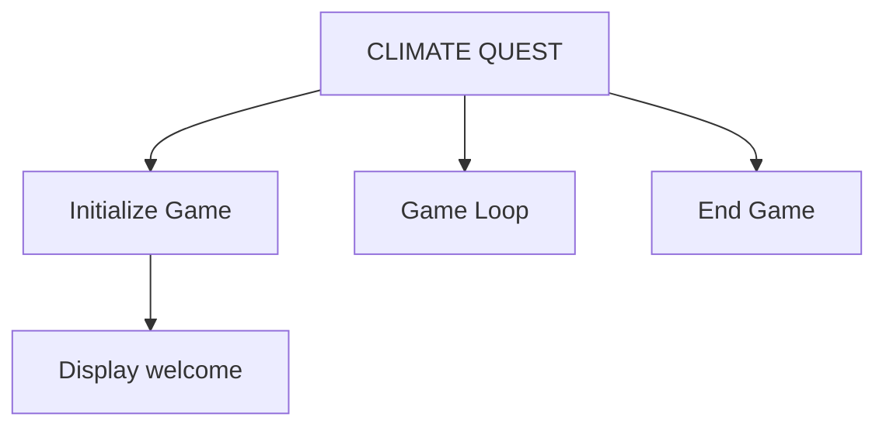
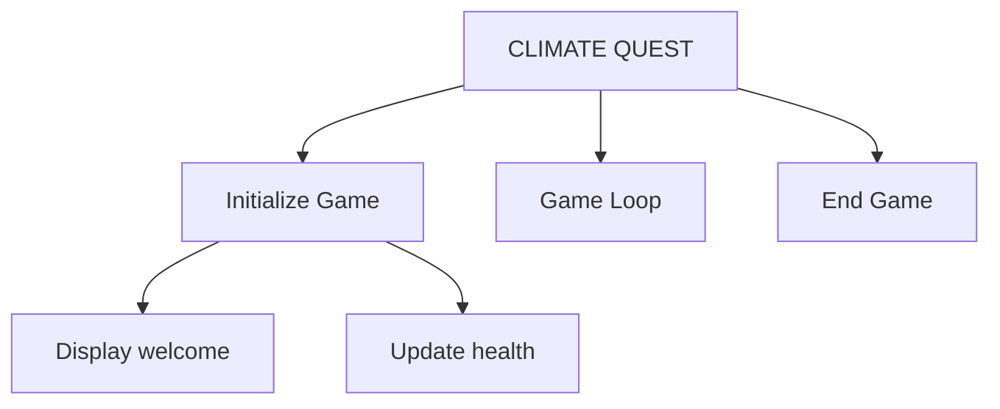
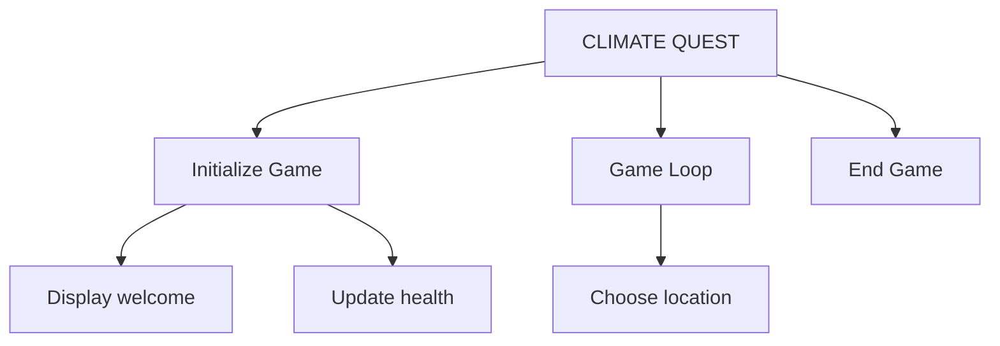

{align=right width="100"}

# {{ title }}

## Objective:

The objective of this task is to practice creating and using functions to handle different parts of a program. You will extend the "Climate Quest" game by adding new functions to manage different locations and challenges. This will help you understand how to modularize code and manage complexity.

!!! note  "Learning Outcomes:"

    By the end of this task, you should be able to:

    1. Create and use functions to handle different tasks.
    2. Understand how to modularize code to manage complexity.
    3. Integrate new functions into an existing program structure.
    4. Practice defining and calling functions with arguments and return values.

## Task Description:

You will use a given **structure chart** to visualise the main processes in the game and then create functions for the "Climate Quest" game to handle the various locations and challenges. You will also update the game to use these new functions, helping to manage the complexity of the program and improve its structure.

## Structure Charts

A **structure chart** is a type of diagram that shows the organization and relationships between different parts of a program, such as functions and procedures.

- Structure charts typically use a **hierarchical** structure to show the different levels of modules in a program, with the main module at the top and subsequent levels branching out to show lower-level modules.
- The **connections** between modules are shown using lines that indicate how data flows between them. This helps programmers understand the dependencies and interactions between different parts of the program.
- Structure charts are often used in **top-down design** approaches, where the overall program is first represented at a high level, and then broken down into smaller modules that handle specific tasks.
- Structure charts serve as a form of **documentation** for the program, helping programmers, designers, and other stakeholders understand the overall architecture and design of the software.

## Climate Quest structure chart

Refer to the [specification](introduction.md) of the Climate Quest game.  At the top most level we see three main processes:

- **Introduction/Initialisation**: Explaining the purpose of the game to the user and gathering some information such as the player's name etc..
- **The Game loop**: The user can select from a number of locations, work through various challenges with the `environment_health` score being updated each time.
- **End of the game**: The game ends and a final score is displayed.

These stages can be represented as a structure chart:



The structure chart will need to be developed further as we start to break down each of these processes into smaller tasks (functions)

### Initialize Game

In the [previous task](task_3.md) our program started by printing a welcome message to the player:

``` python
print("Welcome to Climate Quest!")
print("The environment is facing serious challenges due to climate change.")
print("Your mission is to make decisions that help mitigate these effects and protect the planet.")
```

We can wrap this into a function, and call it from the top level process `initialise_game()`:

```python
def print_welcome():
    """
    Display the welcome message to the user.
    """
    print("Welcome to Climate Quest!")
    print("The environment is facing serious challenges due to climate change.")
    print("Your mission is to make decisions that help mitigate these effects and protect the planet.")

def initialise_game():
    print_welcome()
```



We also set the starting value for the `environment_health` score.  This value will be updated a lot during the course of the program.  To save on duplication we should write a function to set this variable and another to update it (this will be used later).  This can also be called from `initialise_game()`:

```python
def initialize_health(initial_value):
    """
    Initialize the environmental health with a given value.
    """
    return initial_value
    
def update_health(current_health, change_amount):
    """
    Update the environmental health by adding or subtracting a value.
    """
    return current_health + change_amount

def print_welcome():
    # omitted

def initialise_game():
    print_welcome()
    environment_health = initialise_health(100)
```



## New Functions to Implement:

There are many new functions we can now add into our program, as part of the game loop.  We will come onto how these might fit together later and also explore the implementation of these functions.  

One approach at this stage is to:

- identify the functions needed:  this might change later, it's a "first stab"
- write the header for the functions and a stub comment to just print something useful to the screen for now and returns `None` (this will be changed later when we have worked out how to implement the function)
- Include a comment in each function to describe the purpose of the function 

For example: our player will need to move from location to location.  We will need a function to choose that location i.e. `choose_location()`:

```python
def choose_location():
    """
    Allow the player to choose a location for their environmental challenge.
    """
    print("Choose location")
    return None

def game_loop():
    """
    The main game loop
    """
    choose_location()
```



## Exercises

Using this approach:

- add the following functions to your code file
- add the new functions to the structure chart
- call the functions from the `game_loop()` function

1. **`choose_location()`**:
   
      - Allows the player to choose a location for their environmental challenge.
      - **Returns:** str - The chosen location.

2. **`ocean_challenge(environment_health)`**:
   
      - Handles the environmental challenge for the ocean location.
      - **Parameters:** `environment_health` (int) - The current environmental health value.
      - **Returns:** int - The updated environmental health value.

3. **`forest_challenge(environment_health)`**:
   
      - Handles the environmental challenge for the forest location.
      - **Parameters:** `environment_health` (int) - The current environmental health value.
      - **Returns:** int - The updated environmental health value.

4. **`city_challenge(environment_health)`**:
   
      - Handles the environmental challenge for the city location.
      - **Parameters:** `environment_health` (int) - The current environmental health value.
      - **Returns:** int - The updated environmental health value.

5. **`arctic_challenge(environment_health)`**:
   
      - Handles the environmental challenge for the arctic location.
      - **Parameters:** `environment_health` (int) - The current environmental health value.
      - **Returns:** int - The updated environmental health value.

6. **`desert_challenge(environment_health)`**:
   
      - Handles the environmental challenge for the desert location.
      - **Parameters:** `environment_health` (int) - The current environmental health value.
      - **Returns:** int - The updated environmental health value.

**Test Your Functions**:

   - Test each function separately to ensure it works as expected.
   - Verify that the functions interact correctly when integrated into the main program.

**Understand Function Usage**:

   - Observe how functions help in organizing and managing different parts of the game.
   - Practice using functions to handle specific tasks and integrate them into the overall program.

**Test Your Program**:

   - Run your program to ensure that it correctly performs tasks and produces the desired output for different locations and challenges.

## Questions for Reflection:

1. How do the new functions improve the structure of the game?
2. What is the role of each function in managing different parts of the game?
3. How does modularizing the code into functions help in managing complexity?

### Extension Activity (Optional):

- Add more locations and corresponding challenge functions.
- Implement additional features or enhancements to the game using functions.

NB.  A sample file for this stage can be downloaded from [here](./code/climate_quest_1.py)