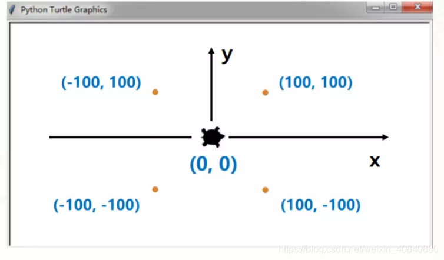

<style>
    .columns {
        display: grid;
        grid-template-columns: repeat(2, minmax(0, 1fr));
        gap: 1rem;
    }    
</style>

<!-- _class: invert -->
# Programming with Python


---

<!-- this is some notes for the presenter -->

# Contents

<div class="columns">
<div>

- [Getting Started with Python](#gettint-started-with-python)
- [Variables](#variables)
- [Operators](#operators)
- [Strings](#strings)
- [Functions](#functions)
- [Built in Function](#built-in-functions)
- [Selection](#selection)
- [Iteration](#iteration)

</div>
<div>

- [Turtle Programming](#turtle-programming)
- [Lists](#lists)
- [2D Lists](#2d-lists)
- [Dictionaries](#dictionaries)
- [Tuples](#tuples)
- [Exceptions](#exceptions)
- [File Handling](#file-handling)

</div>
</div>

---
<!-- _class: invert -->
# Getting Started with Python

---

# Objectives

- Set up a Python environment on your computer.
- Choose and configure an IDE.
- Understand basic Python concepts.
- Write and run your first Python program.

---

# Step 1: Installing Python

<div class="columns">
<div>

1. **Microsoft Store** (Quick & Easy)
   - Search for "Python" on Microsoft Store.
   - Install the latest version (e.g., 3.11).

2. **Full Python Package**
   - Download from [python.org](https://www.python.org/downloads/).
   - Choose the version for your OS (e.g., Python 3.x).
</div>

<div>


</div>
</div>

---

# Step 2: Running the Installer

- **Windows**: Run the `.exe` and select "Add Python to PATH".
- **macOS**: Use the `.dmg` installer.
- **Linux**: Follow terminal-based install steps.

```py
> python --version
Python 3.10.5
```

---

# Step 3: Python Interactive Environment

1. Open a terminal.
2. Type `python` to enter the Python interactive environment.

This is also called the **REPL** (Read-Evaluate-Print-Loop).

---

# Step 4: Basic Operations

Try these commands in the REPL:

```py
>>> 2 + 3
>>> 5 - 1
>>> 4 * 6
>>> 10 / 3
>>> 10 // 3
```

---

# Step 5: Variables in Python

Declare and use variables:

```py
>>> x = 5
>>> y = 3
>>> sum_result = x + y
>>> product_result = x * y
>>> sum_result
>>> product_result
```

---

# Step 6: Strings in Python

Working with strings:

```py
>>> greeting = "Hello"
>>> name = "Alice"
>>> full_greeting = greeting + " " + name
>>> full_greeting
```

String operations:

```py
>>> greeting_length = len(greeting)
>>> uppercase_name = name.upper()
```

---

# Step 7: Lists in Python

Create and modify lists:

```py
>>> fruits = ["apple", "banana", "cherry"]
>>> fruits.append("orange")
>>> fruits.remove("banana")
>>> fruits
```

---

# Step 8: Exiting Python REPL

- Use `exit()`, `quit()`, or press `Ctrl+D` (Windows) to exit the REPL.

---

# Choosing an IDE

- **Default**: IDLE (comes with Python).
- **Alternatives**:
  - Thonny
  - Visual Studio Code
  - PyCharm
  - Online editors like [repl.it](https://replit.com)

Choose one that fits your style!

---

# Writing Your First Python Program

1. Open your chosen IDE.
2. Create a new file and save it as `hello.py`.
3. Enter the following code:

```python
print("Hello, World!")
```

4. Run the program in your IDE.

---

# Updating Python and Pip

Keep your Python and Pip versions up-to-date:

```bash
pip install --upgrade pip
pip list --outdated
```

---

# Your First Python Program (Terminal)

- Save the file in a directory (e.g., `C:\PythonFiles\Hello\hello.py`).
- Run it from the terminal:

```bash
python hello.py
```


---

<!-- _class: invert -->

# Variables

---

# Objectives

- Understand variables and constants.
- Learn Python’s dynamic typing system.
- Follow Python’s naming conventions.
- Use `print()` for output and `input()` for user input.
- Check the data type of variables.
- Gain practical experience via programming tasks.

---

# What is a Program?

- A **program** is a set of instructions that tells a computer what to do.
- Like directions for a robot, a program follows a sequence of steps.

### Key Components of Programs:
1. **Input**: Get data (keyboard, file, etc.).
2. **Output**: Display data (screen, file, etc.).
3. **Operators**: Perform math and logic operations.
4. **Conditionals**: Check and execute code based on conditions.
5. **Repetition**: Repeat actions (loops).

---

# Example Program

<div class="columns">
<div>

```python
name = "Alice"
age = 21
PI = 3.14

print("Name:", name)
print("Age:", age)
print("PI:", PI)

user_input = input("Enter something: ")
print("You entered:", user_input)
print("Data type:", type(user_input))
```
</div>
<div>

- **Line 1**: What is stored in `name`?
- **Line 6**: What does `print("Age:", age)` display?
- **Line 9**: What happens when input is requested?
- **Line 11**: What does `type(user_input)` do?

</div>
</div>

---

# What is a Variable?

<div class="columns">
<div>

- A **variable** is a label for storing data.
- **Dynamic typing** in Python: Data type determined by value during execution.

```python hl_lines="2 3 4"
name = "Alice"
age = 21
PI = 3.14
```

</div>
<div>

**Types of Data**:

  | Line | Identifier | Value   | Type    |
  |------|------------|---------|---------|
  |  1   | `name`     | "Alice" | String  |
  |  2   | `age`      | 21      | Integer |
  |  3   | `PI`       | 3.14    | Float   |

</div>
</div>

---

# Python's Primitive Data Types

1. **Int**eger: whole numbers.
2. **Float**: numbers with decimals.
3. **Bool**: `True` or `False`.
4. **Str**ing: a sequence of characters.

---

# Comments in Python

- Use `#` for single-line comments:

```python
# This is a comment
```

- Comments are ignored by the interpreter.

---

# Dynamic vs Static Typing

- **Static typing** (e.g., C#):
  ```cs
  string name = "Alice";
  int age = 21;
  ```

- **Dynamic typing** (Python): Variable type is set by value.

---

# Identifiers in Python

- Descriptive variable names help code readability.

```python
is_student = True
cumulative_sum = 50
```

- **Rules**:
  - Cannot start with a number.
  - Cannot use Python keywords.
  - Use underscores for multiple words (snake_case).

---

# Python Keywords

- Some reserved keywords in Python include:

  `and`, `as`, `assert`, `break`, `class`, `continue`, `def`, `else`, `if`, `import`, `lambda`, `return`, etc.

- **Cannot be used as variable names**.

---

# Naming Conventions and PEP8

- **PEP8** is Python’s style guide for writing clean, readable code.
- Use **snake_case** for variables:
  
  ```python
  is_student = True
  ```

- For more, check [PEP8 Documentation](https://pep8.org).

---

# Assigning Values to Variables

- Variables can be reassigned to new values.

```python hl_lines="5"
name = "Alice"
name = "Imran"  # Reassigned
```

- Use the assignment operator `=` to assign values.

---

# Simple Output

- Use the `print()` function to display data:

```python
print("Name:", name)
print("Age:", age)
print("PI:", PI)
```

---

# Getting User Input

- Use `input()` to capture user input:

    ```python hl_lines="10"
    user_input = input("Enter something: ")
    print("You entered:", user_input)
    ```

- Data from `input()` is always a string.

---

# Casting Data Types

Convert user input to different types:

- **To Integer**:
  ```python
  age = int(input("Enter your age: "))
  ```
- **To Float**:
  ```python
  price = float(input("Enter price: "))
  ```
- **To String**:
  ```python
  str_value = str(42)
  ```

---

# Checking Data Type

- Use `type()` to check the data type of a variable:

```python hl_lines="12"
print("Data type of user input:", type(user_input))
```

---

# Constants in Python

- **Constants** are values that should not change.

```python hl_lines="4"
PI = 3.14  # Constant
```

- Python doesn't enforce constants but use **UPPERCASE** for constant names.

---

# Formal vs. Natural Languages

- **Natural languages** (e.g., English) evolve over time.
- **Formal languages** (e.g., Python) have strict syntax and rules.

---

# The Python Interpreter

- Python is an **interpreted language** (code is executed line by line).
- Python code is compiled to **bytecode** and executed by the **Python Virtual Machine (PVM)**.

---

# Questions?

- What is a variable, and why is it important in programming?
- Explain the difference between a variable and a constant.
- What does dynamic typing mean in Python?

---
<!-- _class: invert -->
# Operators

---

## Objectives

- Understand assignment operator use
- Perform calculations using mathematical operators (+, -, *, /, %, //)
- Use augmented assignment operators
- Apply operator precedence
- Work with logical and comparison operators
- Modify logical expression evaluation using parentheses

---

# Types of Operators in Python

1. **Mathematical operators**
2. **Comparison operators**
3. **Logical operators**
4. **Assignment operator**

---

## Example Program

```python hl_lines="2"
a = 10
b = 5
result = a + b * 2
print("Result 1:", result)  # what will be printed here?

result = (a + b) * 2
print("Result 2:", result)  # what will be printed hre?

result = a // b
print("Result 3:", result)  # what will be printed here?

is_greater = a > b
print("Is a greater than b?", is_greater)  # and here?

logical_test = (a > b) and (a < 20)
print("Logical test:", logical_test)  # and here
```

---

## Example Output Predictions

- Result 1: 20
- Result 2: 30
- Result 3: 2
- Is a greater than b? True
- Logical test: True

---

## Assignment Operator

The assignment operator `=` assigns a value to a variable.

```python
name = "Simon"
age = 42
print(name, age)
```

- `name = "Simon"` assigns the value "Simon" to the variable `name`.
- `age = 42` assigns the value 42 to the variable `age`.

---

## Mathematical Operators

| Operator | Description   | Example | Result  |
|:--------:|---------------|:-------:|:-------:|
| +        | Addition       | `7 + 3` | 10      |
| -        | Subtraction    | `7 - 3` | 4       |
| *        | Multiplication | `7 * 3` | 21      |
| /        | Division       | `7 / 3` | 2.33    |

---

## Integer Division

| Operator | Description        | Example  | Result |
|:--------:|--------------------|:--------:|:------:|
| `//`     | Floor Division      | `7 // 3` | 2      |
| `%`      | Modulo (Remainder)  | `7 % 3`  | 1      |

---

## Modulo Operator Usage

- The modulo operator `%` returns the remainder from integer division
- Really useful e.g. to check if a number divides evenly.

```python
if x % 2 == 0:
    print("x is even")
else:
    print("x is odd")
```

---

## Exponent Operator

| Operator | Description | Example  | Result |
|:--------:|-------------|:--------:|:------:|
| `**`     | Exponent    | `7 ** 3` | 343    |

---

## Augmented Assignment Operators

Shorthand for incrementing or modifying a value:

```python
x = 10
x += 1  # same as x = x + 1
```

You can use `+=`, `-=`, `*=`, `/=`, and other operators in this way.

---

## Operator Precedence

Order of precedence:

1. **Exponentiation**: `**`
2. **Multiplication/Division**: `*`, `/`
3. **Addition/Subtraction**: `+`, `-`

Use parentheses to modify precedence.

---

## Comparison Operators

| Operator | Description         | Example  | Result |
|:--------:|---------------------|:--------:|:------:|
| `==`     | Equal to            | `7 == 7` | True   |
| `!=`     | Not equal to        | `7 != 6` | True   |
| `>`      | Greater than        | `7 > 6`  | True   |
| `<`      | Less than           | `7 < 6`  | False  |
| `>=`     | Greater than or equal| `7 >= 7` | True   |
| `<=`     | Less than or equal  | `7 <= 7` | True   |

---

## Logical Operators

| Operator | Description                             | Example                  | Result |
|:--------:|-----------------------------------------|:------------------------:|:------:|
| `and`    | Returns `True` if **all** are true      | `(7 > 6) and (4 < 8)`     | True   |
| `or`     | Returns `True` if **at least one** is true | `(10 < 20) or (10 < 5)`  | True   |
| `not`    | Returns the opposite of a Boolean value | `not(7 > 6)`              | False  |

---

## Example: Logical Operators

```python
age = 25
is_student = False

if age >= 18 and not is_student:
    print("You are eligible to vote.")
```

---

## Logical Operator Precedence

Order of precedence:

1. `not`
2. `and`
3. `or`

Use parentheses to alter evaluation order:

```python
result = (True or False) and (not True)
```

---
<!-- _class: invert -->
# Strings

---

## Objectives

- Understand the nature and importance of strings as a fundamental data type.
- Create, manipulate, and format strings using various techniques.
- Explore common string methods and their applications.
- Learn how to index, slice, and find the length of strings.
- Understand string immutability.
- Gain practical experience through programming tasks related to strings.

---

## Introduction to Strings

- Strings are a list of characters, where each character is anything you type in one keystroke.
- This includes letters, numbers, symbols, and even space.
  
Example:

```python
greeting = "Hello, "
name = "Alice"
full_greeting = greeting + name
print("Full Greeting:", full_greeting)
```

---

## String Program Example

```python
greeting = "Hello, "
name = "Alice"
full_greeting = greeting + name
print("Full Greeting:", full_greeting) # what will be printed here?

shout = full_greeting.upper()
print("Shout:", shout)  # what will be printed here?

whisper = full_greeting.lower()
print("Whisper:", whisper) # what will be printed here?

length = len(full_greeting)
print("Length of Full Greeting:", length) # and here?

first_letter = name[0]
print("First Letter of Name:", first_letter) # and here?

sliced_name = name[1:4]
print("Sliced Name:", sliced_name)  # and here?
```

---

## String Example Output

- **Full Greeting**: Hello, Alice
- **Shout**: HELLO, ALICE
- **Whisper**: hello, alice
- **Length of Full Greeting**: 12
- **First Letter of Name**: A
- **Sliced Name**: lic

---

## What Are Strings?

- Strings represent text and are a fundamental data type.
- Text can be a single character, word, or entire paragraph.
- In Python, strings are a list of characters.

---

## Creating Strings

- Strings are enclosed in either single (`'`) or double quotes (`"`).
  
Example:

```python
'Hello, World!'
"Python is fun"
```

- To include a quote within a string, alternate the quote types:

```python
message = "I don't like Mondays!"
```

---

## String Operations

- The `+` operator is used for **concatenation** (joining strings).
  
Example:

```python
'Hello' + ' ' + 'World'  # 'Hello World'
```

- The `*` operator is used for **repetition**.
  
Example:

```python
'Python' * 3  # 'PythonPythonPython'
```

---

## String Methods

- Python has built-in string methods like `upper()`, `lower()`, `len()`, `strip()`, `split()`, `replace()`.
  
Example:

```python
"Python".upper()  # 'PYTHON'
```

---

## `find()`

- The `find()` method returns the index of a character or substring:
  
```python
course = "Python for beginners"
course.find('P')    # 0
course.find('for')  # 7
course.find('Beg')  # -1 (case-sensitive)
```

---

## `replace()`

- Use `replace()` to substitute parts of a string:
  
```python
course.replace('Python', 'Java')
```

---

## String Indexing

- Each character has a unique **index** starting from `0`.
  
Example:

```python
"Python"[0]  # 'P'
"Python"[2]  # 't'
```

---

## String Slicing

- **Slicing** extracts a portion of a string using a range of indices.
  
Example:

```python
course = "Python"
print(course[0])    # 'P'
print(course[-1])   # 'n'
print(course[0:3])  # 'Pyt'
print(course[0:])   # 'Python'
```

---

## String Length

- Use `len()` to find the length of a string.

Example:

```python
len("Hello, World!")  # 13
```

---

## Escape Characters

- Special characters like newline (`\n`) and tab (`\t`) require escape sequences.
  
Example:

```python
"Hello\nWorld"
```

---

## Multiline Strings

- Multiline strings use triple quotes (`'''` or `"""`).

Example:

```python
multiline_text = '''
This is a multiline
string in Python.
'''
```

---

## Printing Strings

There are three common ways to print strings:

```python
first = "Imran"
second = "Khalisa"
print(first + second)       # Concatenation
print(first, second)        # Comma (adds space)
print(f"{first} {second}")  # f-string formatting
```

---

## String Immutability

- Strings are **immutable**, meaning they cannot be modified after creation.
- Any operation on a string creates a new string.

---
<!-- _class: invert -->
# Functions

---

## Objectives

- Understand functions and procedures in Python.
- Learn the importance and benefits of using functions.
- Practice writing and calling functions.
- Understand arguments, parameters, and return values.

---

<!-- slide -->
## Example Code

```python
def convert_celsius_to_fahrenheit(celsius):
    return (celsius * 9/5) + 32

def calculate_average(temperatures):
    return sum(temperatures) / len(temperatures)

def greet(name):
    return f"Hello, {name}! Welcome to Climate Quest."

weekly_celsius_temps = [22, 24, 20, 26, 23, 25, 21]
average_temp = calculate_average(weekly_celsius_temps)
print("Average Weekly Temperature (Celsius):", average_temp)

name = "Student"
greeting = greet(name)
print(greeting)

temp_in_fahrenheit = convert_celsius_to_fahrenheit(average_temp)
print("Average Weekly Temperature (Fahrenheit):", temp_in_fahrenheit)
```

---

<!-- slide -->
## Questions

1. What will `convert_celsius_to_fahrenheit(25)` return?
2. What does `calculate_average()` do with the temperatures list?
3. What will be stored in `greeting`?
4. What will be printed for the average temperature in Fahrenheit?

---

<!-- slide -->
## Answers

1. **`convert_celsius_to_fahrenheit(25)` returns**: `77`
2. **`calculate_average()`** calculates the average, which is `23.0` for the provided list.
3. **`greeting`** stores `"Hello, Student! Welcome to Climate Quest."`
4. **Average temperature in Fahrenheit**: `73.4`

---

<!-- slide -->
## Syntax of Functions

To define a function in Python:

```python
def function_name():
    # Function body
    pass
```

- `def`: Define keyword
- `function_name`: Function name
- `()`: Parentheses for parameters
- `:`: Colon to start function body
- **Indented block**: Function body

---

<!-- slide -->
## Function Naming

- Use descriptive names for functions to clarify their purpose.
- Example: `convert_celsius_to_fahrenheit()` clearly describes its function.

---

<!-- slide -->
## Function Body and Indentation

```python
def convert_celsius_to_fahrenheit(celsius):
    return (celsius * 9/5) + 32
```

- Function body must be indented.
- Indentation shows which code belongs to the function.

---

<!-- slide -->
## Return Values

Functions return values using the `return` statement:

```python
def convert_celsius_to_fahrenheit(celsius):
    return (celsius * 9/5) + 32

celsius = 24
fahrenheit = convert_celsius_to_fahrenheit(celsius)
```

- The function returns the Fahrenheit value.

---

<!-- slide -->
## Procedures vs Functions

- **Procedure**: A function that performs a task but doesn’t return a value.

Example:

```python
def print_message(message):
    print(message)  # Procedure
```

- **Function**: Returns a value.

Example:

```python
def calculate_area(length, height):
    return length * height
```

---

<!-- slide -->
## Parameters and Arguments

- **Parameters**: Placeholders in function definition.
- **Arguments**: Values passed when calling the function.

```python
def convert_celsius_to_fahrenheit(celsius):  # 'celsius' is a parameter
    return (celsius * 9/5) + 32

fahrenheit = convert_celsius_to_fahrenheit(24)  # 24 is an argument
```

---

<!-- slide -->
## Calling Functions

- Call a function using its name followed by parentheses.

```python
def calculate_area(length, height):
    return length * height

area = calculate_area(10, 5)  # Function call
print(area)  # Output: 50
```

---

<!-- slide -->
## Default Parameters

Functions can have default parameters:

```python
def greet(name, message="Hello"):
    print(f"{message}, {name}")

greet("Sally")          # Output: "Hello, Sally"
greet("Sally", "Hi")    # Output: "Hi, Sally"
```

---

<!-- slide -->
## Keyword Arguments

Use keyword arguments to specify parameters by name:

```python
def calculate_area(length, width):
    return length * width

area = calculate_area(length=5, width=10)
```

- Makes code more readable.

---

<!-- slide -->
## Benefits of Functions

- **Modular Code**: Break problems into smaller pieces.
- **Avoid Repetition**: **DRY** (Don’t Repeat Yourself).
- **Easier Debugging**: Simplify testing and finding bugs.
- **Reusability**: Functions can be reused in different programs.

---

<!-- slide -->
## Summary

- Functions are essential for organizing and reusing code.
- They promote readability and maintainability.
- Use functions to solve complex problems efficiently.

For a quick reference, check the [Functions Cheat Sheet](../../../files/beginners_python_cheat_sheet_pcc_functions.pdf).

---

<!-- slide -->
## Activity

<div class="columns">
<div>

Try modifying this code:

```python
def add(a, b):
    return a + b

def multiply(a, b):
    return a * b

num1 = 10
num2 = 5

sum_result = add(num1, num2)
print("Sum:", sum_result)

product_result = multiply(num1, num2)
print("Product:", product_result)
```

</div>
<div>

- Change variable values and observe the output.
- Add more functions with different tasks.
- Experiment with returning different types of values.

</div>
</div>

---

<!-- _class: invert -->
# Built-in Functions

---

## Objectives

- Understand built-in functions in Python.
- Learn commonly used functions: `print()`, `len()`, `input()`, etc.
- Explore their purposes and usages.

---

<!-- slide -->
## Example Code

```python
user_name = input("Enter your name: ")
print("Hello,", user_name)

sample_string = "Climate"
string_length = len(sample_string)
print("The length of the string is:", string_length)

value = input("Enter a whole number: ")
print(type(value))

value_int = int(value)
print(type(value))

number = -7.25
abs_number = abs(number)
print("The absolute value is:", abs_number)

decimal_number = 3.14159
rounded_number = round(decimal_number, 2)
print("The rounded value is:", rounded_number)
```

---

<!-- slide -->
## Predictions

1. **Line 2**: What will `input("Enter your name: ")` do?
2. **Line 6**: What does `len("Climate")` return?
3. **Lines 10 & 13**: What will `type()` return for the input and converted values?
4. **Line 16**: What is the result of `abs(-7.25)`?
5. **Line 20**: What will `round(3.14159, 2)` return?

---

<!-- slide -->
## Commonly Used Built-In Functions

| Function    | Description                                           | Example               | Output |
|-------------|-------------------------------------------------------|-----------------------|--------|
| `print()`   | Displays information on the screen.                  | `print("Welcome")`    | "Welcome" |
| `len()`     | Returns the length of a string.                      | `len("Hello")`        | 5      |
| `input()`   | Takes user input and returns it as a string.         | `input("Name: ")`     | -      |
| `int()`     | Converts a value to an integer.                      | `int("42")`           | 42     |
| `float()`   | Converts a value to a floating-point number.         | `float("3.14")`       | 3.14   |
| `str()`     | Converts other data types to strings.                | `str(42)`             | "42"   |
| `max()`     | Finds the maximum value among a set of values.       | `max(1, 2, 3)`        | 3      |
| `min()`     | Finds the minimum value among a set of values.       | `min(1, 2, 3)`        | 1      |
| `abs()`     | Returns the absolute value of a number.              | `abs(-7)`             | 7      |
| `round()`   | Rounds a floating-point number to the nearest integer. | `round(3.14159, 2)`  | 3.14   |
| `str.upper()` | Converts string characters to upper case.           | `"hello".upper()`     | "HELLO" |
| `str.lower()` | Converts string characters to lower case.           | `"HELLO".lower()`     | "hello" |
| `chr()`     | Converts an ASCII code to a character.               | `chr(65)`             | "A"    |
| `ord()`     | Converts a character to its ASCII code.              | `ord('A')`            | 65     |

---

<!-- slide -->
## Activity

<div class="columns">
<div>

```python
age = int(input("Enter your age: "))
print("You are", age, "years old.")

another_string = "Environmental Science"
string_upper = another_string.upper()
string_lower = another_string.lower()
print("Uppercase:", string_upper)
print("Lowercase:", string_lower)

float_number = float(input("Enter a decimal number: "))
rounded_float = round(float_number)
print("Rounded number:", rounded_float)

negative_number = int(input("Enter a negative integer: "))
absolute_value = abs(negative_number)
print("Absolute value:", absolute_value)
```

</div>
<div>

- Change the string and observe `upper()` and `lower()` methods.
- Input a decimal number and see the rounded result.
- Input a negative integer and see the absolute value.

</div>
</div>

---

<!-- _class: invert -->
# Selection


---

## Objectives

- Understand selection in algorithms and code.
- Define the purpose of selection (conditional statements).
- Learn `if`, `elif`, and `else` syntax in Python.
- Explain relational operators (`==`, `!=`, `>`, `<`, `>=`, `<=`).
- Review examples of conditional statements.
- Understand the role of `elif` in handling multiple conditions.

---

<!-- slide -->
## Introduction

In programming, selection involves making decisions based on conditions. In Python, this is implemented with `if`, `elif`, and `else` statements. 

```python
if condition:
    # do something
else:
    # do this instead
```

---

<!-- slide -->
## Example Code

```python
print("Welcome to the Climate Data Analyzer")

temperature = float(input("Enter the temperature in Celsius: "))

if temperature < 0:
    print("It's freezing cold!")
elif temperature >= 0 and temperature <= 20:
    print("The weather is cool.")
elif temperature > 20 and temperature <= 30:
    print("The weather is warm.")
else:
    print("It's hot outside!")
```

---

<!-- slide -->
## Predictions

- **Temperature -5°C:** What will the program print?
- **Temperature 15°C:** What will the program print?
- **Temperature 25°C:** What will the program print?
- **Temperature 35°C:** What will the program print?

Run the program and compare the output with your predictions.

---

<!-- slide -->
## 1. The `if` Statement

Executes a block of code if the condition is true.

```python
if condition:
    # code to execute if condition is true
```

---

<!-- slide -->
## 2. The `elif` Statement

Used for additional conditions if the previous `if` or `elif` conditions are false.

```python
if condition1:
    # code if condition1 is true
elif condition2:
    # code if condition2 is true
```

*Read `elif` as "else if".*

---

<!-- slide -->
## 3. The `else` Statement

Fallback option if none of the preceding conditions are true.

```python
if condition:
    # code if condition is true
else:
    # code if condition is false
```

---

<!-- slide -->
## 4. Conditions

Conditions are Boolean expressions that evaluate to `True` or `False`, using relational operators:

1. **Equal to (`==`)**
2. **Not equal to (`!=`)**
3. **Greater than (`>`)**
4. **Less than (`<`)**
5. **Greater than or equal to (`>=`)**
6. **Less than or equal to (`<=`)**

Combine conditions with `and`, `or`, and `not` for complex expressions.

---

<!-- slide -->
## Example 1: Basic `if` Statement

```python
age = 16
if age >= 18:
    print("You can vote!")
```

---

## Example 2: `if-elif-else` Statement

```python
score = 85
if score >= 90:
    print("A")
elif score >= 80:
    print("B")
else:
    print("C")
```

---

<!-- slide -->
## Modify the following program:

<div class="columns">
<div>

```python
print("Welcome to the Advanced Climate Data Analyzer")

temperature = float(input("Enter the temperature in Celsius: "))
humidity = int(input("Enter the humidity percentage: "))

if temperature < 0:
    print("It's freezing cold!")
elif temperature >= 0 and temperature <= 20:
    if humidity > 80:
        print("The weather is cool and humid.")
    else:
        print("The weather is cool.")
elif temperature > 20 and temperature <= 30:
    if humidity > 60:
        print("The weather is warm and humid.")
    else:
        print("The weather is warm.")
else:
    if humidity > 40:
        print("It's hot and humid outside!")
    else:
        print("It's hot outside!")
```
</div>
<div>

- Add a condition for temperatures above 35 degrees.
- Change humidity thresholds and observe the output.

</div>
</div>

---

<!-- slide -->
## Summary

[Cheat sheet for selection (and iteration)](../../../files/beginners_python_cheat_sheet_pcc_if_while.pdf)

---

<!-- _class: invert -->
# Iteration

---

## Objectives

- Define iteration and its importance in programming.
- Understand loops as fundamental elements of iteration.
- Differentiate between `for` and `while` loops.
- Explain the purpose of the `range()` function in `for` loops.
- Iterate over sequences (lists, tuples, strings) with `for` loops.
- Understand and use nested `for` loops.
- Compare `for` loops and `while` loops.

---

<!-- slide -->
## Introduction

Iteration, or looping, executes a block of code repeatedly. Without iteration, tasks like printing numbers 1 through 10 would be tedious. Loops simplify such tasks.

Example of repetitive printing without a loop:
```python
print(1)
print(2)
print(3)
# etc.
```

Loops make this much easier.

---

<!-- slide -->
## Example Code

<div class="columns">
<div>

```python hl_lines="3 8"
print("Counting using for loop:")
for i in range(1, 6):
    print(i)

print("\nCounting using while loop:")
count = 1
while count < 6:
    print(count)
    count += 1
```

</div>
<div>

Predict the output for:
- `for` loop
- `while` loop

Run the code and compare actual results with your predictions.

</div>
</div>

---

<!-- slide -->
## The `for` Loop

A `for` loop, or **counted loop**, repeats a set number of times. You specify the start and stop values:

```python
for i in range(1, 11):
    print(i)  # prints values from 1 to 10
```

### `range()` Function Variations

- `range(10)`: Starts at 0, ends at 9.
- `range(1, 20, 2)`: Starts at 1, ends before 20, increment by 2.

---

<!-- slide -->
## Iterating Over Sequences

`for` loops can iterate over sequences like lists, tuples, and strings:

```python
colours = ["red", "brown", "white", "black"]
for item in colours:
    print(item)

phrase = "Hello, World!"
for ch in phrase:
    print(ch)
```

---

<!-- slide -->
## Nested `for` Loops

A loop inside another loop:

```python
for i in range(0, 2):
    for j in range(1, 3):
        print(i, j)
```

Output:
```text
0 1
0 2
1 1
1 2
```

Understand why this is the output.

---

<!-- slide -->
## The `while` Loop

A `while` loop is a **conditional loop** that runs as long as a condition is `True`:

```python
i = 1
while i <= 10:
    print(i)
    i += 1
```

- Initialize the control variable.
- Check the condition.
- Update the control variable.

---

<!-- slide -->
## Example 1: `for` Loop

```python
fruits = ["apple", "banana", "cherry"]
for fruit in fruits:
    print(f"I like {fruit}")
```

---

## Example 2: `while` Loop

```python
count = 1
while count <= 5:
    print(f"Count: {count}")
    count += 1
```

---

<!-- slide -->
## Modify the following program:

<div class="columns">
<div>

```python
# Modified example with nested loops and sequence iteration
print("Multiplication table using nested for loops:")
for i in range(1, 4):
    for j in range(1, 4):
        print(i * j, end=' ')
    print()

print("\nIterating over a string with for loop:")
text = "Python"
for char in text:
    print(char)

print("\nCounting down using while loop:")
count = 5
while count > 0:
    print(count)
    count -= 1
```
</div>
<div>

Tasks:
- Change the range of the multiplication table.
- Iterate over a list of numbers.
- Use a `while` loop to count from 1 to 5.
- Print all even numbers between 1 and 100 using a `while` loop.

</div>
</div>

---

<!-- slide -->
## Summary

[Cheat sheet for iteration (and selection)](../../../files/beginners_python_cheat_sheet_pcc_if_while.pdf)

---

<!-- _class: invert -->

# Turtle Programming

---

## Objectives

- Define Turtle graphics and its role in programming.
- Basic turtle movements and functions.
- Use loops and functions to draw shapes.
- Change turtle and screen properties.
- Create custom projects using Turtle.

---

# Getting Started with Turtle

```python
import turtle
s = turtle.getscreen()
t = turtle.Turtle()
s.exitonclick()
```

- `turtle`: A pre-installed Python library for drawing.
- Turtle moves on a virtual canvas.
- Turtle draws using functions like `forward()`, `right()`, `goto()`.

---

# Basic Turtle Movements

<div class="columns">
<div>

```python
t.right(90)  # turn right
t.forward(100)  # move forward
t.left(90)  # turn left
t.goto(50, 200)  # go to coordinates
t.home()  # return to center
```

- `forward()`, `backward()`, `right()`, `left()` for movement.
- `goto(x, y)` for direct positioning.

</div>
<div>



</div>
</div>

---

# Drawing Shapes

### Exercise 1:
Draw a square, triangle, and circle using loops.

```python
for _ in range(4):
    t.forward(100)
    t.right(90)
```

- Use loops for repetitive shapes.
- `t.circle()` draws circles, `t.dot()` draws filled circles.

---

# Combine Shapes into a Picture

### Exercise 2:
Draw a house using rectangles and triangles.

- Use loops to modularize code.
- Functions prevent code repetition (e.g., for drawing windows).

```python
def draw_rectangle():
    for _ in range(2):
        t.forward(100)
        t.right(90)
        t.forward(50)
        t.right(90)
```

---

# Customizing the Canvas

```python
t.bgcolor("blue")  # Change background color
t.pensize(5)  # Change pen size
t.pencolor("green")  # Change pen color
```

- Customize the turtle's appearance with `shapesize()`, `fillcolor()`.
- Use `bgcolor()` to set canvas color, and hex codes for custom colors.

---

# Pick Up and Put Down the Pen

```python
t.penup()  # Pick up pen (no drawing)
t.goto(0, 100)  # Move turtle without drawing
t.pendown()  # Start drawing again
```

- Use `penup()` and `pendown()` to control drawing paths.

---

# Loops and Conditionals with Turtle

```python
n = 10
while n <= 40:
    t.circle(n)
    n += 10
```

- Python loops (`for`, `while`) and conditionals work with Turtle.
- Combine logic and Turtle drawing to create dynamic patterns.

---

# Exercise 3: Colorful Spiral

Create a colorful spiral with varying colors and angles.

```python
colors = ["red", "blue", "green"]
for i in range(50):
    t.pencolor(colors[i % 3])
    t.forward(i * 10)
    t.right(144)
```

---

# Exercise 4: Turtle Race

- Create a race between two turtles moving randomly.
- Each turtle moves a random distance with every step.

```python
import random
t.forward(random.randint(1, 20))
```


---

# Random Walk Example

```python
import random
while True:
    t.goto(random.uniform(-200, 200), random.uniform(-200, 200))
    t.dot(5)
```

- Use random movement to simulate a random walk on the canvas.

---

# Summary of Turtle Commands

- **Movement**: `forward()`, `right()`, `goto()`
- **Pen Control**: `penup()`, `pendown()`, `pencolor()`
- **Loops**: Use `for` and `while` for repetitive drawing.
- **Custom Functions**: Modularize your code with functions.

---

# Final Example: Turtle Random Walk

```python
import turtle, random
t = turtle.Turtle()
while True:
    t.goto(random.uniform(-200, 200), random.uniform(-200, 200))
    t.dot(5)
```

---

# Programming Tasks

- Draw a house using functions.
- Create a colorful spiral pattern.
- Develop a Turtle race game.

---
<!-- _class: invert -->
# Lists

---

## Objectives

- Define lists and their usefulness.
- Create and access lists in Python.
- Use indexing and loops with lists.
- Perform operations like `append()`, `remove()`, and `index()`.
- Modify lists and use list methods.

---

## Why Lists?

```python
# Without lists
capital1 = "London"
capital2 = "New York"
# With a list
capital_cities = ["London", "New York", "Paris", "Canberra"]
```

- Lists store collections under one variable.
- Lists are **mutable** – items can be added, changed, or removed.

---

## Example

```python
# Example program with basic list operations
fruits = ["apple", "banana", "cherry"]
print("Original list:", fruits)  # what will be printed here?

fruits.append("orange")
print("List after appending 'date':", fruits) # and here?

mixed_list = ["text", 42, 3.14, True]
print("Mixed type list:", mixed_list) # and here?

for item in mixed_list:
    print(item)     # what will be printed here?

nested_list = [[1, 2, 3], ["a", "b", "c"]]
print("Nested list:", nested_list) # what will be printed here?
```

---

## Creating Lists

<div class="columns">
<div>

```python
empty_list = []  
fruits = ["apple", "banana", "cherry"]
numbers = [1, 2, 3, 4, 5]
mixed_list = [1, "hello", 3.14]
```
</div>
<div>

- Use `[]` to initialise the lis
- Use a meaningful identifier for the list
- Lists can hold **mixed data types**.
- Lists can be **nested** within other lists.

</div>
</div>

---

## Accessing List Items

```python
fruits = ["apple", "banana", "cherry"]
favourite_fruit = fruits[2]  # "cherry"
```

- Lists use **0-based indexing**.
- Negative indexing starts from the end of the list.

---

## Iterating Through a List

```python
for fruit in fruits:
    print(fruit)  # "apple", "banana", "cherry"
```

- Loop through lists using a `for` loop to access each item.

---

## Modifying Lists

```python
fruits.append("orange")  # Adds "orange"
fruits[0] = "grape"  # Replaces "apple" with "grape"
numbers.remove(4)  # Removes value 4
```

- Lists are **mutable**, allowing changes using indexing or list operations like `append()`, `remove()`, `insert()`, etc.

---

## List Slicing

```python
sublist = numbers[1:4]  # Extracts elements 1, 2, and 3
partial = fruits[:2]  # Extracts first two elements
```

- Use slicing to extract parts of a list.
- Omitting the start or end index gives all elements before or after that index.

---

## Common List Operations

```python
my_list.append(4)  # Add an item
my_list.extend([5, 6])  # Extend with another list
my_list.clear()  # Clear the list
```

- List methods include: `append()`, `extend()`, `remove()`, `clear()`, `sort()`, and `pop()`.

---

## Checking for List Membership

```python
if "apple" in fruits:
    print("Found apple!")
```

- Use `in` to check if an item is in the list.
- Get the index of an item using `index()`.

---

## Lists vs Strings

```python
str = "hello"
str_list = list(str)  # ['h', 'e', 'l', 'l', 'o']
```

- Convert a string to a list using `list()`.

---

## Example: List Operations

```python
# Creating a list of numbers
my_numbers = [10, 20, 30]
my_numbers[2] = 35  # Modify element
my_numbers.append(60)  # Add element

# Slicing the list
subset = my_numbers[1:4]

# Check for membership
if 25 in my_numbers:
    print("25 is in the list")
```

---

## Activity

- Insert a new fruit into the second position of the `fruits` list.
- Remove an element from the `mixed_list`.
- Add a new element to one of the sublists in `nested_list`.

---

## Summary

- Lists are ordered collections that can hold various data types.
- Lists are **mutable** and can be modified during runtime.
- Lists can be used to implement stacks, queues, or nested structures.

[Cheat Sheet for Lists](../../../files/beginners_python_cheat_sheet_pcc_lists.pdf)

---
<!-- _class: invert -->

# 2D Lists in Python

---

## Objectives

- Define 2D lists and their role in representing tabular data.
- Create and manipulate 2D lists.
- Access elements with two indices.
- Iterate through 2D lists with loops.

---

## What is a 2D List?

- A **2D list** is a list of lists, representing rows and columns.
- Useful for **tabular data** like spreadsheets.

### Example:

```python
matrix = [
  [1, 2, 3],
  [4, 5, 6],
  [7, 8, 9]
]
```

---

## Accessing Elements

- Use two indices: `matrix[row][column]`
- Python uses **0-based indexing**.

### Example:

```python
element = matrix[1][2]  # 6
```

---

## Modifying 2D Lists

- Modify elements by accessing with two indices.

<div class="columns">
<div>

### Example:

```python
matrix[0][0] = 10
```

</div>
<div>

Before:

```
[1, 2, 3]
[4, 5, 6]
[7, 8, 9]
```

After:

```
[10, 2, 3]
[4, 5, 6]
[7, 8, 9]
```
</div>
</div>

---

## Looping Through 2D Lists

### Nested loops to iterate through rows and columns:

```python
for row in matrix:
  for element in row:
    print(element)
```

---

## Activity

Make the following changes to the matrix:

1. Change element at row 3, column 1 to **11**.
2. Add a new row to the matrix.
3. Remove the second row.

---

## Example: Address Book

Create an address book using a 2D list:

```python
address_book = [
  ["Alice", "09876 444555", "alice@example.com"],
  ["Bob", "01287 655444", "bob@hotmail.co.uk"]
]
```

---

## Adding a New Friend

### Option 2: Add new friend to address book

To add an item, use `append()`:

```python
name = input("Enter name: ")
phone = input("Enter phone: ")
email = input("Enter email: ")
address_book.append([name, phone, email])
```

---

## Finding a Friend

### Option 1: Search for friend by name

Iterate over the items in the list, looking for the friend by `name`:

```python
def find_friend(name):
  for friend in address_book:
    if friend[0] == name:
      print(friend)
      return
  print("Friend not found")
```

- a function is useful here
- 
---

<!-- _class: invert -->
# Dictionaries in Python

---

## Objectives

- Differentiate between dictionaries and lists.
- Define a dictionary using `{}` or `dict()`.
- Understand key immutability and uniqueness.
- Access values using keys.
- Use methods like `keys()`, `values()`, `items()`.

---

## What is a Dictionary?

- A **dictionary** holds key-value pairs.
- Keys can be any immutable type (e.g., strings, numbers).
- Think of it like an **English-French dictionary**:
  - Key: `'house'`
  - Value: `'la maison'`

---

## Example: Dictionary

```python
climate_data = {
  "temperature": 22,
  "humidity": 45,
  "wind_speed": 15
}
print(climate_data["temperature"])  # 22
```

- Modify values: `climate_data["temperature"] = 25`
- Add key-value pairs: `climate_data["rainfall"] = 37`

---

## Dictionary Basics

- Defined using `{}` or `dict()`.
- Keys are **unique** and **immutable**.
- Values can be any type (strings, lists, other dictionaries).

```python
# Empty dictionary
empty_dict = {}

# Dictionary with key-value pairs
climate_data = {"temperature": 22, "humidity": 45}
```

---

## Accessing Values

- Use square brackets with the key:

```python
print(climate_data["humidity"])  # Output: 45
```

- Raises `KeyError` if the key is not found.

---

## Modifying & Adding Entries

- **Modify values**: `climate_data["humidity"] = 41`
- **Add new pairs**: `climate_data["rainfall"] = 37`

---

## Dictionary Methods

- `keys()`: Retrieve keys
- `values()`: Retrieve values
- `items()`: Retrieve key-value pairs

```python
keys = list(climate_data.keys())  # ['temperature', 'humidity', 'wind_speed']
values = list(climate_data.values())  # [22, 45, 15]
```

---

## Iterating Through a Dictionary

```python
# Iterate over keys
for key in climate_data:
  print(key, climate_data[key])

# Iterate over key-value pairs
for key, value in climate_data.items():
  print(key, value)
```

---

## Checking Key Existence

- Use `in` or `get()`:

```python
if "humidity" in climate_data:
  print(climate_data["humidity"])

rainfall = climate_data.get("rainfall", "Not found")
```

---

## Activity

1. Add a new key-value pair for precipitation.
2. Remove a key-value pair.
3. Update an existing value.
4. Iterate through the dictionary and print key-value pairs.


---

## Example: Book Dictionary

```python
book = {
  "title": "Python Crash Course",
  "author": "Eric Matthes",
  "pages": 544,
  "year": 2015
}

print(book["title"])  # Python Crash Course
```

---

## Summary

- Use `{}` or `dict()` to create dictionaries.
- Access, modify, and add elements using keys.
- Use built-in methods for common operations.
  
[Cheat Sheet for Dictionaries](../../../files/beginners_python_cheat_sheet_pcc_dictionaries.pdf)

---

## Questions

- What are the advantages of dictionaries over lists?
- How would you check if a key exists in a dictionary?
- What methods retrieve keys, values, and items from a dictionary?

---

<!-- _class: invert -->
# Tuples

---

## Objectives

- Understand tuples' immutability compared to lists.
- Learn tuple creation and accessing elements.
- Recognize tuple use cases for grouping related, unchangeable data.
- Apply relational operators for tuple comparisons.

---

## Tuple Basics

- A **tuple** is an immutable sequence of values, indexed by integers.  
- Typically used to group related, unchangeable data.
- Created using parentheses `()` or the `tuple()` constructor.

```python
climate_info = ("Sunny", 25, 45)
empty_tuple = tuple()
```

---

## Accessing and Slicing Tuples

- Index elements like lists using `0-based indexing`.

```python
weather = climate_info[0]  # Output: "Sunny"
temp_slice = climate_info[1:]  # Output: (25, 45)
```

- You cannot modify tuple elements.  Attempting to do so raises a `TypeError`.

---

## Tuple Use Cases

- Useful for data that should not change, e.g., coordinates `(x, y)`, date/time `(year, month, day)`.
- Relational operators work pairwise for comparisons.

```python
>>> (3, 7, 9) < (3, 6, 8)  # Output: False
```

---

## Tuple Assignment

- Tuples can be unpacked for convenient variable assignment:

```python
email = 'peter.davies@gmail.com'
username, domain = email.split('@')
```

- Can also be used for swapping variables:

```python
b, c = c, b
```

---

## Tuples in Dictionaries

- Dictionaries return lists of tuples when using `.items()`.

```python
for key, value in climate_data.items():
    print(key, value)
```

- Useful for sorting or processing key-value pairs.

---

## Returning Tuples

- Functions can return multiple values using tuples.

```python
def get_name_and_age():
    return "Alice", 25

name, age = get_name_and_age()
```

---

## Activity

Modify the example code:

1. Attempt to change an element in a tuple.  
2. Create a new tuple with updated values.  
3. Combine tuples.  
4. Iterate and print each tuple element.

---
<!-- _class: invert -->
# Exceptions

---

## Objectives

- Define exceptions as events disrupting the program flow.
- Identify common exceptions: `ValueError`, `TypeError`, `IndexError`, `NameError`, `ZeroDivisionError`.
- Use `try...except` blocks to handle exceptions.
- Understand specific and generic `except` blocks.

---

## What are Exceptions?

- Exceptions disrupt the normal flow of a program, triggered by errors like invalid input or division by zero.

### Example Code

```python hl_lines="10-12"
def divide_numbers(a, b): return a / b
def get_element(lst, index): return lst[index]
def convert_to_int(value): return int(value)

print(divide_numbers(10, 0))   # ZeroDivisionError
print(get_element([1, 2, 3], 5))  # IndexError
print(convert_to_int("abc"))   # ValueError
```

---

## Handling Exceptions

```python
def divide_numbers(a, b):
    try:
        return a / b
    except ZeroDivisionError:
        print("Error: Division by zero.")
        return None
    finally:
        print("Execution complete.")
```

### Key Concepts
- **try:** Contains code that may raise exceptions.
- **except:** Catches and manages specific/general exceptions.
- **finally:** Executes after the try/except, regardless of errors.

---

## Activity

Modify the example code to handle:

1. Division by zero.
2. Out-of-range index access.
3. Invalid string-to-integer conversion.

```python
# Example code structure
def get_element(lst, index): 
    try: 
        return lst[index]
    except IndexError: 
        print("Index out of range")
# Apply similar structure for other functions.
```

---

## Types of Exceptions

### ValueError

Occurs when a function receives the correct type but inappropriate value.

```python
int("abc")   # ValueError: invalid literal for int()
```

---

### TypeError

Raised when an operation is applied to an object of the wrong type.

```python
5 + "2"      # TypeError: unsupported operand types
```

---

### IndexError

Occurs when accessing a list/sequence index that doesn't exist.

```python
lst = [1, 2, 3]
print(lst[5])    # IndexError: list index out of range
```

---

### NameError

Raised when a variable or function name is not found.

```python
print(variable)   # NameError: name 'variable' is not defined
```

---

### ZeroDivisionError

Occurs when attempting to divide by zero.

```python
x = 10 / 0    # ZeroDivisionError: division by zero
```

---

## Generic Exception Handling

```python
try:
    # Code that may raise an exception
except:
    print("An error occurred.")
```

Best practice is to specify exception types to assist debugging.

---

## Multiple Exceptions

```python
try:
    # Code that may raise an exception
except (IndexError, ValueError, TypeError):
    print("Caught specific exception types.")
```

Alternatively, use multiple `except` blocks for different exception handling.

---

## The `finally` Block

Executes regardless of exceptions. Useful for cleanup tasks like closing files.

```python
try:
    # Code that may raise an exception
finally:
    # Always executed
```

---

## Raising Exceptions

Use `raise` to trigger exceptions manually.

```python
if unit != "C" and unit != "F":
    raise ValueError(f"Invalid unit: {unit}")
```

---

## Summary

[Cheat sheet for exceptions (and files)](../../../files/beginners_python_cheat_sheet_pcc_files_exceptions.pdf){:class=md-button}

---

<!-- _class: invert -->
# Files
---

## Objectives

- Differentiate between text and binary files.
- Understand file modes and the `open()` function.
- Learn to read from and write to text files.
- Explore resource management and file handling techniques.

---

## Text Files vs Binary Files

- **Text Files:** 
  - Human-readable, encoded in ASCII or UTF-8.
  - Line-based, terminated by newline characters (`\n` or `\r\n`).

- **Binary Files:** 
  - Encoded in binary format, not human-readable.
  - Used for images, audio, executables.

--- 

## Example: Basic File Operations

```python
file = open("example.txt", "w")
file.write("Hello, World!")
file.close()

file = open("example.txt", "a")
file.write("\nThis is a new line.")
file.close()

file = open("example.txt", "r")
content = file.read()
print(content)
file.close()
```

---

## Handling File Errors

- **File Not Found:** Wrap `open()` in `try...except`.
- **Resource Management:** Always close files or use `with open()`.

---

## Opening and Reading Files

### Basic Opening

```python
file = open('example.txt', 'r')
content = file.read()
file.close()
print(content)
```

--- 
## Opening and Reading Files

### Iterating Over Lines

```python
file = open('example.txt', 'r')
for line in file:
    print(line)
file.close()
```
---

## Opening and Reading Files

### Using `with open()`

```python
with open('example.txt', 'r') as file:
    content = file.read()
print(content)
```

## Writing to Files

### Write Method

```python
with open('example.txt', 'w') as file:
    file.write('Hello, World!')
```

--- 

### Write Method

### Append Method

```python
with open('example.txt', 'a') as file:
    file.write("\nAdditional line.")
```

---

### Write Method

### Writing Binary Data

```python
with open('binary_data.bin', 'wb') as file:
    file.write(b'\x48\x65\x6c\x6c\x6f')
```

--- 

## Summary of Methods

- **Reading:** `read()`, `readline()`, `readlines()`, Iterating
- **Writing:** `write()`, `writelines()`, `print(file=file)`
- **Appending:** Use `'a'` mode

---

## Summary & Resources

[Cheat sheet for exceptions (and files)](../../../files/beginners_python_cheat_sheet_pcc_files_exceptions.pdf)
