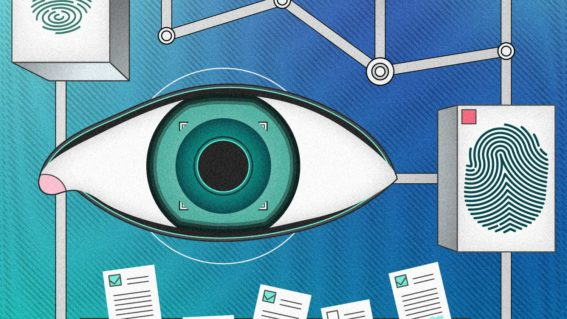
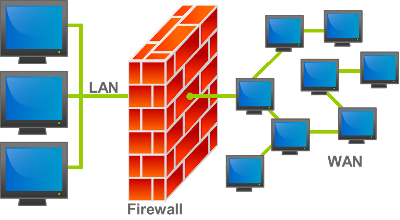

{width="100"; align=right}

# {{ title}}

!!! note "Objectives"

    - Recognize the significance of safeguarding data integrity, confidentiality, and availability in both organizational and home local area networks (LANs).
    - Define authentication and its role in verifying the identity of users, systems, or devices.
    - Examine the use of biometric authentication methods, such as fingerprint and retina scans.
    - Understand the role of smart cards and tokens as physical devices for enhancing security.
    - Define encryption and its purpose in securing data during transmission or storage.
    - Understand the purpose of firewalls in network security.
    - Understand MAC address filtering as a method for controlling network access.
    - Identify encryption protocols, such as SSL/TLS, used for securing communication over computer networks.
    - Recognize the role of VPNs in creating secure communication channels over public networks.

Your organisation, and home, have a local area network with connection to the Internet.  It's really important to safeguard the integrity, confidentiality, and availability of your data and to ensure the smooth running of an organization that only those with authority to connect to your network are able to do so.  They may be operating in the building inside your LAN but might also be working remotely. Implementing a comprehensive network security strategy involving authentication, encryption, firewalls, and other measures is vital for mitigating cyber threats and protecting valuable assets.  This section will consider each of these.

We're considering a number of different problems:

- Prevent unauthorised access to our network and devices connected to that network
- Protect our data to prevent it being stolen especially personal or commercially sensitive data
- Prevent cyber attacks by nation states or other groups that can potentially disrupt national or local infrastructure and institutions
- Ensure our organisation is acting according to the laws of the country, compliance
- Prevent eavesdropping on communication

## Authentication

Authentication is the process of verifying the identity of a user, system, or device before allowing access to a network or system. It ensures that only authorized individuals or systems can access the resources.  Unauthorized access to a network can lead to data breaches, unauthorized modifications, or misuse of resources. Authentication helps in preventing these security risks by confirming the identity of users or devices.

When considering authentication we might consider using:

- something only that person knows e.g. a username and password combination
- something only that person has in their possession e.g. their phone, or a smart card
- something only that person has physically e.g. their fingerprint or retina

The most common method is for person to have a unique **username and password** (and ensuring they adhere to the organisation's policy on using strong, unique passwords).  Additionally, multi factor authentication (MFA) can be used such as a one-time code sent to their mobile phone or other device i.e. something only they will (should) have in their possession.

**Biometric authentication** is beginning to be widely available, frequently built in as a standard in many mobile phones and laptop computers.  Retina scans and facial recognition are also being made available.  These are secure and convenient, a user is unlikely to forget their fingerprint!  However, organisations have to treat such data  with extra care and protection to prevent unauthorized access or misuse.

**Smart cards** and **tokens** are physical devices that users carry with them. They are an extension of MFA.  Smart cards may contain embedded chips, while tokens generate one-time passwords or codes. These devices add an additional layer of security. Smart cards can be combined with a PIN, and tokens can provide dynamic authentication codes, reducing the risk of unauthorized access even if credentials are compromised.

A smart card is a credit card-sized plastic card with an embedded microprocessor chip. The chip can store and process data, making it more secure than traditional magnetic stripe cards.  Users insert the smart card into a card reader, and the embedded chip communicates with the system to verify the user's identity. Typically, a Personal Identification Number (PIN) is also required for authentication.  Combining the smart card with a PIN or biometric authentication provides multi-factor authentication, enhancing overall security.

A token is a physical or virtual device that generates one-time passwords (OTPs) or authentication codes. These codes are used to authenticate a user during the login process.  These tokens might be physical devices that users carry, that generate OTPs based on a time-sensitive algorithm or a software-based solution that generate OTPs on a user's device.

Tokens can be used in various scenarios, including remote access, online banking, and secure transactions.

## Encryption

Encryption involves converting readable data, the **plaintext**, into a secure format, the **ciphertext**, using algorithms, making it unreadable without the appropriate decryption key. It protects the confidentiality of data during transmission or storage.  In the absence of encryption, sensitive information can be intercepted and accessed by unauthorized parties during data transfer. Encryption ensures that even if data is intercepted, it remains unreadable without the proper decryption key, enhancing data security.

Over the centuries many different encryption algorithms have been implemented.  In programming classes you might have been introduced to this idea with algorithms such as the Caesar Cipher or Vigenere Cipher.  As each algorithm has been "cracked" more elaborate and complex algorithms have taken their place.  Given enough time and computational power all encryption algorithms can be cracked but 

In modern encryption there are two techniques:

- **Symmetric Encryption**: a single key is used for both encryption and decryption. The same key must be shared between the communicating parties.  It is simple and efficient but the challenge is how to share that key with both parties securely.  (If you want to read more about the key distribution problem then [read here](https://www.comparitech.com/blog/information-security/diffie-hellman-key-exchange/).)
- **Asymmetric Encryption (Public Key Cryptography)**: Asymmetric encryption uses a pair of keys – a **public key for encryption** and a **private key for decryption**. The public key is widely distributed, while the private key is kept secret.  This is very secure though computationally more intensive than symmetric encryption.

Hash functions are often used in combination with encryption to ensure data integrity. Digital signatures are an example where a hash of the data is signed using a private key to verify the sender's identity.

Some applications will also implement encryption protocols for the transfer of data e.g. **Secure Sockets Layer (SSL)** and **Transport Layer Security (TLS)** are cryptographic protocols that secure communication over a computer network. They use asymmetric encryption during the initial handshake to establish a secure channel, and symmetric encryption for the actual data transfer. Web browsers use SSL/TLS to encrypt data during online transactions, ensuring the confidentiality of sensitive information like credit card details.  Check for the padlock symbol in the address bar of the web browser.

A **Virtual Private Network (VPNs)** uses encryption to create a secure and private communication channel over a public network, such as the internet. This protects data as it travels between the user's device and the VPN server.

**Wireless Encryption (WPA/WPA2/WPA3)** Encryption protocols such as WPA (Wi-Fi Protected Access) and its iterations WPA2 and WPA3 are used to secure wireless network communication. These protocols protect Wi-Fi networks from unauthorized access and eavesdropping, ensuring that only authorized users can connect and communicate securely.

**Email Encryption:** ensures the confidentiality of email messages by encrypting their content, preventing unauthorized access during transmission. Organizations, especially in sectors handling sensitive information, may use email encryption to protect the content of their communications.

## Firewall

A firewall is a network security device that monitors and controls incoming and outgoing network traffic based on predetermined security rules. It acts as a barrier between a trusted internal network and untrusted external networks (such as the internet).  The Firewall prevents unauthorized access to a network by filtering out malicious traffic, blocking unauthorized access attempts, and helping to detect and mitigate security threats. They are crucial for protecting networks from various cyber threats, including malware, hacking attempts, and other malicious activities.

There are different types of firewalls:

- **Packet Filtering Firewalls:** A packet filtering firewalls inspect packets of data and make decisions to allow or block them based on predefined rules, such as IP addresses, port numbers, and protocols. This is the most basic form of firewall and is effective for simple rule-based access control.
- **Stateful Inspection Firewalls:** Stateful inspection firewalls keep track of the state of active connections and make decisions based on the context of the traffic, ensuring that only legitimate connections are allowed.  It is more advanced than packet filtering, providing a higher level of security by considering the state of the connection.
- **Proxy Firewalls:** Proxy firewalls act as intermediaries between internal and external networks. They handle requests on behalf of clients and forward the results back to the clients, effectively isolating internal systems from direct external access.  The proxy firewall enhances security by masking internal IP addresses and adding an additional layer of control over the communication between internal and external networks.

Firewalls play a crucial role in protecting the network from various cyber threats, including malware, viruses, and intrusion attempts. They can block known malicious IP addresses, patterns, or behaviors. Some firewalls include intrusion prevention systems (IPS) that actively monitor network traffic for signs of malicious activity and take preventive action to block or mitigate threats.

Firewalls generate logs of network activity, which are valuable for monitoring and analyzing potential security incidents. They provide visibility into traffic patterns and help identify anomalies or suspicious behavior.

Firewalls with content filtering capabilities can block access to specific websites, applications, or content categories. This helps enforce acceptable use policies and protect against threats originating from malicious websites.

Firewalls often support Virtual Private Network (VPN) functionality, allowing secure communication over untrusted networks. This is essential for remote access and secure communication between geographically dispersed locations, ideal for students want to access the college network from home.

## MAC Address Filtering

MAC address filtering is a network security method that involves controlling access to a network based on the Media Access Control (MAC) addresses of devices. A MAC address is a unique identifier assigned to network interfaces for communication on a network. MAC address filtering allows or denies network access to devices based on their MAC addresses. 

Every network-enabled device, such as computers, smartphones, and networked peripherals, has a unique MAC address assigned to its network interface card (NIC) or wireless interface. The network administrator can configure the router or network access point to maintain a list of permitted or denied MAC addresses. This list is often referred to as an Access Control List (ACL) or MAC address whitelist/blacklist. The filtering rules specified in the ACL determines whether a device is permitted or blocked based on its MAC address. When a device attempts to connect to the network, the router or access point checks the MAC address against the ACL. If the MAC address is on the whitelist, access is granted; if it's on the blacklist, access is denied.

MAC address filtering is commonly used as a supplementary method of controlling access to a network. It helps ensure that only devices with specific MAC addresses are allowed to connect.  In scenarios where organizations provide guest Wi-Fi access, MAC address filtering can be used to restrict guest devices' access to only the internet while preventing them from accessing internal resources.

While MAC address filtering adds an additional layer of access control, it's not foolproof. Skilled attackers can spoof MAC addresses or use MAC addresses from permitted devices, making it important to use MAC address filtering in conjunction with other security measures.

Managing MAC address filtering can become administratively challenging as the number of devices on the network grows. Regular updates to the ACL are necessary to accommodate changes in the network.

## Questions

{{ show_questions(page.title, page.meta.filename) }}
