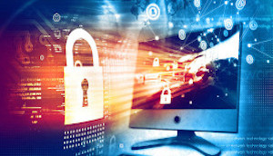
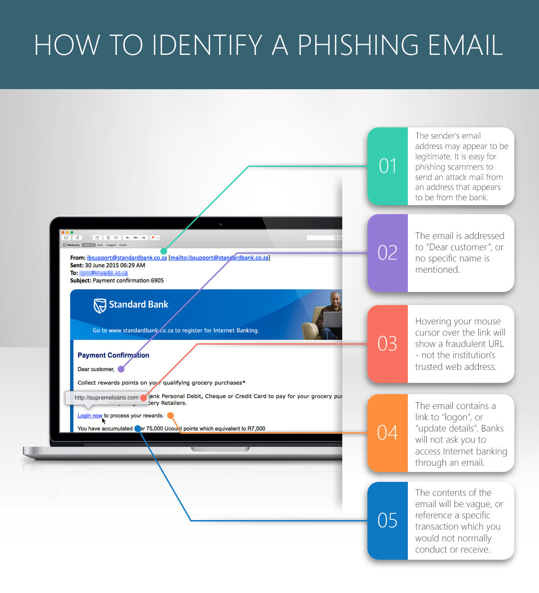
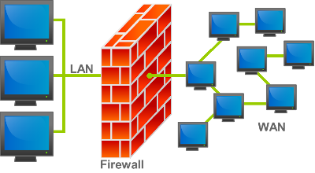

# Network Security


---

## Objectives

- Identify common network threats
- Understand password management and its importance
- Recognize the role of patches and updates in network security
- Identify risks from removable media and misconfigured access rights
- Define and understand brute force, DoS attacks, and SQL injection

---

### Network Threats Overview

Networks face numerous threats, ranging from simple annoyances to sophisticated attacks. 

- Weak passwords
- Outdated software
- Removable media risks
- Misconfigured access rights
- Denial-of-service (DoS) attacks
- Brute force attacks
- Data interception
- SQL injection

---

### Weak Passwords

Weak passwords are easy to guess or crack. Despite warnings, users often choose insecure passwords. In 2024, the most common passwords included:

- 123456
- password
- qwerty

---

### Strong Password Guidelines:

- Use long, complex combinations (numbers, symbols, upper/lowercase letters)
- Avoid common passwords
- Use password managers
- Change passwords regularly
- Never share passwords

---

### Unpatched or Outdated Software

Outdated software contains vulnerabilities that attackers exploit. Notable incidents include:

- **WannaCry (2017):** Exploited unpatched Microsoft Windows systems, causing widespread disruption.
- **Equifax Breach (2017):** Due to unpatched software, exposing millions of personal records.

### Importance of Patching:
- Regularly apply security updates to prevent attacks.
- Automated tools can scan for vulnerabilities in outdated software.

---

### Removable Media Risks

USB drives and other external devices can carry malware. Risks include:

- Malware spreading via AutoRun features
- Unauthorized access via infected devices
- Sensitive data theft

### Mitigation:
- Scan media before use
- Restrict removable device usage on networks
- Educate users about the risks

---

### Misconfigured Access Rights

Misconfigured permissions expose sensitive data and allow unauthorized access. Attackers exploit these to escalate privileges.

### Key Risks:
- Data exposure
- Insider threats
- Security misconfigurations in cloud environments

---

### Denial-of-Service (DoS) Attacks

DoS attacks flood a system with requests, preventing legitimate users from accessing services. **Distributed Denial-of-Service (DDoS)** attacks use multiple systems for a more powerful assault.

### Impact:
- Service outages
- Financial loss
- Possible data theft during attacks

---

### Brute Force Attacks

Brute force attacks systematically try all possible passwords or encryption keys. Attackers often target:

- Login pages
- Encrypted files
- Wi-Fi passwords

### Protection:
- Use strong, unique passwords
- Enable multi-factor authentication (MFA)

---

### Data Interception and Theft

Attackers use tools like packet sniffers and Man-in-the-Middle (MitM) attacks to capture sensitive data.

### Prevention:
- Encrypt data in transit (TLS/SSL)
- Use VPNs on public networks
- Employ network monitoring tools

---

### SQL Injection

SQL injection occurs when attackers inject malicious SQL code into applications. Example:

```php
$query = "SELECT * FROM users WHERE username = '$enteredUsername' AND password = '$enteredPassword'";
```

An attacker could input:

- Username: `admin' OR '1'='1' --`
- Password: (irrelevant)

This SQL injection logs the attacker in as the admin.

### Prevention:
- Use prepared statements to sanitize user input

---

## Questions

1. What are common characteristics of weak passwords, and why are they a threat?
2. How can removable media pose a security threat? Suggest preventive measures.
3. What is the primary goal of a DoS attack? Provide examples.
4. What is a brute force attack
5. Describe a Trojan and how it deceives users.
6. What is the primary function of spyware? How does it differ from other malware?

---

<!-- _class: invert -->
# Social Engineering

---

## Overview

One of the weakest points for any network system is **users**—people are easily fooled into actions that expose attackers to our personal and professional environments.

Social engineering uses psychological manipulation to trick people into giving away confidential information, such as passwords or PIN numbers.

Various social engineering techniques include:

- Phishing
- Pharming
- Shoulder surfing
- Blagging (Pretexting)
- Baiting

---

### Phishing

<div class="columns">
<div>

A cyber attack where attackers trick individuals into giving up sensitive data, such as login credentials or personal details, often by pretending to be trustworthy entities like banks or colleagues. Phishing usually happens via email but can also occur through texts or phone calls.


</div>
<div>



</div>
</div>

---

## Spear Phishing

**Spear phishing** is a more targeted form of phishing, where attackers gather information about the victim to create a convincing attack.

**To guard against phishing:**

- Verify emails by checking the sender’s address.
- Be cautious with unexpected emails asking for immediate action.
- Enable multi-factor authentication (MFA) for extra security.
- Simulate phishing attacks to raise awareness.
- Hover over links in emails to check the actual URL.
- Avoid clicking on suspicious links; type URLs manually.
- Verify any requests for sensitive information via trusted communication channels.
- Contact the organization directly using official contact details.

---

### Pharming

Pharming is a cyber attack where legitimate website traffic is redirected to fraudulent websites without the user’s knowledge. Unlike phishing, which uses deceptive emails or messages, pharming manipulates DNS or router settings.

#### Methods used in Pharming:

- **DNS Manipulation**: Attackers alter DNS records to redirect domain names to malicious IP addresses.
- **Router Compromise**: Attackers manipulate routers to redirect multiple devices to fraudulent sites.
- **Session Hijacking**: Interception and manipulation of communication between a device and a legitimate website.

---

## Shoulder Surfing

Shoulder surfing is a form of visual hacking where attackers observe passwords, PINs, or confidential data by physically watching the user. This attack requires close physical proximity, but technology like inconspicuous cameras can also be used.


### Preventing Shoulder Surfing:

- Be cautious when entering sensitive information in public.
- Shield the device and body to block views from others.
- Use hand movements or create barriers when entering passwords or PINs.
- Be vigilant in public spaces and report suspicious behavior.

---

## Blagging (Pretexting)

Obtaining sensitive information through deception. Attackers may impersonate someone trustworthy, like a company executive or service provider.

---

### Blagging Techniques

- **Impersonation**: Posing as a trusted figure to gain access to restricted information or areas.
- **Phone Blagging**: Manipulating individuals over the phone to reveal sensitive data.
- **Email Blagging**: Crafting deceptive emails to trick recipients into disclosing information.

### Prevention

- Always verify the identity of those requesting information.
- Use MFA for added security.
- Educate users on recognizing blagging attempts.

---

## Baiting

Baiting is when attackers lure individuals into compromising security by offering something attractive, such as free software, downloads, or physical devices.

---

### Baiting Tactics:

- **Free Software**: Users download seemingly legitimate software, which installs malware.
- **Clickbait**: Enticing headlines or offers leading to malicious sites.
- **Infected USB Drives**: Attackers leave compromised devices in public, hoping curious individuals will use them.

### Preventing Baiting:

- Be skeptical of too-good-to-be-true offers from unknown sources.
- Verify the legitimacy of downloads and links.
- Use security software to block malicious activity.
- Educate individuals on the dangers of accepting unexpected offers.

---

## Questions

1. What is social engineering, and how does it exploit human behavior in the context of network security?
2. What are the common techniques used to persuade users to give up sensitive data?


---

<!-- _class: invert -->

# Malware 

---

## What is Malware?

Malware = **Malicious Software**. It is designed to harm, exploit, or compromise systems, networks, or user data.

### Types of Malware:
- **Virus**
- **Worm**
- **Trojan**
- **Spyware**

---

## Virus

### Characteristics:
- Attaches to host files, triggered by user actions.
- Spreads by infecting programs or files.
- Motivations: Profit, political messaging, sabotage, etc.

### Common Virus Types:
- **Memory-resident**: Resides in RAM.
- **Macro-virus**: Embedded in files like Word or Excel.
- **Boot sector**: Targets storage devices' master boot record.
- **Email Virus**: Spreads through email systems.

---

## Worm

### Characteristics:
- Does not need a host file or user action to spread.
- Propagates through vulnerabilities, email, or USB drives.
- Can cause significant damage by consuming resources, modifying files, and creating backdoors.

### Famous Example: **Stuxnet**
- Aimed at sabotaging Iranian infrastructure.

---

## Preventing Worms

- Use antivirus and anti-malware software.
- Keep systems updated.
- Enable firewalls.
- Train users to recognize phishing.
- Restrict USB drive usage.
- Regularly back up data.

---

## Trojan

### Characteristics:
- Disguises as legitimate software.
- Relies on social engineering to trick users into installation.
- Does not self-replicate.
- Can introduce backdoors, spyware, or keyloggers.

---

## Spyware

### Characteristics:
- Secretly monitors user activity.
- Collects sensitive information (keystrokes, login credentials, etc.).
- Used for identity theft or unauthorized surveillance.

### Protection:
- Use anti-spyware software.
- Practice safe browsing and avoid suspicious downloads.

---

## Questions

1. What is malware? Provide examples of its objectives.
2. How do viruses spread and what triggers them?
3. Distinguish between a virus and a worm.
4. What is a Trojan? How does it differ from a virus?
5. What information does spyware collect and how does it differ from other malware types?

---

<!-- _class: invert -->
# Network Security

---

# Overview

- Protect networks from unauthorized access
- Ensure data integrity and prevent cyber attacks
- Stay compliant with laws and regulations
- Safeguard communication from eavesdropping

---

# Authentication

### Verifying Identity:
- **Username and password** (something you know)
- **Phone/Smart card** (something you have)
- **Biometric** (something you are)

**Multi-factor Authentication (MFA):** Adds an extra layer with codes sent to devices.

---

# Biometric Authentication

- **Examples:** Fingerprints, retina scans, and facial recognition
- **Advantages:** Secure and convenient, hard to forge
- **Challenges:** Must handle data with extra care

---

# Smart Cards & Tokens

<div class="columns">
<div>

- **Smart Cards:** Contain embedded chips for multi-factor authentication
- **Tokens:** Generate one-time passwords (OTPs) for secure login

</div>
<div>


</div>
</div>

---

# Encryption

### Purpose:
- Protect data during transmission/storage
- Convert plaintext into ciphertext using algorithms

### Types:
- **Symmetric Encryption:** Same key for both encryption/decryption
- **Asymmetric Encryption:** Public key for encryption, private key for decryption

---

## Encryption in Action

### Key Uses:
- **SSL/TLS:** Secure web communication
- **VPNs:** Private network over public channels
- **WPA/WPA2/WPA3:** Secure wireless networks
- **Email Encryption:** Protect email content

---

## Firewalls

<div class="columns">
<div>

### Types:
- **Packet Filtering:** Blocks/allows data based on rules
- **Stateful Inspection:** Tracks connection states
- **Proxy Firewalls:** Acts as intermediaries between networks


</div>
<div>



Firewalls prevent unauthorized access and can include features like content filtering and VPN support.

</div>
</div>

---

# MAC Address Filtering

- Controls access by allowing/denying devices based on their unique **MAC addresses**
- **Whitelist/Blacklist:** Access Control List (ACL)
- **Challenges:** Attackers can spoof MAC addresses

---

# Questions

1. What are the three main goals of safeguarding data in a network?
2. How does multi-factor authentication (MFA) enhance security?
3. What is the difference between symmetric and asymmetric encryption?
4. What are the roles of smart cards and tokens in network security?
5. How do firewalls protect networks, and what features do they offer?

---

# Summary

- Authentication, encryption, and firewalls are key to network security.
- Biometric authentication, smart cards, and MFA improve access control.
- Encryption secures data in transit and at rest.
- Firewalls and MAC address filtering help control network traffic.

