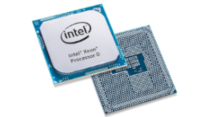
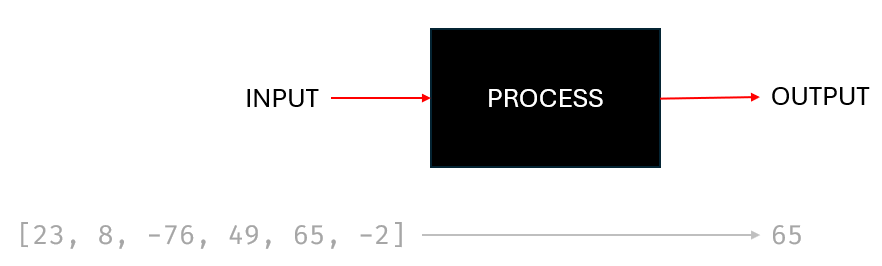
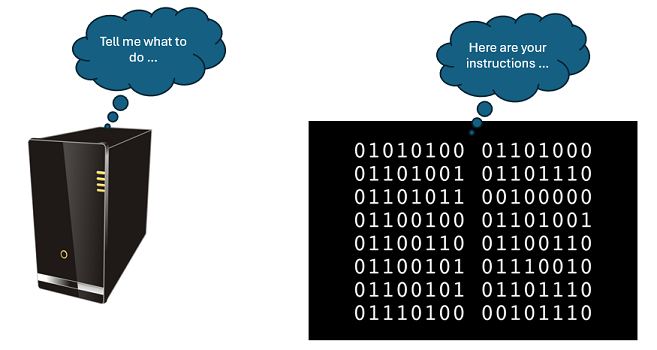
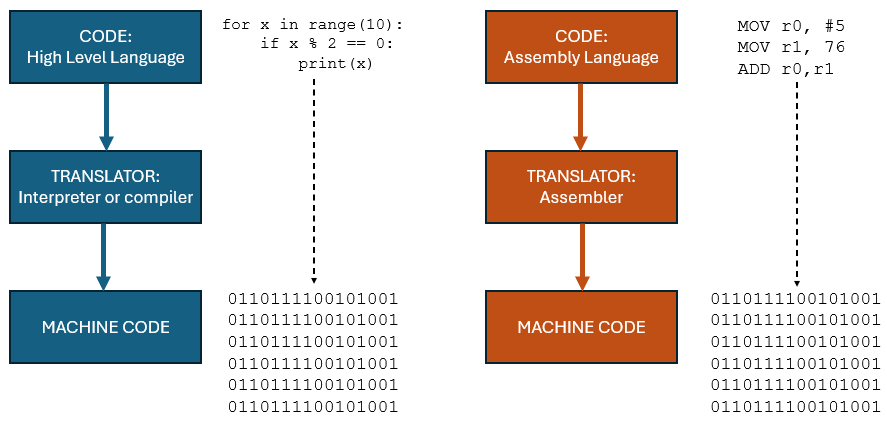
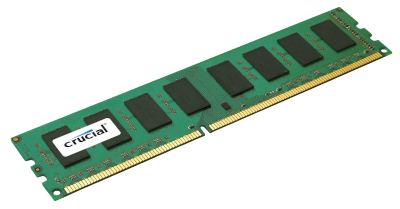
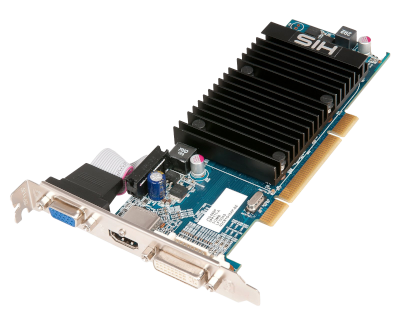
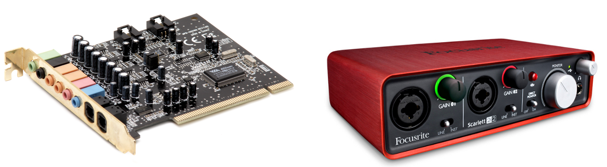
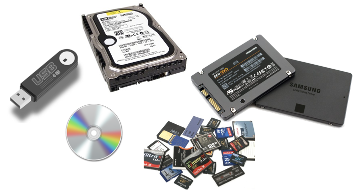

# Systems Architecture



---

# Contents

- [Software](#software)
- [Programming Languages](#programing-languages)
- [Inside the Machine](#inside-the-machine)
- [Memory](#memory)
- [Secondary Storage](#secondary-storage)
- [Systems Architecture](#systems-architecture)

---

<!-- _class: invert -->
# Software

---

## What is a Computer System?

- A computer system includes both hardware and software.
- **Hardware**: Physical components you can touch.
- **Software**: Programs and instructions that run on hardware.

---

## Elements of a Computer System

- **Input**: Devices like keyboard, mouse.
- **Process**: The computer processes input.
- **Output**: Devices like screen, printer.



---

## Hardware

- **CPU**: Central Processing Unit.
- **Memory (RAM)**: Temporary data storage.
- **Storage Devices**: Hard drives, SSDs.
- **Input Devices**: Keyboard, mouse, microphone.
- **Output Devices**: Screen, printer, speakers.

---

## Software

- **Operating Systems**: Manage hardware, e.g., Windows, macOS.
- **Application Software**: Programs for user tasks, e.g., word processors.
- **System Software**: Manages hardware and software interactions.

---

## Types of Software

- **Application Software**: For end-user tasks.
- **System Software**: Manages computer operations.

---

## System Software

<div class="columns">
<div>

- **Operating Systems**
- **Device Drivers**
- **Utility Software**

</div>
<div>


</div>
</div>

---

## Application Software

- **Word Processors**: e.g., Microsoft Word, Google Docs.
- **Web Browsers**: e.g., Chrome, Firefox.
- **Media Players**: e.g., VLC, iTunes.
- **Graphic Design Software**: e.g., Photoshop, GIMP.

---

## System Software

- **Operating Systems**: e.g., Windows, macOS, Linux.
  - Manage hardware resources.
  - Provide user interfaces.
- **Device Drivers**: Allow OS to communicate with hardware.
- **Utilities**: Tools for system management.
  - e.g., disk cleanup, antivirus.

---

## Role of an Operating System

- **Manage Resources**: CPU, memory, I/O devices.
- **Provide a User Interface**: GUI and CLI.
- **Hardware Abstraction**: Simplifies hardware interaction.
- **Security**: Protects system and data.

---

## Management of Resources

- **Processor Management**: Allocates CPU time.
- **Memory Management**: Manages RAM and virtual memory.
- **I/O Management**: Handles communication with devices.
- **Application Management**: Coordinates software execution.

---

## User Interface

- **Graphical User Interface (GUI)**: Icons, windows, menus.
- **Command Line Interface (CLI)**: Text-based commands.
- **Accessibility Features**: Screen readers, magnification.

---

## Utility Software

- **Disk Cleanup**: Frees up disk space.
- **Antivirus**: Detects and removes malware.
- **Backup and Recovery**: Safeguards data.
- **Disk Defragmenters**: Improves performance.
- **System Monitoring Tools**: Monitors system performance.

---

<!-- _class: invert -->
# Programming Languages

---

## Objectives

- Define a programming language and its role in software development.
- Differentiate between low-level and high-level programming languages.
- Compare high-level and low-level programming languages.
- Define machine code and assembly language as low-level languages.
- Describe the role of programming translators (assembler, compiler, interpreter).

---

## What is a Computer Program?

<div class="columns">
<div>

- A set of instructions compiled together to perform specific tasks.
- Machine code: Binary numbers (0s and 1s).
- Programming languages: Formal languages for writing instructions.

</div>
<div>


</div>
</div>

---

## Low-Level Languages

### Machine Code

- Native binary language of computers (0s and 1s).
- Difficult to write and error-prone.
- CPU-specific: Instructions vary between processors.

### Assembly Language

- Uses mnemonics (e.g., `LDA #5`) to represent machine code instructions.
- Easier than binary but still processor-specific.
- Converted to machine code by an assembler.

---

## Assembly Language Example

```armasm
.text
.global main

main:
	mov r0, #23
	and r1, r0, #1
	cmp r1, #1
	blt _isEven
_isOdd:
	mov r0, #1
	ldr r1, =oddStr
	mov r2, #15
	mov r7, #4
	svc 0
	b _exit
_isEven:
	mov r0, #1
	ldr r1, =evenStr
	mov r2, #15
	mov r7, #4
	svc 0
_exit:
	mov r0, #0
	mov r7, #1
	svc 0

.data
oddStr:   .asciz "Number is odd\n"
evenStr:  .asciz "Number is even\n"
```

---

## High-Level Languages

- Closer to human language; easier to read, write, and understand.
- Independent of hardware; portable across different systems.
- Examples: Python, Ruby, JavaScript, C#, Java, Lua.

---

## High-Level Language Example

```python
def check_odd_or_even(value):
    if value % 2 == 0:
        return "Even"
    else:
        return "Odd"

# Example usage:
user_input = int(input("Enter a number: "))

result = check_odd_or_even(user_input)
print(f"The given number is {result}.")
```

---

## High-Level vs Low-Level Languages

| High-Level Language                            | Low-Level Language                           |
| ---------------------------------------------- | -------------------------------------------- |
| Programmer friendly                            | Machine friendly                             |
| Easy to read and understand                    | Hard to read and understand                  |
| Easy to modify and change                      | Hard to make changes                         |
| Requires less code for the same task           | Needs more code for simple tasks             |
| Portable across systems                        | Non-portable                                  |
| Needs a compiler or interpreter for translation| Needs an assembler for translation            |
| Less memory efficient                          | More memory efficient                         |
| Slower execution                               | Faster execution                              |

---

## Program Translators




---

### Interpreter

- Reads and executes code line by line.
- No separate compilation step.
- Examples: Python, JavaScript.
- Code must be interpreted on each execution.

--- 

### Compiler

- Translates high-level code into machine code.
- Produces a standalone executable file.
- Requires separate compilation before execution.
- Examples: C, C++.

--- 

### Assembler

- Converts assembly code into machine code.
- One-to-one mapping from assembly to machine code.

</div>
</div>

---

## Bytecode

- Intermediate code used for platform independence.
- Example: Java and Python.
- Compiled into bytecode, then interpreted by a virtual machine.

#### Java

- Compiled into bytecode (JVM).
- Platform-independent execution.

#### Python

- Compiled into bytecode (.pyc files).
- Executed by Python Virtual Machine (PVM).

---


<!-- _class: invert -->
# Inside the machine

---

## Objectives


- Recognize and name key hardware components inside a computer system
- Understand their roles and interactions
- Troubleshoot hardware issues

---

## Computer Components Overview


- **Motherboard**
- **Memory (RAM)**
- **CPU (Processor)**
- **Graphics Card**
- **Sound Card**
- **Network Card**
- **Secondary Storage**
- **Power Supply Unit**
- **Other Components**: Cables, fan, heatsink

---

## Motherboard

<div class="columns">
<div>

  - CPU Socket
  - Memory Slots
  - Expansion Slots
  - Chipset
  - Storage Connectors
  - Power Connectors
  - I/O Ports
  - BIOS/UEFI Chip
  - CMOS Battery
</div>

<div>


</div>
</div>

---

## Main Memory (RAM)

<div class="columns">
<div>

- **Role**: Temporary storage for data actively used by CPU
- **Characteristics**:
  - Volatile (loses content when power off)
  - Provides fast access
  - Comes in sizes like 4GB, 8GB

</div>
<div>



</div>
</div>

---

## Processor (CPU)

<div class="columns">
<div>

- **Role**: Executes instructions and performs calculations
- **Components**:
  - **ALU**: Performs arithmetic and logic operations
  - **Control Unit**: Manages CPU operations
  - **Clock**: Synchronizes operations
  - **Registers**: Fast storage within CPU

</div>
<div>


</div>
</div>

---

## Graphics Card

<div class="columns">
<div>

- **Role**: Renders and displays visual information
- **Functions**:
  - Graphics rendering
  - 3D processing
  - Video playback
  - Parallel processing

</div>
<div>



</div>
</div>

---

## Sound Card

<div class="columns">
<div>

- **Role**: Processes and manages audio data
- **Functions**:
  - Audio playback
  - Sound quality enhancement
  - Surround sound support
  - Audio recording

</div>
<div>



</div>
</div>

---

## Network Card

<div class="columns">
<div>

- **Role**: Connects computer to a network
- **Functions**:
  - Ethernet and/or wireless connectivity
  - Data transmission and reception
  - MAC Address and network protocols

</div>
<div>


</div>

---

## Secondary Storage

<div class="columns">
<div>

- **Role**: Long-term data storage
- **Types**:
  - **HDD**: Magnetic storage
  - **SSD**: Flash memory
  - **Optical Drives**: CD/DVD/Blu-ray
  - **USB Flash Drives and Memory Cards**

</div>
<div>



</div>
</div>

---

## Power Supply Unit (PSU)

<div class="columns">
<div>

- **Role**: Provides power to the computer
- **Functions**:
  - Stabilizes power delivery
  - Protects against surges
  - Efficient power conversion
  - Regulates voltage and current
</div>

<div>


</div>
</div>

---

## Heat Sink and Fan

<div class="columns">
<div>

- **Heat Sink**:
  - Absorbs and dissipates heat from CPU
  - Made of aluminum or copper
- **Fan**:
  - Enhances heat dissipation
  - Controlled based on CPU temperature

</div>

<div>


</div>
</div>

---

<!-- _class: invert -->
# Memory

---

<!-- _class: invert -->
# Secondary Storage

---

<!-- _class: invert -->
# Systems Architecture

