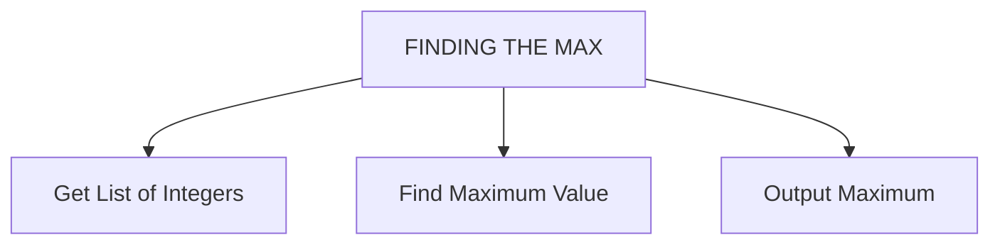
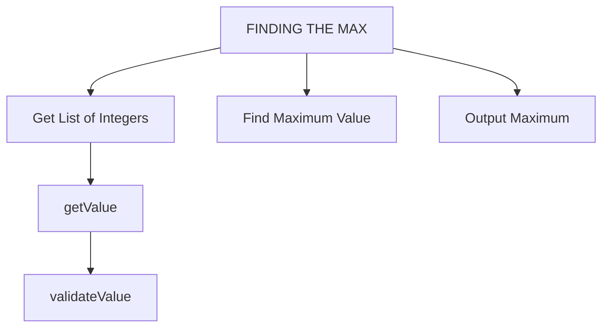

# Algorithms


---

# Contents

- [Overview](#what-is-an-algorithm)
- [Computational Thinking](#computational-thinking)
- [Searching Algorithms](#searching-algorithms)
- [Sorting Algorithms](#sorting-algorithms)
- [Tracing Algorithms](#tracing-algorithms)
- [Structure Diagrams](#structure-diagrams)

---

<!-- _class: invert -->
# Overview

---

# What is an Algorithm?

An **algorithm** is:

> A set of mathematical instructions or rules that help to calculate an answer to a problem.

It's a step-by-step procedure or set of well-defined instructions designed to perform a specific task or solve a particular problem.

---

# Applications of Algorithms

Algorithms are used in various fields:
- **Mathematics**
- **Physics**
- **Engineering**
- **Computer Science**

In computing, they are crucial for programming and automating tasks.

---

# Key Characteristics of Algorithms

1. **Input:** Data or values the algorithm operates on.
2. **Output:** Result or solution to the problem.
3. **Definiteness:** Each step must be precisely defined.
4. **Finiteness:** Must stop after a number of steps.
5. **Effectiveness:** Each step must be simple and executable.

---

# Importance in Computer Science

Algorithms are fundamental for:
- **Sorting Data**
- **Searching Information**
- **Optimizing Processes**

They form the foundation for efficient and effective software solutions.

---

# Algorithmic Design Methods

We use various methods to create and interpret algorithms:
- **Pseudocode**
- **Flowcharts**

These methods help in designing and refining algorithms without specific programming languages.

---

# Computational Thinking Principles

1. **Abstraction:** Simplify complex systems by focusing on essential details.
2. **Decomposition:** Break down problems into smaller, manageable parts.
3. **Algorithmic Thinking:** Design solutions as step-by-step instructions.

---

# Problem Analysis

- **Inputs:** Data or information received.
- **Processes:** Actions or calculations performed on inputs.
- **Outputs:** Results or information produced.

---

# Structure Diagrams

Visual representations showing:
- Organization and relationships between program parts.
- High-level view of program structure.

---

# Algorithm Expression Methods

1. **Pseudocode:** High-level, human-readable format outlining logical steps.
2. **Flowcharts:** Visual representations using shapes for actions, decisions, and loops.

---

# Error Identification and Debugging

- **Common Errors:** Syntax, logic, and runtime errors.
- **Trace Tables:** Track variable values and program execution step-by-step.

---

# Summary

Understanding algorithms is crucial for:
- Systematic problem-solving
- Designing efficient solutions
- Debugging and refining programs

These concepts form the foundation of effective computer science practice.

---
<!-- _class: invert -->
# Computational Thinking

---

## What is an Algorithm?

An **algorithm** is a step-by-step set of instructions or rules designed to solve a specific problem or carry out a task. They are essential in computer science, defining the logic that drives software and systems.

Example problem: Finding the largest value in a list of numbers e.g. `[23, 8, -76, 49, 65, -2]`.

To find $65$, we need to design a set of instructions for a computer, applying "computational thinking".

---

## Input → Process → Output

For all problems:
- **Input:** Data or values we work with.
- **Process:** Series of steps to transform input into output.
- **Output:** Result produced by the algorithm.


---

**Inputs:** The list of values: `[23, 8, -76, 49, 65, -2]`.

**Outputs:** The maximum value $65$.

**Process:**
1. Start with the first number as the current maximum.
2. Iterate through the remaining numbers.
3. Compare each number with the current maximum.
4. Update the maximum if a larger number is found.
5. Continue until all numbers are considered.
6. Final maximum value is the result.

---

## Computational Thinking

**Computational Thinking** involves breaking down complex problems into manageable parts and systematically solving them. It's a fundamental skill in computer science and many other disciplines.

Key components:
1. **Decomposition**
2. **Pattern Recognition**
3. **Abstraction**
4. **Algorithmic Thinking**

---

## Decomposition

Decomposition breaks down a complex problem into smaller, manageable parts.

Example: Making a cheese sandwich.
1. Gather ingredients.
2. Prepare work surface.
3. Spread butter.
4. Slice cheese.
5. Assemble sandwich.
6. Cut and serve.

---

## Pattern Recognition

Pattern recognition involves identifying common features in problems.

Example: Sorting algorithms share steps like comparing and swapping elements. Recognizing patterns allows reuse of solutions.

Patterns in sandwich making:
- Cheese sandwich vs. tuna sandwich.

---

## Abstraction

<div class="columns">
<div>

Abstraction simplifies complex systems by focusing on essential aspects and ignoring unnecessary details.

Example: The London Tube Map shows only essential information, not distances or geographical locations.

</div>
<div>


</div>
</div>

---

**Benefits of Abstraction:**
- Identify essential details.
- Ignore unnecessary details.
- Create generalizations and models.
- Improve understanding and communication.

---

## Algorithmic Thinking

Algorithmic thinking involves creating step-by-step solutions.

Principles:
- **Sequential Steps:** Clear sequence of actions.
- **Clear Instructions:** Precise and unambiguous.
- **Input and Output:** Process input to produce output.
- **Reusability:** Apply solutions to similar problems.
- **Efficiency:** Optimize resources and performance.

Example: Finding the maximum value in a list.

---

<!-- _class: invert -->
# Describing an algorithm

---

## Methods used to describe an algorithm

- Structured English
- Pseudocode
- Flowcharts

---

## Structured English

In the previous section, we used Structured English to find the largest value in a list:

1. Start with the first number in the list and consider it as the current maximum.
2. Iterate through the remaining numbers in the list.
3. For each number, compare it with the current maximum.
4. If the current number is greater than the current maximum, update the current maximum to be that number.
5. Continue this process until all numbers in the list have been considered.
6. The final value of the current maximum is the maximum number in the list.

Structured English is high-level and human-readable, closer to natural language.

--- 

## Pseudocode

Pseudocode provides a structured yet human-readable way to describe algorithms. 

Pseudocode resembles programming code but is not specific to any language.

Exam boards have created their own versions of pseudocode, or reference languages they use in their exam papers

--- 

**AQA Example**

```plain
values <- [23, 8, -76, 49, 65, -2]
current_maximum <- first value in the list
number_of_values <- LEN(values)
FOR i <- 1 TO number_of_values
    current_value <- values[i]
    IF current_value > current_maximum THEN
        current_maximum <- current_value
    ENDIF
ENDFOR
OUTPUT current_maximum
```
---

**OCR Example**

```plain
values = [23, 8, -76, 49, 65, -2]
current_maximum = first value in the list
number_of_values = LEN(values)
for i = 1 to number_of_values
    current_value <- values[i]
    if current_value > current_maximum then
        current_maximum <- current_value
    endif
next i
print current_maximum
```

---

## Flowcharts

<div class="columns">
<div>

Flowcharts use symbols and arrows to represent steps and decision points in an algorithm.

Flowcharts are useful for visualizing the logic of an algorithm, especially for non-programmers. They provide a clear, systematic view but can become complex with detailed algorithms.


</div>
<div>


</div>
</div>

--- 

<div class="columns">


---

<!-- _class: invert -->

# Searching Algorithms

---

### Linear Search

**Linear Search** (or **Sequential Search**) is a straightforward algorithm that searches for an element by checking each item in the list one by one.

---

## Linear Search Example

<div class="columns">
<div>

**Example List:**

- Milk
- Eggs
- Tomatoes
- Mince
- Flour

</div>

<div>

**Algorithm:**

1. Start from the beginning of the list.
2. Compare the target element with each item sequentially.
3. If a match is found, return the index.
4. Continue until the end of the list or until a match is found.
5. If no match is found, indicate the item is not present.

</div>

--- 

## Linear Search - Python Code:**

```python
# Linear search in Python
shopping_list = ["Milk", "Eggs", "Tomatoes", "Mince", "Flour"]
search_key = "Mince"
found = False

for item in shopping_list:
    if item == search_key:
        found = True
        break

if found:
    print(f"{search_key} is in the list")
else:
    print(f"{search_key} is not in the list")
```

--- 

## Linear Search


---

## Binary Search

**Binary Search** is more efficient but requires the list to be sorted. It works by repeatedly dividing the search interval in half.

**Algorithm:**

1. Start with the entire sorted list.
2. Compare the target with the middle element.
3. If the target is equal to the middle element, return the index.
4. If the target is less, repeat the search on the lower half.
5. If the target is greater, repeat the search on the upper half.
6. Continue until the target is found or the interval is empty.

--- 

## Binary Search - Python Code:

```python
# Binary search in Python
def binary_search(items, target):
    low = 0
    high = len(items) - 1

    while low <= high:
        mid = (low + high) // 2

        if items[mid] == target:
            return mid
        elif items[mid] < target:
            low = mid + 1
        else:
            high = mid - 1
    return -1

sorted_list = [1, 2, 3, 4, 5, 6, 7, 8, 9, 10]
target_element = 7

result = binary_search(sorted_list, target_element)

if result != -1:
    print(f"Element {target_element} found at index {result}.")
else:
    print(f"Element {target_element} not found.")
```

--- 

## Binary Search


---

## Efficiency Comparison

<div class="columns">
<div>

- **Linear Search:** O(n) – Time complexity grows linearly with the number of items.
- **Binary Search:** O(log₂ n) – Time complexity grows logarithmically with the number of items (see table)

</div>
<div>

| Number of items (n)   | Max "Guesses" |
| :-------------------: | :------------: |
|         10,000        |       14       |
|          1,000        |       10       |
|           500         |        9       |
|           100         |        6       |
|            50         |        5       |
|            10         |        3       |

</div>
</div>

---

<!-- _class: invert -->

# Tracing an Algorithm

---

## Types of Error

Three types of error can occur when coding and executing that code:

- Syntax error
- Logic error
- Runtime error

---

### Syntax Errors

- Related to code structure and grammar.
- Detected by compiler/interpreter.
- Examples: missing semicolons, mismatched parentheses.

--- 

### Logic Errors

- Flaws in program logic leading to incorrect results.
- Not detected by the compiler.
- Discovered through testing and debugging.

--- 

### Runtime Errors

- Occur during program execution.
- Examples: division by zero, accessing out-of-bounds elements.
- Results in program termination or interruption.

--- 

## Tracing an Algorithm

Tracing helps debug logic and runtime errors by tracking variable changes during execution.

It involves building a table that lists the vrriables and notes how they change during the course of the program being run.

It is a paper and pen exercise (though many IDEs will come with debugging tools where you can **watch** the variables which is similar).

--- 
### Example: Binary Search

**Algorithm:**

```python
def binary_search(items, target):
    low = 0
    high = len(items) - 1

    while low <= high:
        mid = (low + high) // 2

        if items[mid] == target:
            return mid
        elif items[mid] < target:
            low = mid + 1
        else:
            high = mid - 1

    return -1
```

---

## Trace Table for binary search


**Items List:** `[1, 2, 3, 4, 5, 6, 7, 8, 9, 10]`  
**Target:** `7`

--- 

### Trace Table

<div class="columns">
<div>

| target |  low  | high  |  mid  | items[mid] | output |
| :----: | :---: | :---: | :---: | :--------: | :----: |
|   7    |   0   |   9   |       |            |        |
|        |   0   |   9   |   4   |     5      |        |
|        |   5   |   9   |   7   |     8      |        |
|        |   5   |   6   |   5   |     6      |        |
|        |   6   |   6   |   6   |     7      |   6    |

</div>
<div>

```python
def binary_search(items, target):
    low = 0
    high = len(items) - 1

    while low <= high:
        mid = (low + high) // 2

        if items[mid] == target:
            return mid
        elif items[mid] < target:
            low = mid + 1
        else:
            high = mid - 1

    return -1
```

</div>
</div>

--- 

<!-- _class: invert -->

# Structure Diagrams

---

## What is a Structure Diagram?

A structure diagram is a graphical representation of an algorithm, showing the sequence of steps and the flow of control between them. It helps in planning, organizing, and communicating algorithms effectively.

- High-level design tool
- Focuses on broad steps
- Avoids detailed loops and selection structures

---

## Finding a Maximum in a List of Values

**Example List:** `[3, 1, 4, 2, 5, 6]`  
**Objective:** Find the maximum value, which is `6`.

---

### The Structure Diagram

The main steps involved:

1. **Input**: Read a list of integers
2. **Find Maximum**: Identify the maximum value
3. **Output**: Display the maximum value

**Diagram:**



This diagram provides a high-level view, without details of implementation.

---

## "Unpack" Each Process

**Get List of Integers**

Options:
- Hard code values
- User input with validation
- Read from a file

For simplicity, we use hard-coded values:

```python
def read_input():
    return [3, 1, 4, 2, 5]  # Replace with actual input mechanism
```

---

**FindMax()**

Pseudocode:
```
Initialize max_value to the first element of the list
For each element in the list:
  If element > max_value:
    Update max_value to element
Return max_value
```

---

**Output Maximum**

Output to the screen:

```python
def display_output(max_value):
    print("Maximum value:", max_value)
```

---

**MAIN**

Combining the processes into the main program:

```python
def main():
    numbers = read_input()
    max_value = find_max(numbers)
    display_output(max_value)

main()
```

---

## Expanding the Structure Diagram

If user input is required, add a process for user entry and validation:



---

## Benefit of Structure Diagrams

- **Clarifies the Problem**: Breaks down the problem into manageable steps.
- **Organizes the Algorithm**: Shows sequence and flow of control.
- **Identifies Key Processes**: Highlights comparison and updating steps.
- **Simplifies Implementation**: Provides a clear framework for coding.

---

## Workflow Example

Define functions with **stubs**:

```python
def read_input():
    print("Read input")
    return 0

def find_max(numbers):
    print("Find Max")
    return 0

def display_output(max_value):
    print("Display output")
    return 0

def main():
    numbers = read_input()
    max_value = find_max(numbers)
    display_output(max_value)

main()
```

---

## Summary

Structure diagrams are essential in algorithm development. They help in planning, organizing, and implementing algorithms efficiently by breaking down problems into manageable steps and clarifying the flow of control.
